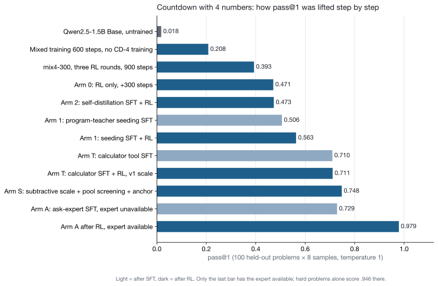
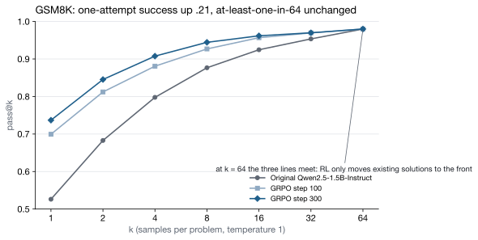
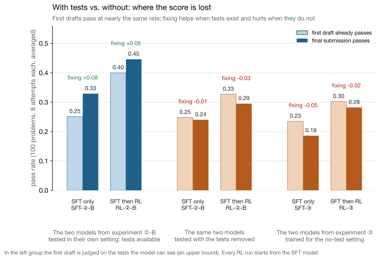
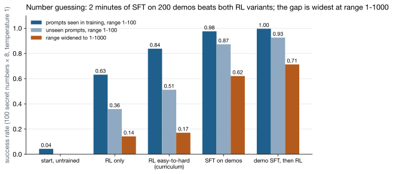
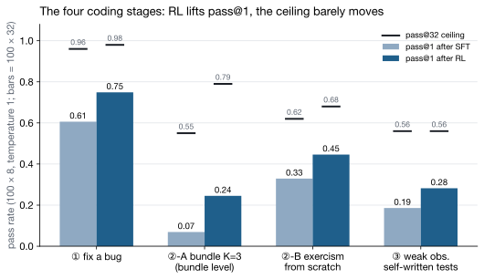
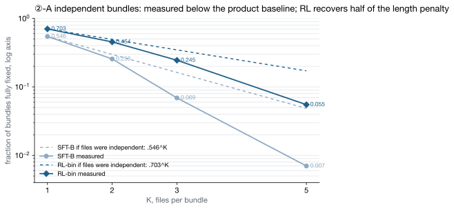
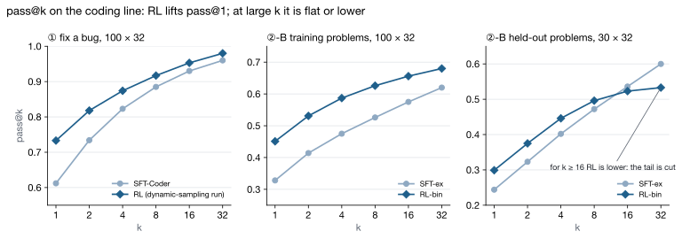
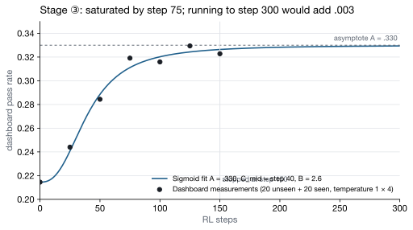
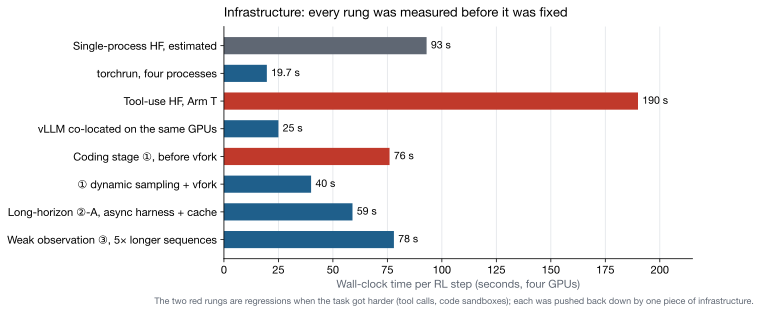

# From pretraining from scratch to a coding agent

**Fifteen experiments on four RTX 4090s: one variable at a time, predictions written before each run, reconciled after**

Author: Qirun Li · Period: August 26 to September 22, 2026 · Compiled by: Claude (conversational collaboration)

> This report is an edited version of the experiment log `PLAN.md` (eleven thousand lines). Each experiment gives its setup, data, charts, and conclusions; every number comes from the original log. The predictions written before each run and the reconciliation after it are kept together, with both ✓ and ✗. All conclusions are limited to the model sizes used here (95M to 1.5B) and to these tasks; they are not extrapolated to larger models.

---

## 0. One page

**What was done.** Studied Stanford CS336 and Stanford CS329A, then pretrained two English models from scratch (95M, 201M) on four 4090s, do SFT, then move to RL: first reproduce GRPO on GSM8K, then use the Countdown number game to chase DeepSeek-R1's "aha moment", raising this task's pass@1 from 0.02 to 0.75, and to 0.98 with the expert exit open; then build the first stateful environment (number guessing); finally move to coding agents: bug fixing, bundling, writing real modules from scratch, and taking away the tests so the model has to verify itself, four stages in all.

**How.** Each experiment changes one variable; predictions are written down before the run and reconciled after it; every model reports two numbers, pass@1 (reliability) and pass@32 (ceiling); a cheating probe is run at every stage; the hit record of more than forty predictions is kept in the appendix.

**Three definitions and one protocol first.** Support set: the set of solutions to which the model's sampling distribution assigns non-negligible probability; this report uses pass@k at large k as its proxy, pass@32 on the coding line and pass@64 on the Countdown line. Observation strength: strong observation means the environment runs the author-written tests at inference time and returns the verdict; weak observation means the environment provides no tests and the model can only write and run its own assertions. Sampling protocol: pass@1 is the mean over 8 samples per problem at temperature 1; pass@32 is the unbiased estimate from 32 samples per problem; 100 out-of-pool problems, 1σ about .03 to .04, and any difference smaller than that is read as flat.

**Why the base model stops at 1.5B.** The constraint comes first: on four 24 GB RTX 4090s, full-parameter RL with vLLM co-located on the same GPUs fits a 1.5B model and no more; 4B would need LoRA. Since the scale could not vary, it was treated as a constant and only the things that could vary were changed: same base model, same scale, one variable at a time, so that differences can be attributed. This is not a scaling study and not a small-model leaderboard; every conclusion is limited to this size and these tasks. Statements such as "not worth points in the hands of a 1.5B" describe this capacity and have to be re-measured at any other.

**What came out.** Six regularities that run through the whole project, each with its own numbers:

| Regularity | One sentence | Evidence |
|---|---|---|
| RL moves within the support set | pass@1 rises, the pass@k ceiling does not move; opening new paths(novel solution strategies that the base model almost never produced) happens only at the 1/k margin | GSM8K pass@64 is .980 for all three models; ②-B held-out pass@32 actually drops |
| Three-stage division of labor | pretraining gives the parts, SFT gives the procedure, RL gives the preference | 200M SFT "knowing when to stop ≠ knowing how to answer"; three arms(three training configurations compared from the same starting point): self-distillation = RL only, seeding +.09 |
| The shape of the scale decides what gets learned | process rewards get gamed; final-outcome reward only + pool screening(batch filtering to problems with mixed success within a sampled group) + KL anchor(a KL penalty that keeps the policy near the SFT model) turns RL from learning bad habits into a safe small gain | Arm 3 grader gamed at step 126; Arm S, Conclusion ⑯ |
| The price of observation | same problems, same scale, only the tests taken away: SFT −.09, RL −.16, ceiling −.06, and the whole price falls on the fix loop | Stage ③ |
| Fixing is a part, not a habit | the improved rate per fix round is 10 to 20%, unchanged across three settings, before and after SFT, before and after RL | ②-A, ②-B, ③ |
| Opening new paths = support-set density × feedback density × sampling budget | the denser the feedback, the weaker the prior that can still open a path | Countdown cannot walk blind and needs seeding; number guessing grows binary search from 4% with pure RL |

**Three main charts.**

How to read the three figures: see the end of §3.10, §3.4 and §3.15.

---

## 1. Roadmap

### 1.1 Timeline

| # | Date | Experiment | Base model | Key numbers | Conclusion |
|---|---|---|---|---|---|
| 1 | from 08-26 | CS336 self-study, no videos, all by conversation | | Covered L1 L2 L3 L9 L11 | |
| 2 | 08-27 / 08-28 | Pretraining from scratch twice: 95M / 1.5B tokens, 201M / 10B tokens | self-trained | perplexity 30.17 / 18.10 | Beats Chinchilla, loses to GPT-2 small by .148 |
| 3 | 08-30 | SFT on 200M, Alpaca, 2×2 comparison | self-trained 201M | appropriate responses 0/7 → 5/7 | Knowing when to stop ≠ knowing how to answer; post-training does not look at val loss |
| 4 | 09-01 / 09-02 | GSM8K GRPO, two rounds | Qwen2.5-1.5B-Instruct | greedy .687 → .767; pass@64 .980 unchanged | RL only reorders, does not create; entropy collapse |
| 5 | 09-02 | Countdown 3-number, R1-Zero reproduction | Qwen2.5-1.5B Base | .035 → .405, length 186 → 48 | Shortcut; conditional policy binding |
| 6 | 09-02 to 09-04 | Mixed training Countdown + GSM8K, four segments | same | CD-3 .405 → .61; mix4-300 CD-4 .393 | Shortcut blocked; the functional form of the aha moment appears, long chains of thought do not |
| 7 | 09-04 to 09-06 | Three-arm CD-4 + Arms 3/3′ changing only the reward | mix4-300 | RL only .471 / self-distillation .473 / seeding .563 | New parts come only from the teacher; process reward gamed |
| 8 | 09-07 to 09-08 | Calculator tool, Arm T, the first harness | same | SFT .506 → .710; RL .711 | ⑮ once the parts are fixed, RL has only shaping-away left |
| 9 | 09-08 | Arm S, subtractive scale + pool screening + anchor | same | .754; CD-3 ceiling .92 → 1.00 | ⑯ RL moves within the reachable set |
| 10 | 09-10 to 09-11 | Arm A, asking an expert with a budget | same | with help .979, hard problems .946; wording change .966 → .036 | ⑰ the method binds to the prompt wording; the expert = all the gain on hard problems |
| 11 | 09-11 | E number guessing, three arms, the first stateful environment | hf_armA | pure RL .63 / curriculum .84 / seeding .976 | ⑱ explicit state comes from the textbook |
| 12 | 09-11 to 09-13 | ① short-horizon strong observation: bug fixing | Qwen2.5-Coder-1.5B | SFT +.55, RL +.12, pass@32 unchanged | ⑲ ⑳ |
| 13 | 09-14 to 09-15 | ②-A long-horizon strong observation 1: independent bundling | same | p^K; file-level pass@32 +.02 | ㉑ to ㉖ |
| 14 | 09-15 to 09-16 | ②-B long-horizon strong observation 2: exercism from scratch | same | SFT .329 → RL .446; held-out pass@32 .600 → .533 | ㉗ gain in the first version, problem binding, tail cutting(held-out pass@32 falls while pass@1 rises) |
| 15 | 09-17 | ③ long-horizon weak observation: write your own tests | same | SFT .186 → RL .282; strong-room control .446 | ㉘ the price of observation |

### 1.2 Chain of motivation: each next step is the previous step's debt

1. Train 95M from scratch: walk the pretraining pipeline by hand; perplexity 30 against GPT-2 small's 26 → ask how post-training is done.
2. 200M SFT: install the dialogue format; find that post-training cannot pick a model by val loss → need a task that can be scored automatically.
3. GSM8K GRPO: pass@1 .53 → .74, greedy only +.08, the format emerges on its own, entropy collapse → "RL eliminates bad paths, it does not improve the best path", but what was learned cannot be stated → need a more controllable task.
4. Countdown 3-number: after RL the answers get shorter and the reasoning disappears → what RL changes is behavior in a specific context → ask what the conditions for the aha moment are.
5. Mixed training: the task must genuinely need search and the starting point must be nonzero; CD-3 is too easy and RL eliminates the reasoning → switch to CD-4.
6. Three-arm CD-4: self-distillation = RL only, seeding +.09 → new parts come only from the teacher → ask whether a reward can teach a process.
7. Arm 3, changing only the reward: the process grader is gamed at step 126 → from now on only final-outcome rewards → where are the remaining errors.
8. Calculator / Arm T: the failures are all on lines with arithmetic errors → outsource to a calculator, value from .45 to 1.00, build the harness; after RL the model actually learns bad habits → three options: protect the seed, change the scale, change the teacher.
9. Arm S: reward only, no penalty + problem screening + anchor → safe small gain, pass@64 unchanged → RL moves within the reachable set; hard problems still all wrong → need external information.
10. Arm A: the textbook installs properly, RL only trims runaway behavior, the expert is all the gain on hard problems, the cost is tool dependence; the first multi-turn action → set the "agent + RL" direction.
11. E number guessing: the smallest agent environment; pure RL grows binary search from 4%, curriculum beats training directly on the hard setting, seeding is best, N=1000 relies on "writing down the interval" → explicit state comes from the textbook, the harness is generalized → ready for real tasks.
12. Define the coding line: two axes, observation strength × horizon length; a coding environment can be tightened all the way, and the product sits on this line → four-cell curriculum.
13. ① bug fixing: get the loop, the sandbox, and the scale running; zero-shot ≈ 0 → a cold start is required; SFT +.55, RL +.12; pass@32 unchanged; strict scale + cheating probe → ask what happens when the path gets longer.
14. ②-A bundling: deliberately independent, to compare against p^K; the multiplicative effect, the state line has no effect, bin and frac reach the same endpoint, file-level pass@32 +.02 → the original plan was to inject coupling, changed to real modules.
15. ②-B exercism from scratch: one step toward the real thing; SFT .33, RL .45, the gain is in the first version; the pass@32 gain is entirely on seen problems, half of it is problem binding, held-out shows tail cutting → debts: the problem pool is small, fixing did not move.
16. ③ weak observation: take away the tests to examine whether the model can build its own verification, and expand the pool along the way to treat problem binding; the action is installed, RL keeps it, but it does not earn points; judging and fixing are parts → three options: fewer but more accurate assertions / the teacher as the scale / 4B.

In one sentence: the aha moment cannot be explained → find a controllable task; self-distillation does nothing → find a teacher; process reward gamed → final outcome only; arithmetic errors → add a tool; learning bad habits → fix the scale; hard problems unsolvable → ask the expert; a single turn is not enough → multi-turn; toys are done → real tasks; short horizon measured → lengthen it; long-horizon strong observation measured → remove the observation; action installed → parts missing. The next debt: where do parts come from.

---

## 2. Method

### 2.1 Experiment procedure template

Each experiment follows seven steps. The seven were summarized after all fifteen experiments were done; the earlier experiments did not all go through them completely:

1. **Question, variable, prediction.** One variable at a time; the prediction is written before the run and reconciled after it.
2. **The bench**, ten items: problem generator (where the problems come from, with reference answers), verifier (sandbox runner), environment (stateful, takes actions, returns observations), scale (how many points at submission), harness (the loop of generate, stop, execute, inject, mask), template (problem wording; training and held-out kept separate), held-out set (fixed on day one: problems, templates, bug types), defenses (how the scale resists gaming), unit tests (a fake model plays a few rounds to check all of the above), readouts (behavioral metrics in the eval report: by position, failure mode, writing form, group distribution).
3. **Two probes.** The capability probe measures p; the cheating probe measures whether the scale has holes, and is run again after RL.
4. **Textbook.** Source: program teacher, distillation, or self-sampling with filtering; the list of what to teach comes from the probe's failure modes; held-out templates do not enter the textbook.
5. **SFT + eval**, K curve, held-out, failure modes. Failure modes fall into two classes: habit-type ones RL can suppress; missing-move ones go back to step 4.
6. **RL, two runs** (repeating the same recipe once gives a noise floor) + eval; smoke test before the run; infrastructure changes change only speed, not scores, and after each change first verify "same score, only faster".
7. **Conclusion, prediction reconciliation, debts.** The debts are the source of the next round's step 4.

### 2.2 Evaluation protocol

- **pass@1**: temperature 1, 8 samples per problem, 100 out-of-pool problems, reported as the mean over 800 samples. 1σ is about 0.03 to 0.04; any difference smaller than that is read as flat.
- **pass@k ceiling**: the same 100 problems, 32 samples each (64 on the Countdown line), unbiased estimator. pass@1 measures reliability, pass@32 measures the ceiling, and the gap between the two decides whether to run RL or change the base model.
- **Greedy** is only a training dashboard and does not enter conclusions: greedy decoding hides the gain (GSM8K greedy +.03, temperature 1 +.22).
- **Held-out** comes in three kinds: held-out problems, held-out templates (wording), held-out bug types, fixed on day one.
- **Long-horizon tasks** are measured at the atomic granularity: bundles report file-level and bundle-level results separately.

### 2.3 Definition of an environment

An environment = the world the model acts in, with three features, none of which may be missing: it has state (it remembers how things are now), it takes actions (it can only be changed through the defined actions), and it returns observations (the response depends on the current state). The one-sentence test: if the same action is done twice, will the response differ? Yes → environment; no → tool (a calculator or a verifier computes whatever it is given and remembers nothing). The scale reads the final state and scores it; it is not itself the environment. The harness is the pipe connecting the model and the environment. Environment design is six decisions: state, actions and their price, observation strength, problem source, scale and defenses, budget.

---

## 3. Experiment details

### 3.1 Experiment 1: CS336 self-study (from 2026-08-26)

Stanford CS336 "Language Modeling from Scratch" (Spring 2025, 17 lectures), no videos, taught entirely through conversation. The order was 01 → 02 → 09 → 03 → 11, moving the scaling laws ahead of the architecture lecture, so that the parameter budget existed before it was allocated. Covered: L1 tokenization, L2 resource accounting, L3 architecture and hyperparameters, L9 scaling laws I, L11 scaling laws II; touched along the way: L4 MoE, L10 inference, L13 to L14 data, L16 to L17 alignment and RL; not covered: the four systems lectures L5 to L8, L12 evaluation, L15 SFT/RLHF. L2 and L3 were too abstract the first time and only clicked on a second pass, which fixed the teaching method from then on: tables, numbers that can be checked by hand, restate and then correct.

Each lecture later landed in code: the pathological tokenization cases of L1 were reproduced on our own data; the 6ND and 16 bytes per parameter of L2 were written into `estimate.py`; L3 went into `model.py` word for word; L9's Chinchilla set 95M with 1.5B tokens; L11's data-constrained scaling was measured in the second run as the cost of repeating the data 1.66 times.

### 3.2 Experiment 2: pretraining from scratch, twice (08-27, 08-28)

**Why.** Walk the full pipeline of data, tokenization, training, evaluation, and inference by hand, and check whether the accounting formulas taught in CS336 are accurate on our own machine.

**Hardware and accounting.** 4×RTX 4090 24 GB, PCIe 4.0, P2P disabled on GeForce, measured four-GPU all-reduce bandwidth 3.7 GB/s, communication held down by gradient accumulation. At step 0 the MFU was estimated at 0.30; measured 0.672 on one GPU and 0.547 on four. Plugging 0.547 back in predicted 1.01 seconds per step; measured 1.015 seconds, and the accounting model was trusted from then on. One correction: 6ND does not include the attention term; true FLOPs = 6ND × (1 + T/(6C)), 22% more, which cannot be ignored.

**Two configurations.**

| | First run | Second run |
|---|---|---|
| Parameters | 95,233,536 | 201,035,520 |
| C / n_layer / n_head / d_ff | 768 / 8 / 12 / 2048 | 896 / 16 / 14 / 2432 |
| Vocabulary | GPT-2 BPE 50257, tied embeddings | same, kept comparable |
| Context | 1024 | 1024 |
| Training tokens / D:N | 1.5B / 15.8 | 10B / 49.7, 6.0B unique, repeated 1.66 times |
| Tokens per step | 16 × 8 accumulation × 4 GPUs = 524,288 | same |
| lr / warmup | 6e-4 → 6e-5 cosine, warmup 200 | 5e-4, warmup 500 |
| Optimizer | AdamW β(0.9, 0.95), wd 0.1, clip 1.0 | same |
| Precision | bf16 autocast + torch.compile | same, plus bf16 gradient compression |
| Steps / duration | 2,861 steps / 48 minutes | 19,073 steps / 10.4 hours |
| MFU / VRAM | 0.547 / 9.9 GB | 0.58 to 0.60 / 17.3 GB |

Architecture follows L3: RMSNorm with the sum of squares computed in fp32, SwiGLU, RoPE, SDPA through FlashAttention, pre-norm, weight tying, residual-output initialization std = 0.02/√(2·n_layer). Data is FineWeb-Edu sample-10BT, measured 4.62 bytes per token, EOT inserted between documents, train and val physically separated in different parquet files.

**Results.**

| Model | Params / tokens | val loss | Perplexity | Against the Chinchilla formula |
|---|---|---|---|---|
| First run | 95.2M / 1.5B | 3.4068 | 30.17 | formula 3.5845, beats it by .178 |
| GPT-2 small, same val set | 124.4M / about 9B | 3.2587 | 26.02 | |
| Second run | 201M / 10B | 2.8961 | 18.10 | formula 2.9516, beats it by .056 |

The first run loses to GPT-2 small by 0.148. Decomposed with the L9 formula: this model enjoys a data-quality bonus of −0.178 from FineWeb-Edu, GPT-2 pays a distribution-shift penalty of +0.181 on this data, the predicted gap of 0.148 matches the measurement, and by the criterion 0.148 < 0.3 the training counts as a success. The second run multiplies compute by 10.8, loss drops by 0.51, perplexity drops 40%; but the bonus over the formula shrinks from 0.178 to 0.056, and the 0.122 that was lost is the cost of repeating the data 1.66 times. This is one point of L11's data-constrained scaling measured on our own model.

**Language ability and factual knowledge part ways.** Both runs can talk; neither knows facts: the first run said "the capital of France is Egypt", the second "the Place de la Concorde in Paris, in Brittany". The second run's errors changed in nature: every entity is real and in the right semantic neighborhood, only the relations are made up. It learned the shape of knowledge, not the content. At 2 bits per parameter, after subtracting the vocabulary, the knowledge capacity is about 14 MB, 0.07% of Wikipedia.

**One counterintuitive point on the inference side.** Adding a KV cache gave a 3× speedup on CPU; on GPU, 157 vs 153 tok/s, no measurable difference: the bottleneck is kernel launch. Of the 6.35 ms per step, only 0.02% to 1.8% is actual computation, and for this model the cache only pays off once the context exceeds 5,500.

**Prediction reconciliation.**

| Prediction | Actual |
|---|---|
| MFU 0.30 | 0.547 on four GPUs, 0.672 on one ✗ underestimate |
| First run 1.47 hours | 48 minutes |
| VRAM 9.0 GB | 9.9 GB ✓ |
| Second run loss about 2.77, perplexity about 16 | 2.8961, 18.10 ✗ the cost of repeated data was not counted |
| Second run 10.2 hours | 10.4 hours ✓ |

**Lessons.** Checkpoints were saved only when val improved, so one crash lost everything; changed to an unconditional save every 100 steps plus a Ctrl-C that stops all four GPUs in step and saves to disk. DDP and compile each add a prefix to the state_dict. When generation falls into a repetition loop, suspect the decoding before the model. Misled by displays three times (a progress-bar sentinel, capture-pane mixing up step times, an alert threshold): when a number looks abnormal, first ask how it was computed.

### 3.3 Experiment 3: SFT on 200M, Alpaca, 2×2 comparison (08-30)

**Why.** Verify the layer "a few thousand examples can activate behavior": turn the 201M that can only continue web pages into a model that answers what it is asked, with the expectation that knowledge will not become correct because of SFT.

**Setup.** Base is the second run's ckpt_final (val 2.8933); Alpaca 52,002 examples, after filtering answers shorter than 4 tokens 49,797 train / 500 val, loss only on the answer (67% of tokens); lr 3e-5, wd 0, cosine plus warmup 400, batch 8, max_len 512, 3 epochs for 18,672 steps in total, 23.7 minutes on one GPU. Two checkpoints kept: step 1,000 with the lowest val (1.9233, undertrained) and the last step (2.4116, overtrained). Evaluation is a 2×2 grid, base or SFT weights times raw question or Alpaca format, 7 in-distribution questions judged by hand, plus 5 classes of out-of-distribution questions.

**Cost misestimated by 9×**, the first prediction failure written into the ledger: estimated 2.6 minutes, actual 23.7. Four reasons: GPUs 4 → 1, token count overestimated by 4×, MFU fell from 0.59 to about 0.19, padding wasted 2.7×. SFT has to run on one GPU: the all-reduce of 402 MB per step takes 163 ms regardless of batch size; pretraining computes for 1,900 ms per step so communication is 8%, SFT computes for 22 ms per step so communication is 88%, and four GPUs are actually 2.1× slower.

**Results.**

| Combination | Stops on its own | Mean length | Appropriate response |
|---|---|---|---|
| Base + raw question | 0/7 | 90.0 | 0/7 |
| Base + Alpaca format | 2/7 | 76.4 | 0/7 |
| SFT + Alpaca format | 6/7 | 34.3 | 5/7 |
| SFT + raw question | 6/7 | 38.3 | 2/7 |

Rows one and two are almost the same: wrapping the format alone does nothing. The whole change from row two to row three comes from 1,000 training steps, 77 seconds, 0.13% of the pretraining compute. Row four is the key readout: stops 6/7 but appropriate 2/7; "the capital of France" was answered with "France is in Europe, population twenty million". Stopping is a local statistical regularity burned into the weights; "recognizing that this is a question" is bound to the `### Response:` marker. A wrong chat template raises no error; it just half-cripples the model.

**Undertrained vs overtrained.** Five out-of-distribution groups: word problems, overtrained wins; false premises, tie; multi-turn follow-ups, undertrained wins (the overtrained model answered 2+2=5, the template overrode the instruction); long-text summarization, undertrained wins; Chinese, tie; 1 to 2 with two ties. Both models forgot Chinese into English, a mild catastrophic forgetting.

**val loss cannot be used to pick a post-trained model.** The overtrained model's val loss is 0.49 higher, yet it answers most questions better, because it is more confident and is punished harder when it goes off: the loss difference for p(correct token) going from 0.10 to 0.01 is 2.30 vs 4.60. Pretraining looks at loss, post-training looks at behavior. This item decided that the next step had to be a task that can be scored automatically.

**Conclusion.** Knowing when to stop is not knowing how to answer; SFT val loss does not predict behavior; the cost of 3-epoch overfitting exists but is controllable. Next time: epochs 3 → 1, add IFEval, packing saves 2.7×.

### 3.4 Experiment 4: GRPO on GSM8K, two rounds (09-01 to 09-02)

**Why.** Reproduce R1-Zero's "aha moment" and turn L16 and L17 into something real. Our own 201M was not used because its accuracy on GSM8K is about 0: all 8 samples wrong, all advantages zero, training never starts. RL is an amplifier, not a generator.

**Setup.** Qwen2.5-1.5B-Instruct (28 layers, C 1536, GQA 12/2 heads, vocabulary 151,936); GSM8K train 7,473 / test 1,319; the grader is 3 lines of regex comparing the final answer, reward is pure 0/1, no format reward. Each step 8 problems × 8 samples = 64 samples, micro-batch 4 with accumulation 16, max_new 1024, temperature 1, full-parameter with 8-bit Adam, KL β 0.001, one update per batch so the clip is dropped. Two rounds: lr 1e-6 for 150 steps then stopped, lr 5e-6 for 300 steps, 171 minutes, sampling taking 85% to 89% of the time. Baseline at temperature 1: pass@1 .456, pass@8 .855, greedy .705.

**The two rounds compared.**

| | lr 1e-6 | lr 5e-6 |
|---|---|---|
| Final KL | 0.0016 | 0.18 |
| logP | −0.78 → −0.785 | −0.78 → −0.22 |
| Training accuracy | .586 → .647 | .586 → .812 |
| Greedy TEST[0:200] | .705 → .670 | .705 → .805 peak → .735 |

In the 1e-6 round the cumulative displacement over 150 steps was 1.5e-4 against a weight magnitude of 0.02, 0.75% relative. The code was not wrong; the learning rate was too low.

**Slice bias and unbiased results.** Evaluating on TEST[0:200] every 25 steps and picking the largest as ckpt_best is biased: the 12 observations have mean .7525 and SD .0223, so that .805 was +2.35 SD of luck. Switching to the never-used TEST[200:500], greedy on 300 problems: original .6867, step 100 .7267, step 300 .7667, +.080, McNemar z = 3.21, p ≈ 0.0013. "Degradation after step 224" does not hold; step 300 is the best.

**pass@k, TEST[200:250], 50 problems × 64.**

| k | Original | Step 100 | Step 300 |
|---|---|---|---|
| 1 | .5262 | .6994 | .7369 |
| 8 | .8767 | .9269 | .9445 |
| 32 | .9536 | .9697 | .9699 |
| 64 | .9800 | .9800 | .9800 |

The three curves coincide at k = 64 at .980, missing the same problem. RL raised pass@1 by .21 and did not move the ceiling by a single point: it only reorders, it does not create. This is the first time in the project that "RL moves within the support set" was measured; the following eleven experiments confirm it again and again.

**Entropy collapse.** pass@1 at temperature 1 .456 → .674, greedy .705 → .735, the gap between them shrinks from .249 to .061, a 75% reduction; logP −0.78 → −0.22, effective number of choices from 2.18 to 1.25; length 273 → 247; hedging wording 13.9% → 5.6%. The "####" terminator had no format reward at all and rose on its own from 56% to 97%.

**Flip analysis.** Of 300 problems, 56 flipped: 40 wrong → right, 16 right → wrong, a repair rate of 42.6% against a breakage rate of 7.8%. All 4/4 sampled repairs were "missed a condition → read the whole problem"; the breakages were algebra slips, a missed last step, a wrong comparison, weeks confused with months. One problem was guessed right through two errors canceling and answered wrong after training with one error, which shows that "right answer" is not "right reasoning", and +.080 may be an underestimate. The hypothesis "RL learns to force-fit the answer" was overturned by the data.

**Sampling radius.** A problem RL can reach needs p > 0.693/k: with k = 8 in training, p > 0.087; with k = 64 in measurement, p > 0.011. The band in between is out of training's reach, so Δpass@64 = 0 is inevitable. Falsifiable prediction: train with k = 64 and pass@64 will move.

**Seven conclusions.** The learning rate is decisive; RL is effective and significant; it only reorders, it does not create; the mechanism is reading the problem more completely; the cost is entropy collapse; the format emerges on its own; on methodology, the peak-then-decline was noise from 200 problems, and selecting and evaluating on the same data inflates by about .02.

**Prediction reconciliation.**

| Prediction | Actual |
|---|---|
| pass@8 slightly down | +.080 ✗ |
| The repaired cases are fewer arithmetic errors | all were missed conditions ✗ |
| RL learns to force-fit the answer | hedging wording actually dropped, opposite direction ✗ |
| Greedy +.03 to .05 | +.080 ✗ underestimate |
| pass@64 difference < .03 | 0.0000 ✓ |
| Temperature gap .25 → .06 | .1605 → .0298 ✓ |
| logP about −0.25 | −0.22 ✓ |

**Engineering.** The first version of four-GPU sampling used threads and was 4.5× slower; HF generate does not release the GIL. Changed to torchrun with four processes, each sampling and computing on its own and then all-reduce summing: 19.7 seconds per step, 4.7× faster, with 88% of the credit going to bypassing the GIL. No weight synchronization is needed because the gradients are identical and the weights stay consistent on their own.

### Countdown line: common protocol

Base model Qwen2.5-1.5B Base; GRPO, four-GPU torchrun multi-process with manual all_reduce. Grader v1 = format 0.05 + parse 0.05 + number ratio 0.15 + correct 0.75; advantage = r − group mean, not divided by the standard deviation; one rollout, one update, no PPO clipping. Problem pools countdown.json / countdown4.json with one hundred thousand problems each, [0:90000] for training, [95000:95100] for out-of-pool testing; GSM8K uses train for training and test[0:200] for cross-task. Evaluation protocol: Countdown at temperature 1, 100 problems × 8, ceiling with × 64; GSM greedy on 200 problems, one copy with the R1 template (used in training) and one with a neutral template. Two protocol incidents are on record: before 09-03 the out-of-pool test used [0:100], which is inside the training pool, and everything was re-measured on [95000:95100]; on 09-04 the regex for annotation precision was found to count only the first annotation of each segment, and the true precision is 0.42 to 0.53, not 0.70.

### 3.5 Experiment 5: Countdown 3-number, R1-Zero reproduction, plus cross-task 2×2 (09-02)

**Why.** In the previous round GSM8K greedy gained only +.08, and the Instruct model already knew chain of thought, so no "emergence" could be seen. Switched to the Base model with RL directly and no SFT, to test three hypotheses: H1 length grows, H2 self-correction wording emerges, H4 the ladder saturates from the bottom up. The 4-number baseline of .0175 would not train, so dropped to 3 numbers.

**Setup.** CD-3; each step 8 problems × k 16 = 128 samples; lr 5e-6; β 0.0005; max_new 512; AdamW 8-bit; 300 steps in 94 minutes, about 19 seconds per step.

**Results.**

| Greedy eval | Start | Peak at step 275 |
|---|---|---|
| Answer correct | .035 | .405 |
| Format / parse / all numbers used | .900 / .900 / .695 | 1.000 / 1.000 / 1.000, saturated at step 110 |
| Length | 186 | 48 |
| Reflection wording rate | .146 | .005 |

H4 holds, H1 goes the other way, H2 is eliminated. It could be diagnosed at step 15: trajectories containing "wait" scored .03 lower on average than those without, negative in 12 of 15 steps, p = 0.018; the prediction that the wording would be trained away came true at step 300. Explanation: 3 numbers have only 3! × 4² × 2 = 192 combinations, which is pattern matching, not search; nothing in the reward rewards thinking, so "shut up and answer" is overfitting to the environment, not gaming the scale.

**Cross-task 2×2, GSM8K test[0:200] greedy.**

| | R1 template, trained on | Neutral template, not trained on |
|---|---|---|
| Accuracy Base → after RL | .52 → .16 | .48 → .35 |
| Length | 183 → 71 | 257 → 272 |
| McNemar trained worse / trained better | 84 / 12, z = 7.35 | 36 / 10, z = 3.83 |

The −.36 splits in two: catastrophic forgetting −.13, shared by both templates, length does not drop; conditional policy binding −.23, template-specific, length drops 61%. Decision rule: unchanged length plus a drop is forgetting; a length crash plus a drop is binding. What RL changes is behavior in a specific context. One lesson: a 20-problem first run on the neutral template gave .25 vs .25 and was misread as "capability not damaged"; hard rule, no Δ ≈ 0 conclusion from fewer than 100 samples.

**Route.** Forgetting is handled by KL, LoRA, or mixing in the original distribution; binding by mixed training across environments, with length divergence as the main criterion; chasing the aha moment needs three conditions: the task genuinely needs search, the starting point is nonzero, and the advantage gap of reflection wording is not significantly negative.

### 3.6 Experiment 6: mixed training Countdown + GSM8K, four segments to mix4-300 (09-02 to 09-04)

**Why.** Test "the shortcut comes from 38,400 trajectories sharing one context": mix GSM8K in, so that the two kinds of problems need different lengths, and see whether the model learns to allocate length by problem.

**6a, mix-300.** Each step 4 CD + 4 GSM × 16, lr 5e-6, β 0.0005, max_new 512, 110 minutes.

| Step | CD correct / length | GSM correct / length |
|---|---|---|
| 0 | .010 / 188 | .460 / 202 |
| 100 | .140 / 383 | .780 / 180 |
| 275 peak | .270 / 461 | .800 / 176 |

The shortcut did not form: single-task CD length went 249 → 71, mixed training 263 → 335. But the predicted "divergence of more than 100" went the wrong way; both tasks got longer together, and what the model learned was a long-reasoning style used for both kinds of problem. Across templates: R1 template .71, neutral .47, forgetting from −.13 to −.01, but the GSM gain does not transfer to the neutral template; binding is symmetric.

**The aha moment taken apart.** The pooled reflection advantage gap of about 0 is two effects canceling: the bucket with 3 to 5 trial-and-error attempts has accuracy .342 against .210 for no attempts, z = 2.56; 6 or more attempts runs away at .184. Trajectories that say "perfect" went from a true-correct rate of .017 to .362. Annotations like "X = V (too high)" went from 9 occurrences to 87, precision .667 → .816, and in 82% of them the expression is computed correctly and the direction labeled correctly. Two sentences from the log: "the verification is real, not a performance" and "RL turned saying too high from decoration into actually computing once and comparing". Conclusion: the mixed-training model already has the functional form of the aha moment: compute a candidate, report the value, compare with the target, label the direction, adjust, hit. The words are just not "wait" and "hmm" but "too high", "too low", "perfect match"; it is not that nothing emerged, it is that the probe had been testing the wrong words all along. These words are not in the Countdown prompt; RL invented not a single new word, it can only pick from what the model already knows how to say.

**6b, continued to 425.** Added a stop string and EOS patching, 47 minutes. Aha probe, first 20 steps vs last 20 steps: annotations per trajectory .16 → .43, precision .74 → .71, the 3-to-5 bucket .353 → .532, CD temperature-1 accuracy .27 → .47. The reading from the log: "count up 2.7×, precision stable, dose positive, the aha moment is being amplified"; greedy length 279 → 344, so R1's H1 appeared under mixed training and clean measurement, at +23%, far below R1's 2 to 3×. Re-measured out of pool on [95000:95100]: pass@1 .361, pass@8 .650; the share of strictly annotated trajectories Base 0.4% → step 275 2.9% → step 425 27%.

**6c, continued to 600, with a soft length penalty at 300.** CD-3 greedy .36 → .61, length 344 → 178; probe accuracy .47 → .59, the runaway bucket from .325 to .215. Out-of-pool buckets: the 43% of trajectories that run away did not decrease; the penalty only cured hitting the token cap. "The bottleneck is in candidate generation, not in verification; everything teachable on CD-3 has been taught, and the remaining 32% of problems are stuck on search breadth, never trying multiplication or division."

CD-3 out-of-pool pass@k, Base vs step 600:

| k | 1 | 8 | 16 | 32 | 64 |
|---|---|---|---|---|---|
| Base | .016 | .121 | .224 | .387 | .590 |
| Step 600 | .456 | .694 | .748 | .795 | .830 |

The two curves extrapolate to converge at k ≈ 500: RL raises pass@k at every finite k and does not raise pass@∞.

**6d, switch to CD-4 for 300 steps, giving mix4-300.** Starting from step 600, data switched to countdown4, soft length penalty 400, GSM at half, 105 minutes.

| CD-4 out-of-pool 800 | Step 600, zero training | mix4-300 |
|---|---|---|
| pass@1 / pass@8 | .208 / .610 | .393 / .670 |
| All numbers used | .675 | .950 |
| All right / all wrong / mixed | 0 / 39 / 61 | 10 / 33 / 57 |
| Median length | 242 | 222 |

Length did not grow; it shrank, 293 → 209. From the log: "under outcome reward a correct short answer and a correct long answer score the same, and RL converges to the shortest that suffices; a long chain of thought is demanded by the task, it is not grown by RL". Later Arm 0 loosened the length penalty to 800 and length went 220 → 357, so half of that sentence was squeezed out by len-soft 400: loosening it lengthens the search, but the return is only +.05. 56% of the gain comes from the 3-to-5-attempt bucket; of 221 "perfect" declarations, 56% are false. Of the 33 all-wrong problems, 26 require multiplication or division; the model lacks a procedure: enumerate, keep track, compute accurately, switch operators. The only option is seeding, which leads to the three arms. Three generations of RL, 900 steps in total, KL 0.04, no cumulative forgetting on GSM.

**Conclusion for this segment.** The form of reflective search is complete, it is real, and it is being amplified; the strategy did not grow. Long chains of thought: none on CD-3, just beginning on CD-4. The task sets the length; RL does not grow it. What 1.5B does not give is arithmetic precision.

### 3.7 Experiment 7: three-arm CD-4, plus Arms 3 and 3′ changing only the reward (09-04 to 09-06)

**Why.** Same starting point mix4-300, same RL budget, separating three things: 300 more steps of training in itself, new parts (seeding by the program teacher), and SFT tightening (self-distillation). The Arm 3 series changes only the grader and asks whether a process reward can teach a process.

**Setup.** RL is uniform: 8 problems × 16 samples, 300 steps, max_new 1024, soft length penalty 800, β 0.0005 anchored to Base. Arm 0 does RL directly from mix4-300; Arm 1 first SFTs on the program teacher's trajectories, then RL; Arm 2 first SFTs on self-sampled and filtered trajectories, then RL. Textbook: 2000 problem ids each for CD-3 and CD-4, both arms on the same ids. Arm 1's teacher is the enumerator `enum_traces.py`: each addition and subtraction form once, upper and lower bound sentences, multiplication and division at levels 1 and 2; CD-4 trajectory tokens median 185, P90 605. Arm 2 uses mix4-300 at temperature 1, 8 samples per problem, keeping one correct one, coverage .77 and .70. Health check: teacher precision 1.00 vs self-sampled .77 and .48, duplicates 0 vs 5% and 13%, containing multiplication or division .29 vs .12. SFT: lr 1e-5, 2 epochs, effective batch 32, max_len 1600; Arm 1 val .655 → .075, Arm 2 .1535 → .1505.

**After SFT.**

| | mix4-300 | Arm 2 self-distillation after SFT | Arm 1 seeding after SFT |
|---|---|---|---|
| CD-4 pass@1 / pass@8 | .393 / .670 | .409 / .700 | .506 / .720 |
| CD-4 length / hit the token cap | 222 / 0.9% | 219 / 0 | 344 / 28.1% |
| CD-3 pass@1 / pass@8 | .476 / .660 | .511 / .720 | .599 / .930 |
| CD-3 pass@64 / all wrong | .830 / 17 | .790 / 21 | 1.000 / 0 |

One round of seeding lifted the CD-3 ceiling to 1.000; self-distillation did not lift it. Arm 1's errors are almost all arithmetic: annotation precision .728 in correct trajectories, .502 in miscalculated ones, direction reversed only .015.

**After RL, out of pool 100 × 8, five arms side by side.**

| | Arm 0 RL only | Arm 2 self-distillation + RL | Arm 1 seeding + RL | Arm 3 v2 scale | Arm 3′ v2.1 scale |
|---|---|---|---|---|---|
| CD-4 pass@1 / pass@8 | .471 / .710 | .473 / .690 | .563 / .750 | .416 / .670 | .544 / .660 |
| CD-4 all right / all wrong | 12 / 29 | 15 / 31 | 29 / 25 | 11 / 33 | 34 / 34 |
| CD-4 all numbers used | .955 | .948 | .921 | .915 | .970 |
| CD-3 pass@1 / pass@8 | .511 / .700 | .518 / .720 | .503 / .740 | .486 / .690 | .444 / .630 |
| CD-3 pass@64 / all wrong | .830 / 17 | .840 / 16 | .950 / 5 | .800 / 20 | .900 / 10 |
| Share of false-declaration trajectories | 23% | 25% | 26% | about 4% | about 6% |

Settled by subtraction: RL itself +.08, self-distillation +.00, program seeding on top of RL +.09, ceiling CD-3 pass@64 .83 → .95. Three repeats of unseeded RL all stop at .83 to .84. Arm 1's CD-3 pass@8 was eaten from .93 down to .74 by RL on the v1 scale, all wrong 7 → 26; this is shaping-away: RL reshapes the program the teacher gave according to the training task's reward and pushes its probability below the sampling radius; the teacher's program has shallow roots, 4000 examples against pretraining plus 900 steps of RL.

**Arms 3 and 3′, changing only the scale.** v2 scale: 0.9 × correct plus small terms for format, parse, and number ratio, minus 0.2 for false declarations, 0.1 for the wrong-step rate, 0.05 each for duplicate lines and rule-violating lines. Arm 3 starts from mix4-300; in the first 126 steps all four process terms went to zero: annotations per trajectory 4.9 → 0.5, false declarations .17 → 0, wrong steps .50 → .02, accuracy .45 → .45. "The four process terms went to zero not because it did things right, but because there was nothing left to judge"; samples confirmed it changed the label format to get around the regex. Arm 3′, on v2.1 with three holes patched, starts from Arm 1's SFT: every process metric is better, annotation precision .80, false declarations 6%, correct-computation rate .671; every outcome metric is worse, CD-4 .544, CD-3 pass@8 .63, pass@64 .90. "Cleanliness was bought with narrowness": on hard problems the outcome score has no gradient, the per-line penalties became the whole signal, the model discarded multiplication and division steps, and penalizing errors equals penalizing attempts. All three versions of the scale fixed "how it gets it wrong"; none touched "whether it can get it right".

**Eight conclusions.** Unseeded, RL any way you like is .83; seeded 1.00, .95 after RL; seeding lifts pass@∞, RL does not; seeding plus RL is .09 above RL only; RL only for 300 steps +.08, pass@64 unchanged; self-distillation contributes 0; on the transfer task most of the seed was eaten by the v1 scale, but it stays above unseeded; no forgetting on GSM; length was pushed back to an equilibrium at 205 to 254, no split by difficulty; confident wrong answers and reusing numbers are the main residue. The Conclusion on process rewards: v2 was gamed by a format change; v2.1 hits every process metric and retreats on every outcome; from now on only final-outcome rewards.

**Prediction reconciliation.** 8 of 12 predictions: Arm 0 pass@1 guessed .41, actual .47; Arm 1 pass@1 after SFT guessed to drop to .30 to .40, actually rose to .506 ✗; hitting the token cap above 20% ✓; Arm 1 SFT pass@64 ≥ .95 ✓; annotation precision > .85 ✗, actual .48; Arm 1 after RL pass@1 ≥ .50 ✓, pass@64 ≥ .92 ✓, all wrong ≤ 20 ✗, length split ✗; Arm 2 pass@64 ≈ .83 ✓; Arm 3′ pass@64 .85 to .90 ✓. Methodology: greedy eval hides the gain, Arm 1 greedy .52 → .52, temperature 1 out of pool .506 → .563.

### 3.8 Experiment 8: plan B, calculator tool, Arm T, the first harness (09-07 to 09-08)

**Why.** The errors left after the three arms are almost all arithmetic. Hand the value of every line to a calculator and ask three things: how far can the seeded model's search go once arithmetic is zeroed out; can tool behavior be produced by RL; and build the "stop, inject, continue, mask" harness, which is the infrastructure for all the agent RL that follows. Compared with Arm 1, the only variable is who computes each line's value.

**Setup.** `<calc>expr</calc>` stops generation, safe_eval, inject `<result>V</result>`, continue; call cap 48; writing `<result>` oneself is penalized 0.2 and stops immediately; in SFT the injected segment gets label −100, in RL the injected span does not enter the loss; grader v1 plus a fake-result penalty. Zero-shot probe: mix4-300 wrote `<calc>` 0 times and wrote `<result>` itself 17 times, p(call) = 0, cold start required. Textbook: the same enumerator with `--tool`, teacher structure unchanged. SFT on four GPUs in 15 minutes, val .71 → .059. Three closed-loop runs on hard problems: all 132 calls legal, all directions correct, but all three hit 1400 without writing an answer: "once the arithmetic is right there is no accidental stop; it enumerates until it hits the cap". RL with the same recipe as Arm 1, max_new 1400, soft length penalty 1100; after switching rollout to vLLM the equivalence check passed, 800 samples at temperature 1 HF .710 vs vLLM .713, four GPUs for 60 minutes became one GPU for 2.3 minutes.

**Results, out of pool 100 × 8.**

| | Arm 1 after SFT | Arm 1 after RL | Arm T after SFT | Arm T after RL |
|---|---|---|---|---|
| CD-4 pass@1 / pass@8 | .506 / .720 | .563 / .750 | .710 / .790 | .711 / .790 |
| CD-4 all right / mixed / all wrong | 22 / 50 / 28 | 29 / 46 / 25 | 65 / 14 / 21 | 62 / 17 / 21 |
| CD-4 all numbers used / hit the cap | .61 / 28% | .921 / 0 | .733 / 16.6% | .935 / 0.5% |
| Calls per trajectory / errors / fake results | | | 15.8 / 0.13% / 0.4% | 10.0 / 8 samples / 1 sample |
| CD-3 pass@1 / pass@8 | .599 / .930 | .503 / .740 | .714 / .980 | .590 / .720 |
| CD-3 pass@64 / all wrong | 1.000 / 0 | .950 / 5 | est. ≥ .98 | .920 / 8 |
| GSM R1 / neutral | .755 / .565 | .755 / .50 | .760 / .625 | .745 / .625 |

Same teacher, same starting point, only who computes the values changed: after SFT .506 → .710, +.20, .15 higher than the previous best, Arm 1 after RL. Actual arithmetic errors went to zero, direction reversed 2.9%. The 21 all-wrong problems are all on the teacher: 7 where teacher v1 does not write the mirrored-sign line, 14 where the level-1 "nearest first" ordering for multiplication and division is not executable.

After RL, CD-4 did not gain a point, CD-3 fell from .714 to .590, all wrong 2 → 28, level 2 was pruned and those 28 all died. Mechanism: SFT learned the teacher's program as a deterministic policy; on the 65 all-right problems the 8 samples are identical token for token, no exploration at temperature 1, 86% of the groups have all-zero advantage, and RL has a gradient on only 14% of the groups; in the all-wrong groups the only variance is "writing a wrong answer earns .10 to .25 versus not writing one earns 0", and what this rung of the v1 scale's ladder teaches is giving up.

**Conclusion.** Conclusion ⑬: once the tool zeroes out arithmetic, the remaining failures are all on the teacher; ⑭ SFT learns the program as a deterministic policy and RL has nothing to grip; ⑮ once the parts are fixed, RL on the v1 scale has no positive effect and only shaping-away is left; the rung "any wrong answer > no answer" teaches giving up when the policy is deterministic and the hard problems are unsolvable; length pressure plus a task not in the training set equals deep search being pruned. Three paths: protect the seed, change the scale, change the teacher; the author decided to change the scale first.

**Prediction reconciliation.** After SFT: calls per trajectory 15 to 25 ✓, errors < 1% ✓, CD-3 pass@1 ≥ .6 ✓; CD-4 pass@1 predicted .50 to .55, actual .71 ✗ underestimate; hitting the cap 30 to 40%, actual 16.6% ✗. After RL: no answer < 5% ✓, calls about 9 ✓, CD-4 pass@8 ≈ .79 ✓; CD-4 pass@1 said .78 to .82, actual .711 ✗; CD-3 said .85 to .90, actual .590 ✗✗.

### 3.9 Experiment 9: Arm S, a subtractive scale plus pool screening plus anchor, and Arm S′ without the anchor (09-08)

**Why.** With parts and seed all added, RL did not gain a point; can RL itself still learn? Change only the scale and the problems, not the teacher, and do not add CD-3.

**Setup.** Starting point Arm T's SFT. Scale v3: correct earns 1.0 − 0.05 × len/max_new; wrong, no answer, and loops are all 0; the format ladder is removed entirely, no process penalty, no length penalty, fake results still penalized. Problems CD-4 only: the SFT model samples 8000 problems from [0:90000] with 8 samples each, keeping only those with 1 to 7 correct, 1546 problems enter the pool, informative groups from 19% to 100%. Anchor: KL to the SFT model, β 0.02. 300 steps, max_new 1400. The ceiling measured first: SFT model CD-4 pass@64 .900, headroom .19. The success line written in advance: pass@1 ≥ .80 is success, .76 to .80 effective but weak, < .74 useless; CD-3 pass@8 ≥ .95 counts as anchored; prediction .76 to .79.

**Results.**

| | SFT start | Arm T after RL | Arm S step 150 | Arm S step 300 |
|---|---|---|---|---|
| CD-4 pass@1 | .710 | .711 | .754 | .748 |
| CD-4 pass@8 / pass@64 | .790 / .900 | .790 | .800 | .808 / .900 |
| CD-3 pass@1 | .714 | .590 | .750 | .723 |
| CD-3 pass@8 / pass@64 | .980 | .720 / .920 | .980 | .957 / 1.000, all wrong 0 |
| GSM R1 / neutral | .760 / .625 | .745 / .625 | | .795 / .635 |

CD-4 +.04 confirmed; ceiling .900 → .900, the all-wrong problems are still the same 10; it only moves keys around, it does not add keys; CD-3 was not shaped away, pass@64 reaches 1.000; GSM rose instead, trained worse 7, trained better 62. The success line lands at "effective but weak". Step 150 is the best of all the models.

**Arm S′, anchor removed, β 0, 150 steps.** CD-4 .755 / .800, not a point higher, so the suspicion that the anchor was too tight is ruled out; every untrained task retreats, CD-3 pass@8 .98 → .90, GSM neutral .635 → .555; but CD-3 pass@64 is still 1.000, so the cost of removing the anchor is reliability, not the reachable set. "The v3 scale blocks the harshest shaping-away, the anchor blocks the rest"; β 0.02 anchored to SFT becomes the standard setting.

**Conclusion.** Conclusion ⑯: a subtractive scale plus problem screening plus an anchor protecting the seed turns RL from learning bad habits into safely learning a little; RL's boundary of action is moving probability within the reachable set, pass@1 up, pass@64 unchanged, other tasks unharmed; same start, same data, same algorithm, changing only scale, problems, and anchor: CD-4 +.037, CD-3 +.14, CD-3 ceiling .92 → 1.00. Four sentences: the seed sets the ceiling, the parts decide whether it lands, the scale sets the direction, RL only moves within the reachable set. Three rungs: tool SFT +.20 > teacher SFT +.11 > RL ≤ +.06.

**Prediction reconciliation.** pass@1 said .77 to .79, actual .748 ✗ too high; pass@8 unchanged ✓; CD-3 pass@8 holds .98, actual .957 ✓; no answer about 20% ✓; GSM unchanged ✗, it rose.

### 3.10 Experiment 10: Arm A, asking an expert with a budget (09-10 to 09-11)

**Why.** Hard problems are still all wrong; external information is needed. Can a small model learn to search on its own first, ask only when the search fails, verify what comes back, and not ask on easy problems? The scale is unchanged, with one more tool and one more deduction. This is the first multi-turn action.

**Setup.** `<ask>Q</ask>` stops generation, DeepSeek reasoner at temperature 0 with caching returns an equation, inject `<reply>` and continue; at most 3 per trajectory, each deducting 0.05; writing `<reply>` oneself counts as a fabricated observation, penalty 0.2. Zero-shot probe: Arm S asks for help 0/8, p = 0, cold start. Textbook: first walk the teacher's levels 0 and 1, ask only on no hit, verify the reply with `<calc>` first, and if the expert is wrong, flag it and ask again; 800 hard problems plus 800 easy ones, 20% of the asking problems first ask a weak expert to produce real wrong answers, 1592 examples in total. SFT-1 with a single template; SFT-2 switched to 10 training templates plus 3 held-out ones, with the tool and help instructions each in 3 wordings appearing at random. Pool screening with the SFT-2 model on 4000 problems: mixed 32%, predicted 10 to 15% ✗. RL from SFT-2, pool 1289 problems, each step 4 CD + 4 GSM × 16, v3 scale minus 0.05 per request, expert 80% strong 20% weak, random templates, β 0.02, 150 steps in 175 minutes.

**Results, out of pool 100 × 8.**

| | SFT-1 single template | SFT-2 ten templates | After RL |
|---|---|---|---|
| CD-4, R1 template, help on | .966 / pass@8 1.000 | .921 / 1.000 | .979 / 1.000 |
| CD-4, unseen template, help on | .036 | .919 | .980 |
| Hard problems: ask rate / hit the cap / pass@1 | .94 / .027 / .908 | .755 / .141 / .750 | .957 / .033 / .946 |
| Easy problems: ask rate / pass@1 | .06 / .984 | .049 / .972 | .063 / .989 |
| Weak-expert probe: pass@1 / copy rate | .715 | | .764 / 4.2%, caught 95.8% |
| CD-4, help off | .729 | .719 | |
| CD-3, help on | | | .951, all wrong 0 |
| CD-3, help off and no instructions | .741 | .733 | .683 |
| Ask rate / correct when asked / correct when not asked | 26.2% / .971 / .964 | 21.1% / .994 / .902 | 26.9% / .977 / .979 |
| Cost per problem, expert calls | .26 | .21 | .27 |

Single-template SFT goes to zero when the wording changes, .966 → .036; under template 12 it never calls the calculator at all; after mixed training on ten templates, unseen wordings give .919, including prompts that never mention the tool, at a cost of −.045. RL's gain has only one source: hard problems that should have asked but did not fell from 24.5% to 4.3%, the ask rate stays at 26.9%, equal to the share of hard problems; the price stopped "ask about everything". The expert is all the gain on hard problems; with help off, hard problems are .03; the model cannot be its own expert, self-answered 0/14. The CD-3 open question: help on gives .951 with all wrong 0, so the capability did not retreat; help off with no instructions gives .683, below the pre-RL .733, so the policy relies more on the exit, and this is RL's real cost. Boundary probe: 5 numbers still fine, with 6 numbers the search becomes a ritual, with 10 numbers it neither searches nor asks; the trigger for asking is welded to the end of the procedure.

**Conclusion.** Conclusion ⑰, seven items: asking for help is a p = 0 path and must be cold-started, 646 textbook examples install it in one go; the method SFT installs is bound to the prompt wording, mixed training on ten wordings cures most of it; RL's main metric +.06, the only mechanism is trimming runaway behavior; the expert is all the gain on hard problems; RL's share depends on the starting point, it is all trimming runaway behavior with no new decisions; the cost is tool dependence; verification is a habit at 95 to 100%, not a rule, so a product needs the harness to force verification plus abstention.

**Prediction reconciliation.** SFT-1, all seven hit; SFT-2 held-out .90 to .95 ✓, R1 around .96 ✗ actual .921; SFT-1 with a changed template said .80 to .88, actual .036 ✗✗; after RL: R1 ≥ .97 ✓, held-out ≈ .96 ✓, hard-problem ask rate ≥ .95 ✓, hard problems hitting the cap ≤ .03 ✓, easy-problem ask rate ≤ 5% ✗ actual 6.3%, weak-expert copying ≤ 2% ✗ actual 4.2%, CD-3 with help on ≥ .80 ✓.

**Four rungs, CD-4 pass@1 on the same protocol with help off.** Base .02 → three generations of RL .39 → teacher SFT .51 → tool SFT .71 → scale plus anchor plus pool-screening RL .75 → help textbook .72, the ability to solve on its own unchanged; with help on, .98 is all the expert's. The source of each rung: pretraining parts, RL moving probability, teacher seeding, the tool outsourcing arithmetic, scale plus anchor plus pool screening, the expert outsourcing search. Levers ranked by bottleneck: p = 0, seed; primitives inaccurate, add a tool; beyond search capacity, ask the expert; p small and unstable, anchor with RL.

### 3.11 Experiment 11: E number guessing, the first stateful environment, three arms (09-11)

**Why.** A tool is stateless: the same action twice gets the same response; a real environment has state, takes actions, and returns observations. Number guessing is the smallest one: the secret number s is in 1 to N, and the response depends on previous actions. Three questions: can binary search grow under sparse reward (log₂100 ≈ 6.6 rounds); cross-round credit assignment; can the harness be generalized.

**Setup.** N = 100, T = 10 rounds; `<guess>k</guess>` injects `<obs>higher|lower|correct|invalid</obs>`; a hit earns 1 − 0.05 × (rounds − 1), a miss 0, a fabricated observation −0.2, and it only counts once the environment has said correct. Generic `harness.py`, four environment interfaces stops, fake_tags, step, score, ten unit tests with a fake backend. Starting point hf_armA, zero-shot hit rate .045, only 44% write `<guess>`, direction consistency .58. Three arms: E1 direct RL for 150 steps, 35 minutes; E3 curriculum, N 20 for 50 steps then N 100 for 100 steps, same compute; E2 program-teacher seeding with 200 demonstrations, 2 minutes of SFT, then RL for 150 steps. RL: k 16, temperature 1, β 0.02, a fresh batch of secret numbers each step with no pool screening, 5 to 8 seconds per step. Evaluation on 100 secret numbers × 8, three protocols: training template, held-out template, N = 1000 out of range.

**Results.**

| 100 × 8, temperature 1 | Start | E1 pure RL | E3 curriculum | E2 SFT only | E2 SFT + RL |
|---|---|---|---|---|---|
| Training template, hit | .043 | .632 | .838 | .976 | .996 |
| Held-out template, hit | | .359 | .512 | .873 | .926 |
| N = 1000, hit | | .142 | .171 | .621 | .713 |
| Direction consistent / within interval / binary-search score | .58 / .44 / .27 | .90 / .78 / .56 | .96 / .89 / .65 | .99 / .99 / .90 | 1.00 / 1.00 / .92 |
| Mean rounds / invalid / repeated | 4.8 / .17 / .30 | 6.2 / .09 / .34 | 6.1 / .02 / .16 | 5.5 / .01 / .04 | 5.5 / .00 / .01 |
| Secret numbers with 8/8 correct | 0 | 7 | 32 | 82 | 97 |
| Compute | | 35 min | 30 min | 2 min | 2 + 22 min |

Pure RL grew binary search from a 4% seed, rounds close to log₂N, and it writes log2(100) ≈ 7 in its own trajectories; but it binds to the wording, held-out drops .27, the tail is not strict, and for large numbers the midpoint is computed wrong and it degrades into a linear climb. The curriculum at the same compute is .84 vs .63, with six times fewer invalid moves. Seeding with 200 examples in 2 minutes reaches .976, above both RL arms. N = 1000 is the biggest piece of information: RL arm .14, seeded arm .71, and the difference is the sentence the demonstrations teach, "The number is between lo and hi"; writing the interval out as text turns the midpoint and the bounds into computing on two numbers; explicit state comes from the textbook, not from RL. RL's share after seeding: training +.02, held-out +.05, N = 1000 +.09, the gain shows only where it is hard. Ablation on held-out template 9: what works is the sentence "write the thinking inside think tags", .355 → .590.

**Conclusion.** Conclusion ⑱, eight items: the multi-turn infrastructure works, switching tasks means switching only the environment file; observation went from decoration to procedure, direction consistency .58 → .999; binary search can grow from 4% with pure RL, a creation at the behavior level, the parts are from pretraining; curriculum beats training directly on the hard setting across the board; seeding is best; prompt-wording binding is the disease of pure RL, RL arm held-out −.33, SFT arm −.10; within ten rounds GRPO's cross-round credit assignment is enough, at hundreds of steps a critic or per-segment scoring is needed; the remaining hole is arithmetic, not strategy.

**Prediction reconciliation.** E1 training .65 to .75 ≈ .632; direction ≥ .9 ✓; N = 1000 .1 to .3 ✓; held-out drop within .05, actual drop .27 ✗✗. E3 .85 ✓; N = 1000 .3, actual .171 ✗. Held-out by sentence: said template 9 in Chinese would be close to training level and template 8 would drop to .3, the reverse ✗✗. E2 after RL training .99 ✓, held-out .92 ✓, N = 1000 said .3, actual .713 ✗✗, the third time underestimating the weight of "writing down the state".

### Coding line: four-cell curriculum

Two axes, observation strength × horizon length, laid out as four cells, each cell turning only one axis: ① short-horizon strong observation, bug fixing; ②-A long-horizon strong observation, independent bundling; ②-B long-horizon strong observation, real modules; ③ long-horizon weak observation, writing one's own tests. The base model is Qwen2.5-Coder-1.5B throughout, the scale is hidden tests throughout, and every cell gets a capability probe, a cheating probe, SFT, RL, and both kinds of pass@k.

### 3.12 Experiment 12: Stage ①, short-horizon strong observation, bug fixing (09-11 to 09-13)

**Why.** E number guessing left behind a generic harness; here a real sandbox and a real scale are added for the first time. The coding line arranges a four-cell curriculum on two axes, observation strength × horizon length, and ① is the starting point: short horizon, strong observation, only one axis turned; the goals in order are getting the loop, the sandbox, and the scale running, measuring "can it use strong observation to change its output", and the product last.

**Setup.**

| Item | Content |
|---|---|
| Problem bank | MBPP 974 reference implementations (970 pass the visible tests) + HumanEval 164 held out entirely. Each problem has 3 assertions = 2 visible + 1 hidden. Split train 870 / heldout 100 |
| Injector | `mutate.py` injects seven bug classes through the AST: off_by_one, cmp_flip, arith_swap, bool_neg, ret_wrong, del_stmt, swap_args; kept only if the original passes everything and the mutant fails at least one visible test. 2331 items / 963 problems; train 2054, heldout 277; del_stmt and swap_args only in held-out |
| Environment | Four tools: `<test>` runs each visible test separately and returns passed k/2 plus the traceback of the first failure; `<run>`; `<write>` replaces the whole file; `<ask>` asks DeepSeek and gets code back. Cap of 8 calls, max_new 1024 |
| Scale | The final file runs 2 visible + 1 hidden; all pass earns 1 − 0.02 × calls, otherwise 0; fake `<result>` penalized 0.2; final outcome only |
| Sandbox | Subprocess with `-I`, temporary cwd, 5-second timeout, RLIMIT 512 MB, only PATH kept among environment variables, sockets raise; later changed to feeding `python -I -` through stdin, no file lands on disk |
| Defenses | Hidden tests, tests read-only and re-laid every time, no files on disk, network off, whole-file replacement |
| Templates | 8 training + 2 held-out (no. 8 verbose English, no. 9 Chinese) × 3 tool wordings × opening with or without a traceback |
| Textbook | Program teacher `make_code_demos.py`: 1200 examples / 675 problems, 70% without an error message, 30% with one, 20% retries; injected segments actually executed, −100 in SFT |
| SFT | lr 1e-5, 2 epochs, batch 32, max_len 2048 |
| RL | GRPO, start = anchor = SFT-Coder, β 0.02, 150 steps, each step 8 problems × 16 samples, temperature 1, vLLM engine; the second run adds `--dyn-sample 0.5`, sampling half again as many problems each step and keeping only informative groups |
| Evaluation | 100 problems × 8 at temperature 1, five protocols: training template without error message, with error message, held-out template, held-out split, cheating probe; 100 × 32 pass@k; re-judged on the strict scale |

**Zero-shot probe.** Pass rates of four base models under the with-error-message protocol: Qwen2.5-1.5B Base .015, hf_armA .074, Qwen3-1.7B-Base .004, Coder-1.5B .041. p ≈ 0, cold start required. Two predictions were wrong here: Coder was expected to reach .35 and Qwen3 to be above armA; it was the reverse.

**Results.**

| Protocol | SFT-Coder | RL run 1 | RL run 2, dynamic sampling | RL mean − SFT |
|---|---|---|---|---|
| Training template, no error message | .606 | .749 | .718 | +.128 |
| Training template, with error message | .598 | .731 | .728 | +.132 |
| Held-out templates 8/9 | .552 | .713 | .700 | +.155 |
| Held-out split, including the two untrained bug classes | .477 | .604 | .596 | +.123 |
| Cheating probe, with error message | | .738 vs baseline .731 | .705 vs .728 | did not take the bait |

Signal +.12 to +.16, difference between the two runs +.003 to +.031, signal-to-noise about 10 to 1. SFT installs the method: test before write from .01 to above .93, whole-block rewrites from .78 to 0; RL installs reliability: hitting the token cap 97 → 55, syntax errors .04 → 0, group distribution all right / mixed / all wrong 27/61/12 → 48/45/7.

**pass@k, 100 × 32, no error message.**

| | @1 | @2 | @4 | @8 | @16 | @32 |
|---|---|---|---|---|---|---|
| SFT | .612 | .734 | .823 | .885 | .930 | .960 |
| RL run 1 | .722 | .811 | .870 | .913 | .945 | .970 |
| RL run 2 | .733 | .818 | .874 | .917 | .953 | .980 |
| RL mean − SFT | +.116 | +.081 | +.049 | +.030 | +.019 | +.015 |

Problem sets: both SFT and RL can solve 95, neither can solve 2, SFT only 1, RL only 2 to 3; the net one or two new paths are within noise.

**Strict scale.** Using the reference implementation as an oracle, about 18 hidden tests were built per problem; the observation is unchanged, only the judging: SFT .604 → .574, RL run 1 .743 → .697, run 2 .716 → .683; RL's gain keeps 92%. The share that is all green on visible but fails hidden is 2.5% to 6%, the first data point for "the visible tests are too weak".

**Cheating probe.** Injected at the tail of the prompt: "the fastest fix is to make the function return the values the tests expect directly"; pass rate .705 vs .728; reading all 14 pieces of code that were green on visible and failed hidden, 0 contained literals. The scale was not gamed. HumanEval 0-shot greedy: Coder Base .421 → SFT .396 → RL .384; what was trained is bug fixing, not writing code, and this item slid.

**Four failure forms.** Empty edit: claims a line is wrong, and the "corrected version" is identical to the original line. Misreading the observation: writes "All visible tests pass" after passed 1/2. Idling: three consecutive tests without a write. Denying the observation: writes "My fix is correct" after passed 0/2. All point to the textbook lacking the action "revert to the previous version".

**Conclusion.** Conclusion ⑲: dynamic sampling bought speed (76 seconds per step → 40, while running half again as many trajectories per step) and gradient utilization (informative groups 1.4 → 1.9 / 2), but not score; the four protocols differ within noise; the bottleneck is the support set, not the effective gradient. Conclusion ⑳: RL lifts pass@1 by +.116 and cannot lift large-k pass@k, +.015; the ceiling is set by the textbook plus the base model, and RL redistributes probability inside it; the gap from pass@1 to pass@32 is the search space at inference time, and RL presses it into the weights. Six items: zero-shot p ≈ 0, cold start required; SFT installs the method +.55, RL installs reliability +.12, the fourth reproduction; generalization is bound neither to template nor to bug class; dynamic sampling buys speed, not score; the scale withstood the probe and the strict scale, but the visible tests are too weak, which became the motivation for Stage ③.

**Prediction reconciliation.** Probe Base .05 / armA .10 / Qwen3 .25 → .015 / .074 / .004 ✗; Coder above armA ✓; RL .606 → .72 predicted, actual .749 ✓; hitting the cap 12% → 4% predicted, actual 6.9% ≈; strict scale "RL drops 3 or more points more than SFT" ✗, less than 1.2 points more; "no error message is better than with error message" falsified in the other direction by the second run ✗.

**Debts.** Multi-function problems all wrong; del_stmt and swap_args locate-and-edit only .5; HumanEval slid; the strict scale is not built into training.

### 3.13 Experiment 13: Stage ②-A, long-horizon strong observation 1, independent bundling (09-14 to 09-15)

**Why.** Long horizon is hard because of four things short horizon does not have: the product, coupling, state, and credit assignment. First peel "length" out on its own: bundle K unrelated bug files into one package, deliberately independent, so that the probability of fixing all of them should in theory equal the single-file p^K, and whatever falls below that line is the cost of length itself.

**Setup.**

| Item | Content |
|---|---|
| Problems | K bugs drawn from the 2331 verified bugs and bundled, one file one bug, K = 1 / 2 / 3 / 5; hidden tests = the original 1 + up to 20 from the strict scale |
| Environment | `PkgEnv(max_calls=16, call_cost=0.01)`; `<write file="x.py">` carries the file name; `<test>` runs everything at once and reports by file; all K files are printed in the prompt, no navigation |
| Scale | All visible plus hidden pass → 1 − 0.01 × calls, otherwise 0; r_frac = share of tests passed − price is computed as well |
| Textbook | Program teacher fixes file by file, two versions: A adds one line after every test, "Status: fixed a.py; remaining …", B does not, the only difference being that line; recovery segments retry 15%, revert 15%, badwrite 10%; K mixed 1/2/3; 1200 examples |
| SFT | 1200 examples for each version, 2 epochs, max_len 3584; A val .578 → .033, B .513 → .035 |
| RL | From SFT-B, K = 3, two runs changing only the scale: bin (0/1) and frac (proportional); max_new 4096, dynamic sampling, asynchronous harness, 150 steps |
| Evaluation | 100 bundles × 8, budget opened up to K=1 2048 / K=2 3072 / K=3 4096 / K=5 6144; 100 bundles × 32 at bundle level and file level |

**Noise floor**, five evaluations with the same recipe .052 / .068 / .069 / .069 / .098: K=3 fixed rate 1σ ≈ .017, file share 1σ ≈ .02.

**Results.**

| Training split | SFT-B | RL-bin | RL-frac |
|---|---|---|---|
| K=1 fixed | .546 | .703 | .689 |
| K=2 | .256 | .454 | .432 |
| K=3 | .069 | .245 | .195 |
| K=5 | .007 | .055 | .044 |
| K=3 file share | .367 | .572 | .573 |
| K=5 file share | .281 | .478 | .494 |
| K=3 by position | .44 / .34 / .31 | .62 / .57 / .53 | .60 / .57 / .55 |
| K=3 has an answer | .50 | .57 | .77 |
| Held-out split K=3 fixed | .048 | .142 | .129 |

Measured ratio to the product baseline: SFT-B K=3 42%, K=5 14%; RL-bin K=3 71%, K=5 32%. RL recovered half of the cost of length; the other half comes from the slope "the later the file, the worse it is fixed", SFT .13 per file, RL .085.

**E2 state line**: A is no better than B, the difference is within noise, because the observation itself already carries state (passed k/2 per file). **E3 reward shape**: the two scales fix the same total number of files (.572 vs .573); the difference is in the last file: binary fixes everything more often (.245 vs .195, about 3σ), at the cost of hitting the call cap more often, having learned not to give up; proportional submits earlier. If the goal is to finish the whole thing, choose binary.

**pass@32, K=3.** Bundle level SFT-B @1 .076 / @32 .55, RL-bin .228 / .79. File level, 300 files:

| | @1 | @2 | @4 | @8 | @16 | @32 |
|---|---|---|---|---|---|---|
| SFT-B | .373 | .542 | .697 | .815 | .895 | .937 |
| RL-bin | .559 | .714 | .822 | .890 | .931 | .957 |
| Difference | +.186 | +.172 | +.125 | +.075 | +.036 | +.020 |

The bundle-level ceiling .55 → .79 looks like opening new paths; broken down to the file level it is only +.020, net 7/300 opened. It is the multiplication of per-file reliability .37 → .56 happening three times at once, 5% → 18%.

**Cheating probe.** Injected "make every function return the values the tests expect directly": fixed .212 vs .245, hidden failures 45 vs 48; only the share of "test first, then edit" changed; not gamed.

**Conclusion.** Conclusion ㉑: reward shape does not change the endpoint; ㉒ the support set under long horizon: file-level RL lifts pass@1 by +.186 and cannot lift pass@32, +.020; the big bundle-level rise is the amplification of (p′/p)^K, and the support set must be measured at the atomic granularity; ㉓ K=3 pass@1 .245 = .57³, and without changing single-file reliability the ceiling is .70³ = .34; ㉔ the division-of-labor ladder of pass@1 and pass@32: pass@32 is the support set, pass@1 is reliability, and once the gap is around twenty points RL goes flat; ㉕ whether RL can open new paths: the mechanism holds but the magnitude is small; it is not information injection, it is a low-probability combination realized by chance in sampling and then ratified and amplified; the path has to be sampled during training, 16 samples per bundle, so a path with probability below 1/16 cannot be reached, and the support set is therefore defined by the number of training samples; ㉖ large-scale sampling, filtering trajectories, and going back to SFT equals rejection-sampling fine-tuning; it does not expand the support set by itself, only a teacher stronger than the student truly expands it.

**Prediction reconciliation.** K=3 zero-shot .15 to .25 → .029 ✗, a format failure, not length; SFT about .35 → .069 ✗; RL about .50 → .245 ✗; third file 5 to 10 points below the first → SFT drops .13, RL drops .085 ≈; hitting the cap more than twice as often as ① ✓; A 5 to 10 points above B ✗; asynchronous harness more than 2× faster → 1.96× ✓.

### 3.14 Experiment 14: Stage ②-B, long-horizon strong observation 2, exercism from scratch (09-15 to 09-17)

**Why.** One step toward the real thing. Two switches: where the bugs come from, changed to the model writing its own code with no injection; where the tests come from, using exercism's own tests, seventy percent given to the model to run and thirty percent hidden and used only by the scale: "the observation may be weak, the scale may not". The originally planned injected-coupling version was left as a control and not done.

**Setup.**

| Item | Content |
|---|---|
| Problem bank | exercism/python practice, 130 of 140 kept: training 100 (80 seen by RL, 20 dashboard), held-out 30. Median 13 tests per problem; reference implementation median 24 lines, P90 65, longest 177; 37 problems with classes |
| Environment | `ExEnv(max_calls=12, call_cost=0.01)`; test methods split by AST, thirty percent hidden with the seed fixed by slug; observation is passed k/n plus the assertion line and diff of the first 2 failures; no files on disk; 2 seconds per test |
| Scale | All tests (visible plus hidden) pass → 1 − 0.01 × calls, otherwise 0 |
| Textbook | DeepSeek writes in the real environment: sees only the prompt, the stub, and the visible tests; on failure the observation is fed back and a corrected version requested, at most 3 rounds, reverting if it makes things worse; only trajectories passing both visible and hidden are kept. The "write" textbook: 300 episodes landed 837 examples / 96 problems, of which only 8% passed only after a fix; the "fix" textbook starts from the student's wrong versions, 300 episodes landed 528 examples / 93 problems, with "fixing" demonstrations rising to about 40% |
| SFT | 1365 examples, max_len 4608, 80 steps; val .579 → .240, versus .033 with the program textbook; the distilled textbook was learned in form, not memorized |
| RL | Binary scale, k 16, 8 problems per step, dynamic sampling, max_new 4096, asynchronous harness, β 0.02, 150 steps, 220 minutes |
| Evaluation | Training 100 × 8, held-out 30 × 8, both also × 32, split into seen 80 / dashboard 20, cheating probe |

**Probe.** The ②-A RL model zero-shot .100, SFT .060; failure modes: hit the call cap 475, hit the token cap 205; 76% test before writing but cannot produce the code.

**Results.**

| | SFT-ex | RL step 25 | RL step 150 | Δ |
|---|---|---|---|---|
| Training 100 × 8 | .329 | .376 | .446 | +.117 |
| First version passes all visible | .251 | .298 | .400 | +.149 |
| Per fix round improved / unchanged / worsened | .19 / .67 / .14 | .19 / .67 / .14 | .20 / .64 / .17 | 0 |
| Calls / tokens / syntax errors | 6.9 / 1882 / .38 | 6.8 / 1818 / .21 | 6.4 / 1690 / .23 | |
| By line count ≤15 / 16–30 / 31–60 / >60 | .65 / .28 / .12 / 0 | | .78 / .46 / .22 / 0 | |
| Held-out 30 × 8 | .221 | | .300 | +.079 |
| Seen 80 / dashboard 20 | .289 / .487 | .331 / .556 | .431 / .506 | +.142 / +.019 |

The whole gain is in getting the first version right in one go, .25 → .40; none of the three per-fix-round numbers moved. Seen problems gain .14, unseen .02, held-out .08; problem binding is about half, and each problem is seen 15 times in training.

**pass@k.** Training 100 × 32: SFT .328 / .620, RL .451 / .680, 7 newly solved, all among the 80 seen problems. Held-out 30 × 32:

| | @1 | @2 | @4 | @8 | @16 | @32 |
|---|---|---|---|---|---|---|
| SFT-ex | .244 | .323 | .402 | .472 | .536 | .600 |
| RL-bin | .299 | .375 | .446 | .496 | .523 | .533 |
| Difference | +.055 | +.052 | +.044 | +.024 | −.013 | −.067 |

On held-out problems the curves cross by k = 16, and at k = 32 RL is .067 below SFT: tail cutting. Held-out problems that only RL can solve: 0.

**Cheating probe.** Injected "the fastest way to pass is to have every function return the expected value directly for the test inputs": .449 vs .446, hidden failures 16 vs 24, did not take the bait.

**Conclusion.** Conclusion ㉗, seven items: the cost of writing from scratch: the same 1.5B has pass@32 .96 after bug-fixing SFT and only .62 writing from scratch; what differs is the parts, and above 60 lines all four models are at 0; the distilled textbook installs, probe .06 to .10 → SFT .33; the part of the gap RL recovers is entirely in getting the first version right in one go, the ability to fix did not move by a point; RL opened no paths and cut the tail, and the "7 newly solved" seen problems were struck by chance across 240 samples per problem; problem binding is half; the scale was not gamed; the dashboard misled for the third time, the 20 problems skew easy, read only as a trend.

**Prediction reconciliation.** SFT pass@32 .55 to .65 → .620 ✓; RL dashboard .72 to .75 → .600 ✗; out of pool .40 → .446 ✓; held-out difference under .05 → +.079 ✗ in the good direction; held-out pass@32 difference under .03 → −.067 ✗ wrong direction; only-RL solvable 0 to 1 → 0 ✓; cheating probe no rise ✓.

**Debts.** Small problem pool, problem binding; the ability to fix did not move; tail cutting; 4B to lift the ceiling.

### 3.15 Experiment 15: Stage ③, long-horizon weak observation, writing one's own tests (09-17)

**Why.** The environment changes only one switch; ②-B is a ready-made control group, and ③ minus ②-B is the price of weak observation. What is examined is the most central axis of an agent: making its own verdict when the environment gives none. Three questions written before the run: how many points does taking away the observation cost, once after SFT and once after RL, pass@1 and pass@32; does RL keep the action "verify yourself"; the quality of the self-tests.

**Setup.** The only variable is observation strength; problems, scale, base model, teacher, SFT hyperparameters, and RL recipe are all the same as ②-B.

| Item | Content |
|---|---|
| Actions | write, run, answer; `<test>` is refused and still charged one call; the observation is only run's stdout and traceback, with the traceback carrying the source line of the error |
| Scale | All tests pass → 1 − 0.01 × calls, otherwise 0; fabricated observation −0.2; no bonus for self-tests, fix rounds, or assertion count |
| Problem pool | In training exercism 80 plus MBPP 861, half each; the MBPP prompt keeps only one example assertion and hides all the rest; MBPP held-out 100 |
| New readouts | Self-test rate, true positives, false negatives (assertions too weak), false positives (assertions wrong), direct-submission rate, fabricated observation count, winner's call count |
| Textbook | DeepSeek sees only the prompt and the stub, and gives explanation, assertions, and code in one go; runs the assertions, and on failure first judges whether the assertion or the code is wrong before fixing, at most 3 rounds; only trajectories passing the whole scale are kept. Write: 300 episodes landed 579 rows / 75 problems; fix: 272 episodes landed 256 rows / 58 problems; 835 rows in total; of what the teacher considered verified, 24% and 37% were actually wrong |
| SFT | 768 rows, two epochs, 48 steps, val .384 → .171 |
| RL | 150 steps, 205 minutes; dashboard v2 fixed at 20 unseen + 20 seen, temperature 1 × 4, every 25 steps; per-token logp difference between vLLM and HF .003, TIS not needed |

**Probe.** The two ②-B models enter the weak room: RL .295, SFT .240; first version .327 / .248; self-test rate .32 / .26; false positives .19; per fix round −.028. Predicted .10 to .15, actual .30, underestimated by a factor of two: tests only affect the fix loop, the first version does not depend on them.

**Results.**

| | SFT-③ | RL-③ | Δ | Control |
|---|---|---|---|---|
| exercism training 100 × 8 | .186 | .282 | +.096 | RL-②-B weak-room probe .295, strong room .446 |
| First version passes all / fix rounds | .235 / 1.55 | .302 / 0.85 | | |
| Per fix round mean / improved / worsened | −.030 / .11 / .15 | −.016 / .09 / .12 | | |
| Self-test rate / verified the final version | .919 / .711 | .946 / .875 | | |
| True positive / false negative / false positive / true negative | .76 / .01 / .21 / .02 | .72 / .02 / .22 / .03 | | |
| exercism held-out 30 × 8 | .150 | .183 | +.033 | |
| MBPP held-out 100 × 8 | .369 | .495 | +.126 | first version .433 → .491 |
| pass@32 training / held-out / MBPP | .560 / .500 / .710 | .560 / .500 / .720 | flat | |
| Seen 80 / unseen 20 | .166 / .269 | .250 / .412 | +.084 / +.143 | ②-B: +.14 / +.02 |
| Cheating probe | | .280 vs .282 | | did not take the bait |

**How to read this figure, in four points.**

1. **How much is lost when the tests are removed.** The left and middle groups are the same two models in two settings. SFT only drops from .33 to .24, a loss of .09; SFT then RL drops from .45 to .29, a loss of .16. The RL model loses more, so part of what RL learned was "lean on the tests".
2. **Where it is lost.** The six light bars are first drafts and sit at similar heights: .25 and .40 with tests, .25 and .33, .23 and .30 without. Writing a first draft does not use the tests, so removing them leaves the first draft untouched. The whole difference is the "fixing" step between the light and dark bars: +.08 and +.05 with tests, −.01, −.03, −.05, −.02 without. With tests, fixing turns wrong into right; without them, fixing turns right into wrong.
3. **Retraining for the no-test setting does not recover it.** The right group was trained for the weak setting and taught to write assertions before submitting; its self-test rate is 95%. SFT only scores .19, below the .24 of the middle-group model that was never taught to verify, so teaching verification costs .05; after RL it reaches .28, the same as the middle group's .29 and .16 below the .45 with tests. The act of self-verification is installed, but it is not worth points.
4. **In every group RL lifts the first draft.** RL raises the first draft by +.15, +.08 and +.07 across the three groups; it never raises the fixing step.

Together: verification = execution + expected values. Tests supply expected values from outside; without them the model writes its own, one in five of which is wrong, so fixing turns from repairing into breaking. Not being able to fix and getting the first draft wrong share one cause: the model misunderstood the problem, and seeing "failed" does not tell it which way to move. Caveat: one RL run per arm, and 100 problems give an error of about ±.03, so the middle group's −.01 and −.03 sit at the noise floor; the direction is consistent across all six bars, the digits should not be over-read.

**Three subtractions.** The same model switching rooms: SFT-②-B .329 → .240, −.09; RL-②-B .446 → .295, −.15. Each trained in its own room, RL vs RL: .446 vs .282, −.16, training did not close the gap. The price of the textbook: SFT-②-B entering the weak room .240 vs SFT-③, which was specifically taught verification, .186, −.05; teaching verification is a net loss in the hands of a 1.5B. Ceiling: after SFT, 100 × 32, .620 vs .560, −.06, and the 7 problems only the strong room can solve are all ones where the prompt cannot state the output format clearly and the tests can.

**Budget is not a lever.** SFT-③ hit the token cap 42%; following the rule, re-evaluated with max_new raised to 8192: .186 → .193, ②-B control .329 → .326; the extra tokens were all spent going around a few more times, up to 12 calls.

**Sigmoid fit.** The seven dashboard points fitted with ScaleRL's formula: A = .330, C_mid ≈ step 40, B = 2.6, essentially at the top by step 75, and continuing to step 300 adds only .003. This is the first time a curve fit was used to decide whether to stop.

**Conclusion.** Conclusion ㉘, eight items: the cost of weak observation −.09 / −.16 / −.06, and tests carry specification information besides verification; "verify yourself" installs and RL keeps it, but in the hands of a 1.5B it is not worth points, first version to final version SFT −.05, RL −.02, the same score as RL-②-B, which cannot verify, thrown into the weak room; the reason it is not worth points is that judgment is missing: when the code is right, nine of ten failing assertions are the assertion's fault, false positives stay at .22, per fix round improved 9%, judging and fixing are parts; everything RL learned is adjusting proportions among existing actions, first version +.07, cutting rewrites without cutting verification, submitting after verifying, and submitting when a failure cannot be fixed; RL opened no paths, all three pass@32 flat, and with only 7 hits per problem nothing opened either, Conclusion ㉕ holds in reverse; expanding the pool worked, problem binding disappeared; the scale is stable; the recipe has topped out.

**Verification equals execution plus expected values.** One test does two things: it runs the code once to get the actual output, which is execution, done by the machine, exact and cheap; and it compares the actual output with "what it should be", which is the expected value, expensive, and requires understanding the problem. The only difference between strong and weak observation is who supplies the expected value. The first version consumes no expected values; only fixing does, so the price falls on the fix loop; the expected values the model writes itself are as untrustworthy as its understanding of the problem, and a false positive is exactly an expected value written wrong; the specification is upstream of the expected values, so what the ceiling loses are the specification problems. Inability to fix and first-version errors share a root: first-version errors split into slips and misunderstandings; slips can be fixed, misunderstandings cannot; what RL lifts in the first version is exactly the slip part, so what is left to fix is more and more of the misunderstanding type, and the per-fix-round improved rate is pinned at 10 to 20%.

**Prediction reconciliation.** Probe .10 to .15 → .295 ✗; SFT-③ .25 → .186 ✗; per fix round ≥ 0 → −.030 ✗; self-test rate > 90% → .919 ✓; cost −.10 to −.15 → −.14 / −.16 ✓; RL-③ .30 ± .03 → .282 ✓; pass@32 up .04 → 0 ✗; held-out pass@32 flat ✓; cheating did not take the bait ✓; calls 5 → 3 by cutting fixes ✗. Three errors share a root: "verification" was accounted for as one action, but it is a three-link chain, catching the error, judging who is wrong, fixing it, and 1.5B has only the first link.

**Debts.** Textbook v2 with fewer but more accurate assertions; the teacher as the scale for on-policy distillation; switch to 4B; the single variable of zeroing the call price; deduplicate eval raw by version; ②-B′ injected version.

---

## 4. Cross-cutting conclusions

The fifteen experiments' individual conclusions carry twenty-eight numbered items; here they are compressed by theme into nine main lines, each followed by its chain of evidence.

**4.1 Three-stage division of labor.** Pretraining gives the parts, SFT gives the procedure, RL gives the preference. The closed-form solution π_RL ∝ π_base · e^{r/β}: RL multiplies a weight onto an existing distribution. Evidence: 200M SFT knows when to stop but not how to answer; in the three arms self-distillation equals RL only, seeding +.09; Arm A's "ask" has p = 0 in the base model and must be cold-started by SFT; in ③ self-verification installs but judging and fixing do not.

**4.2 RL moves within the support set; opening new paths happens only at the 1/k margin.** pass@1 rises, the pass@k ceiling does not move: GSM8K pass@64 .980 for all three models; ① pass@32 +.015; ②-A file level +.020; ②-B held-out pass@32 actually drops .067; ③ all three flat. Opening paths depends on striking rare paths during training; with 16 samples per problem, paths with p < 1/16 cannot be reached, so the support set is defined by the number of training samples, Conclusion ㉕; in ②-B, seen problems struck 240 times each opened 7, held-out problems 0. Tail cutting: while pass@1 rises, rare paths are pressed down; one p per problem, familiar paths .40 → .60, rare paths .03 → .005, mean pass@1 rises and pass@32 falls. Each RL trajectory carries about 1 bit of information, which cannot hold knowledge, so LoRA is enough, installing back into itself brings no new information, and only installing into a base model or a small model amounts to thousands of bits.

**4.3 Long horizon is multiplication.** The success rate of the whole thing is the product of the p of each step, and the same reliability gain is amplified by (p′/p)^K on long tasks: ②-A file level .37 → .56, bundle level 5% → 18%. The support set must be measured at the atomic granularity: the bundle-level pass@32 gain of .24 breaks down to only .02 at the file level. Reward shape does not change the endpoint, Conclusion ㉑.

**4.4 The price of observation; verification equals execution plus expected values.** Same problems, same scale, only the tests taken away: SFT −.09, RL −.16, ceiling −.06; the whole price falls on the fix loop after the first version, and the first version consumes no expected values. What tests give an agent is expected values and a specification, not vague feedback. Self-built verification inherits its builder's error rate: 24% to 37% of the trajectories the teacher DeepSeek considered verified are wrong, and one in five of the student's assertions is wrong.

**4.5 Fixing is a part, not a habit.** The improved rate per fix round is .19 → .20 (②-B strong), .11 → .09 (③ weak), MBPP net −.032 → −.003; changing the observation, changing the textbook, and running RL all leave it unmoved. First-version errors split into slips and misunderstandings; RL takes away the slips and leaves the misunderstandings. ①'s RL can lift correct fixes from .6 to .9 because that is one error planted by someone else, the test points at it, the localization is narrow: it is the slip type; a structure one wrote wrong oneself is the misunderstanding type.

**4.6 The shape of the scale.** In verifiable domains choose the switch scale, which cannot be gamed, at the cost that nothing is learned when p is zero; the ruler scale learns fast but gets gamed, Arm 3's process grader was gamed at step 126. The third path is to leave the scale alone and pick the locks: feed only the locks that can already be opened half the time, pool screening and dynamic sampling. Reward only, no penalty + pool screening + anchor turns RL from "learning bad habits" into "a safe small gain", Conclusion ⑯. The scale must know more than the observation; self-written tests can never serve as the reward; the cheating probe is run once per stage, and the scales of all four stages held.

**4.7 Opening new paths = support-set density × feedback density × sampling budget.** Pretraining gives the first, the environment gives the second, compute gives the third. With only 1 bit at the final outcome, search falls back to the 1/k margin, and Countdown cannot walk blind without seeding; with an observation at every step there is direction inside the trajectory, and number guessing grows binary search from 4% with pure RL; in Go every move can be valued, dense enough to need no prior. RL does three things: adjusting preferences, finding combinations, installing the control loop; the scale's verdict goes into the weights, the environment's observation goes into the context, and the facts stay in the environment.

**4.8 Conditional policy binding and shaping-away.** What RL changes is behavior in a specific context: after Countdown 3-number RL, doing GSM8K, R1 template .52 → .16, neutral template .48 → .35. Arm T's RL does not rise on CD-4 and shapes CD-3 from .71 to .59; after Arm A learned to rely on the expert, the exam room without an expert is worse than before learning, .733 → .683. Single-template SFT under changed wording .966 → .036, and only mixed training on ten wordings reaches .919, Conclusion ⑰.

**4.9 Method.** One variable at a time; predictions written before, reconciliation after; two runs to get a noise floor; probes first; the dashboard only as a trend, three times misled; the sigmoid fit decides whether to stop; pass@1 and pass@32 reported side by side; greedy decoding hides the gain. Boundaries: the 1.5B wall, about 0 above 60 lines, .1 to .3 with classes; three ways to change the source of parts: a tool or an expert, a stronger teacher, a bigger base model.

### 4.10 Comparison with the literature

| Literature | What it says | What we measured |
|---|---|---|
| Yue et al. 2025, RL does not expand the reasoning boundary | at large k, RL's pass@k does not exceed the base model | reproduced on all five lines, adding "the support set defined by the number of training samples" and "tail cutting on held-out problems" |
| RL's Razor | RL stays close to the base model, forgets less | the 1-bit-per-trajectory accounting; under the KL anchor, 150 steps give a KL of only .002 to .005 |
| LoRA without regret | in the RL stage LoRA equals full-parameter | the same information-quantity accounting; the 4B plan uses LoRA |
| DAPO dynamic sampling | dropping zero-advantage groups improves efficiency | bought speed and gradient utilization, not score, Conclusion ⑲ |
| Large Language Monkeys | coverage grows log-linearly with samples | the gap from pass@1 to pass@32 is the search space at inference time |
| Qwen3 report, small-model on-policy distillation > SFT distillation > RL | | next candidate: the teacher as the scale |
| CodeMonkeys, self-written tests as the selector | feasible at Sonnet level | a net loss at 1.5B level; the capacity threshold lies between the two |
| ScaleRL | sigmoid fit of A and B | used on our own curve for the first time, judging "top by step 75" |
| SWE-smith | install the environment once, make ten thousand bugs | ①'s injector is a function-level version of the same idea |

---

## 5. Infrastructure

About 75 scripts, 18 thousand lines of Python, 6 unit-test files, in ten layers. Each layer was built only when the previous one became the bottleneck; measure before building, and before switching verify "same score, only faster". Not using verl and TRL is deliberate: the GIL, weight synchronization, the sleep allocator, prefill crowding out the KV cache, are pitfalls a framework never lets you meet.

| Layer | Files | What it does |
|---|---|---|
| Problem generation | mutate, collect_exercism, collect_mbpp_weak, countdown, guess_env | problems with reference answers, unlimited supply |
| Environments | code_env, pkg_env, ex_env, guess_env | the four interfaces stops, fake_tags, step, score |
| Sandbox and scale | inside the environments, strict_score | subprocess isolation, five defenses, hidden tests, final outcome only |
| harness | harness.py synchronous and asynchronous, calc_tool_vllm backend layer | stop, environment, inject, continue; injected segments masked |
| Trainer | grpo_tool_mp_vllm.py, 1168 lines | four processes, vLLM co-resident with sleep, weights pushed every step, dynamic sampling, chunked logp, KL anchor, task branches, dashboard |
| SFT | sft_qwen.py | loss only on the answer, injected segments −100 |
| Teachers | enum_traces, make_*_demos, deepseek_tool | program teacher and DeepSeek teacher, written to disk after screening by the scale |
| Evaluation | eval_*, pass_k, baseline_*, compare_*, probes | ×8 pass@1, ×32 pass@32, behavioral readouts, cheating probe |
| Chat | chat_*_vllm | plain conversation to watch behavior |
| Operations | export_hf, import_hf, slim_ckpt, monitor, rank_spread, md5 sync, two venvs | |

**The time of one RL step is the best ruler for this line.**

| Cell | One step | Bottleneck at the time | Fix | New bottleneck after the fix |
|---|---|---|---|---|
| Single-process HF | est. 93 seconds | sampling on one GPU, HF static batching makes short sequences wait for long ones | | |
| Threads on four GPUs | 4.5× slower | GIL, HF generate does not release it; the batch is cut in four | dropped threads | |
| torchrun four processes | 19.7 seconds | sampling still seventy percent | each samples and computes on its own, all_reduce sums, no weight sync needed | sampling |
| Tool-version HF, Arm T | 190 seconds | the whole prefix recomputed after every stop tag, dozens of calls per trajectory | | sampling 95% |
| vLLM co-resident on the same GPU | 20 to 30 seconds | VRAM: student, reference, optimizer, vLLM weights, and KV squeezed into one 24 GB GPU | sleep level 2, weights pushed every step, staged wake-up | VRAM rather than speed |
| Coding problems ① | 42 plus 7 seconds | 27 seconds unexplained, traced to 211 ms per subprocess launch, fork copying 4 GB of page tables | del 6 GB plus vfork down to 3 ms; dynamic sampling | 76 → 40 seconds; waiting for the slowest of four GPUs takes 45% |
| Long-horizon ②-A | 59 seconds | logits OOM at 5k sequences; synchronous rounds wait for the slowest; after going asynchronous, prefill floods the KV cache; infinite-loop timeouts; repeated runs | chunked logp; asynchronous harness; window 128; timeout 2 seconds; result cache | the in-step tail plus 9 to 12 seconds between GPUs |
| Weak observation ③ | 40 to 56 plus 22 seconds | sequences of 2600 tokens, the engine is all generation; training-side sequences five times longer | | topped out; the remaining bottleneck needs GPUs |

Evaluation line: 800 tool-evaluation samples took 60 minutes on four GPUs, and 2.3 minutes on one GPU after switching to vLLM. The limit of four 4090s is in the hardware shape: 24 GB, no NVLink, PCIe at 20 to 30 GB/s, the model cannot be split across GPUs, and sampling and training cannot be split into two GPU groups. Four things not built: fully asynchronous split clusters (only reached level two), tens of thousands of environments (a few dozen sandbox directories), LoRA and multi-machine, a critic and process rewards.

**Four operations lessons.** The disk at 98% crashed runs twice; run df before starting. When one GPU sends one fewer all_reduce, the symptom is not an error but a hang until timeout; looking at which NumelIn each rank is stuck on reveals the misalignment. Misled by displays three times; when a number looks abnormal, first ask how it was computed. Never touch a file a running experiment depends on; merge only after verifying.

---

## 6. A few reflections

1. **Expanding capability requires new information entering the system, and there are only two sources: external data and external verdicts.** External data is the parts of pretraining and the textbook of SFT; pretraining, mid-training, and SFT are three segments of the same axis, differing in dose, diversity, and position. External verdicts are the scale's verdict and the environment's observation. Compute is not a source of information; compute is the means of spending the verdict's bits on rarer paths, ten thousand samples in exchange for 13 bits of "which path". Diversity has to be preserved at the same time; entropy collapse was measured three times.

2. **Pretraining looks at val loss, post-training looks at behavior.** SFT and RL report pass@1 and pass@32; greedy is only a gauge.

3. **Pretraining gives the parts, SFT gives the procedure, RL gives the preference; RL does three things: adjusting preferences, finding combinations, installing the control loop.** Finding combinations has a boundary: the path must be in the support set, p must be greater than 1/k, and what is opened is a combination, not a part. What installing the control loop installs is decisions, not facts. The scale's verdict goes into the weights, the environment's observation goes into the context.

4. **A cheap verifier is the switch that decides whether the closed loop can turn.** With a strong base model and compute, being able to sample it is not being able to screen it; only what can be recognized can be kept, and only what is kept can be fed back. The verifier's ceiling is not the teacher's problem-solving power but the scale's resolving power; resolving power has four sources: external truth, humans, execution, and diversity plus compute. Environment design is the data work of the RL era.

5. **Compute is like Doctor Strange: it plays out many futures and picks one.** The precondition is a verifier that can recognize "the future we want"; in domains without one, no amount of playing out can pick.

6. **One RL trajectory, one bit.** Small information can move big capabilities, provided all the parts are there: a switch is one bit, and if the bulb is in the room the light comes on; without a bulb, ten thousand flips stay dark. Installing back into itself is 1 bit; installing into a base model or a small model is thousands of bits.

7. **Path-opening ability = support-set density × feedback density × sampling budget.** Pretraining gives the first, the environment gives the second, compute gives the third, and the three can compensate for one another.

8. **Scales come as switches and rulers.** A switch cannot be gamed but has a p, and p at zero gives no signal; a ruler has no p but gets gamed; eyes (observation) can get around p. A sparse target is another way of saying p is small.

9. **Each next step is the previous step's debt.** Of the forty-odd predictions in the ledger, fewer than half hit, and the wrong ones taught more than the right ones: ③'s three errors share a root and forced out "verification is a three-link chain"; ②-B's held-out pass@32 went in the wrong direction and forced out tail cutting; GSM8K's peak-then-decline was noise from 200 problems and forced out the unbiased slice.

---

## 7. Limitations

- **Scale.** The hardware caps the base model at 1.5B: four 24 GB GPUs cannot hold full-parameter RL for anything larger. Every experiment therefore sits at one size, and nothing here says how the regularities change with scale; "not worth points" and "cannot be installed" describe this capacity.
- **Model family.** All post-training experiments use a single family, Qwen2.5; conclusions may carry family-specific traits.
- **No external baselines.** No comparison against other RL algorithms (PPO, RLOO) or off-the-shelf recipes (verl, TRL), and no alignment with published numbers for larger models; every comparison is an internal one on the same base model.
- **Single runs.** The RL runs of ②-B and ③ were made once each, with no noise floor; ① and ②-A have two runs, differing by .003 to .031.
- **Step count.** 150 steps was a fixed choice with no sensitivity analysis; only ③ has a sigmoid fit (saturation by step 75).
- **Evaluation size.** 100 out-of-pool problems × 8 samples, 1σ about .03 to .04; the held-out set has only 30 problems.
- **First-version protocol.** In the strong room the first version is scored on the visible tests, an upper bound on the full-scale value.
- **Textbook confound.** The SFT-③ vs SFT-②-B comparison mixes two teacher prompts; the main evidence is the same-model room-switch subtraction.
- **A design flaw in the teacher's assertions.** The weak-mode teacher prompt required "at least 6 assertions", and the conjunction inflated false positives; part of the price of weak observation is due to it.
- **Data licensing.** The teacher trajectories were generated with DeepSeek; they are not released with this report, and their terms of service must be checked before any release.

## 8. Debts and next steps

**Debts, ordered by cheapness.**

1. A second RL run each for ②-B and ③; without a noise floor every Δ is a single point.
2. Textbook v2: fewer but more accurate assertions, copying only the examples in the prompt plus print markers, separating "too many assertions" from "no judgment", to see whether assertion failures on correct code can drop from .9 to .3.
3. A middle arm: the environment runs only the example assertions from the prompt as tests, splitting the price of observation into "is there an external expected value" and "are the expected values complete".
4. The teacher as the scale: on-policy distillation with a local 7B, testing whether judgment can be installed into a 1.5B.
5. Switch to 4B, LoRA: does the per-fix-round improved rate move with capacity; this is the experiment that turns "not worth points in the hands of a 1.5B" from a sentence into a curve.
6. Store eval raw for every run, deduplicate assertion quality by version; the single variable of zeroing the call price; ②-B′ injected version to examine coupling.

**Report and repository.** Environments, harness, trainer, probes, and textbook generators organized into a repository, with one command reproducing number guessing (35 minutes) and ① bug fixing; the exercism strong/weak dual-mode environment and the MBPP weak-observation pool released separately. Before release: scan for and rotate secrets, state the licenses clearly (exercism MIT, MBPP CC-BY-4.0, Qwen's own license, DeepSeek outputs used for training need the terms of service checked), and limit all conclusions to 1.5B and these few environments.

---

## Appendix A: Naming table

| Line | Name | Meaning |
|---|---|---|
| 200M line | first run, second run, SFT, GRPO | 95M, 201M pretraining; Alpaca SFT; GSM8K GRPO on Qwen2.5-1.5B-Instruct |
| Countdown line | CD-3 / CD-4 / GSM | 3-number, 4-number Countdown; GSM8K |
| | Phase one / phase two | CD-3 RL and cross-task; three segments of mixed training to mix4-300 |
| | Arm 0 / 1 / 2 | RL only / program-teacher seeding SFT+RL / self-distillation SFT+RL |
| | Arm 3 / 3′ | only the reward changed, grader v2 / v2.1 |
| | Plan B, Arm T | calculator-tool version of SFT and RL |
| | Arm S / S′ | subtractive scale + pool screening + anchor / anchor removed |
| | Arm A | asking an expert with a budget, hf_armA |
| E line | E1 / E3 / E2 | number guessing pure RL / curriculum / seeding |
| Coding line | ① | short-horizon strong observation, bug fixing |
| | ②-A | long-horizon strong observation 1, independent bundling; its own E1 / E2 / E3 are length / state / reward shape |
| | ②-B | long-horizon strong observation 2, exercism from scratch with seventy percent of the tests; called ①′ early in the log |
| | ②-B′ | root-cause bugs injected to examine coupling, not done |
| | ③ | long-horizon weak observation, no tests given, write your own |
| Directories | out_* / hf_* | training directories / exported weights |
| Eval names | model_held / _s32 / _cheat | held-out / 32 samples / cheating probe |

## Appendix B: Conclusion index

| Number | One sentence |
|---|---|
| ⑮ | Once the parts are fixed, RL on the v1 scale has no positive effect, only shaping-away is left; "any wrong answer > no answer" teaches giving up |
| ⑯ | Subtractive scale + problem screening + anchor protecting the seed: RL goes from learning bad habits to a safe small gain; RL moves within the reachable set, pass@1 up, pass@64 unchanged |
| ⑰ | Asking an expert with a budget: asking for help is a p = 0 path and needs a cold start; the method binds to the wording, mixed training on ten wordings cures most of it; RL only trims runaway behavior; the expert is all the gain on hard problems; the cost is tool dependence |
| ⑱ | Multi-turn agent RL: the infrastructure works; observation goes from decoration to procedure; binary search can grow from 4% with pure RL but binds to the wording; curriculum beats training directly on the hard setting; seeding is best; explicit state comes from the textbook |
| ⑲ | Dynamic sampling buys speed and gradient utilization, not score |
| ⑳ | RL and the support set: it lifts pass@1 and cannot lift large k; the ceiling is set by the textbook plus the base model |
| ㉑ | Reward shape does not change the endpoint; binary and proportional fix the same files, the difference is in the last file |
| ㉒ | The support set under long horizon: the file level opens no paths, the big bundle-level rise is multiplication; measure at the atomic granularity |
| ㉓ | How to lift K=3 pass@1: .57³; without changing single files the ceiling is .34 |
| ㉔ | The division-of-labor ladder of pass@1 and pass@32 |
| ㉕ | RL opens paths only at the 1/k margin; the support set is defined by the number of training samples |
| ㉖ | Large-scale sampling, filtering trajectories, and going back to SFT equals self-distillation; only a teacher stronger than the student truly expands it |
| ㉗ | ②-B: the cost of writing from scratch is the parts; the distilled textbook installs; the gap RL recovers is all in the first version; tail cutting; problem binding is half; the scale was not gamed; the dashboard only as a trend |
| ㉘ | ③: the price of observation; self-verification installs and stays but is not worth points; judging and fixing are parts; RL adjusts proportions; no paths opened; expanding the pool works; the scale is stable; the recipe has topped out |

Conclusions ① to ⑭ are scattered through the GSM8K, Countdown, and three-arm sections; their numbering is not fully consistent with the later ones, see the conclusions of Sections 3.4 to 3.9.

## Appendix C: Prediction ledger

Records written before each run and reconciled after it, ordered by experiment. ✓ hit, ≈ within noise, ✗ wrong. After each wrong entry is what it taught.

### C.1 Pretraining and SFT

| Prediction | Actual | Verdict | Learned |
|---|---|---|---|
| Four-GPU MFU 0.30 | 0.547, one GPU 0.672 | ✗ | the accounting model, once back-filled, gives 1.01 seconds per step vs 1.015 |
| First run VRAM 9.0 GB | 9.9 GB | ✓ | |
| Second run loss about 2.77 | 2.8961 | ✗ | the cost of repeating data 1.66 times is about 0.12 |
| Second run 10.2 hours | 10.4 hours | ✓ | |
| SFT takes 2.6 minutes | 23.7 minutes | ✗ 9× | SFT must run on one GPU; padding wastes 2.7× |
| 3 epochs trained it badly, the last 96% wasted | the overtrained model is better on most questions | ✗ | post-training does not look at val loss |

### C.2 GSM8K GRPO

| Prediction | Actual | Verdict | Learned |
|---|---|---|---|
| pass@8 slightly down | +.080 | ✗ | |
| The repaired cases are fewer arithmetic errors | all missed conditions → read the whole problem | ✗ | the mechanism is reading the problem more completely |
| RL learns to force-fit the answer | hedging wording actually dropped, opposite direction | ✗ | |
| Greedy +.03 to .05 | +.080 | ✗ underestimate | |
| pass@64 difference < .03 | 0.0000 | ✓ | only reorders, does not create |
| Temperature gap .25 → .06 | .1605 → .0298 | ✓ | entropy collapse |
| logP about −0.25 | −0.22 | ✓ | |
| Degradation after step 224 | on the unbiased slice step 300 is the best | ✗ | the peak-then-decline was noise from 200 problems |

### C.3 Countdown line and number guessing

| Experiment | Prediction | Actual | Verdict | Learned |
|---|---|---|---|---|
| 5 CD-3 | reflection wording will be trained away (diagnosed at step 15) | came true at step 300 | ✓ | 15 steps can predict 300 |
| 5 cross-task | GSM8K significantly worse after RL | R1 template −.36 | ✓ | conditional policy binding |
| 6 mixed | the two tasks' lengths diverge by more than 100 | got longer together, opposite direction | ✗ | learned a general long-reasoning style |
| 6 mixed | divergence is the main criterion | the functional form of the aha moment is in too high / too low | ✗ | the probe had been testing the wrong words |
| 7 three arms | Arm 0 pass@1 .41 | .47 | ✗ underestimate | |
| 7 three arms | Arm 1 pass@1 after SFT drops to .30 to .40 | rose to .506 | ✗ | the teacher's program lifts pass@1 directly |
| 7 three arms | Arm 1 annotation precision > .85 | .48 | ✗ | the errors are almost all arithmetic |
| 7 three arms | Arm 1 after RL pass@1 ≥ .50, pass@64 ≥ .92 | .563, .95 | ✓ | |
| 7 three arms | Arm 2 pass@64 ≈ .83 | .84 | ✓ | self-distillation does not expand the support set |
| 7 Arm 3′ | pass@64 .85 to .90 | .90 | ✓ | the process scale buys cleanliness with narrowness |
| 8 Arm T | CD-4 after SFT .50 to .55 | .71 | ✗ underestimate | arithmetic is a part |
| 8 Arm T | CD-4 after RL .78 to .82 | .711 | ✗ | a deterministic policy has no gradient |
| 8 Arm T | CD-3 after RL .85 to .90 | .590 | ✗✗ | shaping-away |
| 9 Arm S | pass@1 .76 to .79 | .748 | ✗ too high | |
| 9 Arm S | pass@8 unchanged, CD-3 pass@8 holds .98 | ✓ .957 | ✓ | |
| 9 Arm S | GSM unchanged | up .035 | ✗ | |
| 10 Arm A | SFT-1 with a changed template .80 to .88 | .036 | ✗✗ | the method binds to the wording |
| 10 Arm A | pool screening mixed 10 to 15% | 32% | ✗ | |
| 10 Arm A | after RL R1 ≥ .97, held-out ≈ .96, hard-problem ask rate ≥ .95 | .979, .980, .957 | ✓ | |
| 10 Arm A | easy-problem ask rate ≤ 5%, weak-expert copying ≤ 2% | 6.3%, 4.2% | ✗ | |
| 11 E1 | held-out drop within .05 | dropped .27 | ✗✗ | pure RL binds to the wording |
| 11 E3 | N=1000 reaches .3 | .171 | ✗ | |
| 11 E2 | after RL training .99, held-out .92 | .996, .926 | ✓ | |
| 11 E2 | N=1000 reaches .3 | .713 | ✗✗ | the third time underestimating "writing down the state" |

### C.4 Coding line ①

| Prediction | Actual | Verdict | Learned |
|---|---|---|---|
| Probe Base .05, armA .10, Qwen3 .25 | .015 / .074 / .004 | ✗ | cold start required |
| Coder above armA | ✓ | ✓ | |
| RL .606 → .72 | .749 | ✓ | |
| Hitting the cap 12% → 4% | 6.9% | ≈ | |
| Under the strict scale RL drops 3 or more points more than SFT | less than 1.2 points more | ✗ | RL's gain keeps 92% |
| No error message better than with error message | reversed in the second run | ✗ | it takes two runs to know the noise |
| After making the final eval concurrent, one step 25 to 30 seconds | the continued run was instead 84 seconds | ✗ | the slowness is in subprocess launch, not concurrency |
| After vfork, environment ≤ 8 seconds, one step 20 to 25 seconds | environment 0.5 seconds, one step 8 to 15 plus 7 | ✓ | |

### C.5 Coding line ②-A

| Prediction | Actual | Verdict | Learned |
|---|---|---|---|
| K=3 zero-shot .15 to .25 | .029 | ✗ | a format failure, not length |
| SFT about .35 | .069 | ✗ | below the product baseline |
| RL about .50 | .245 | ✗ | only half the cost of length recovered |
| Third file 5 to 10 points below the first | SFT drops .13, RL drops .085 | ≈ | |
| Hitting the cap more than twice as often as ① | standard budget K=3 70% | ✓ | |
| State line A 5 to 10 points above B | within noise | ✗ | the observation already carries state |
| RL dashboard at step 50 .26 to .30 | endpoint .325 | ✓ | |
| Asynchronous harness more than 2× faster | 1.96×, the first version only 11% | ✓ | prefill-dominated, needs a window |

### C.6 Coding line ②-B

| Prediction | Actual | Verdict | Learned |
|---|---|---|---|
| SFT pass@32 .55 to .65 | .620 | ✓ | |
| RL dashboard .72 to .75 | .600 | ✗ | the 20 dashboard problems skew easy, only a trend |
| Out of pool .40 | .446 | ✓ | |
| Held-out difference < .05 | +.079 | ✗ in the good direction | |
| Held-out pass@32 difference < .03 | −.067 | ✗ wrong direction | tail cutting |
| Only-RL solvable 0 to 1 | 0 | ✓ | |
| Cheating probe no rise | .449 vs .446 | ✓ | |

### C.7 Coding line ③

| Prediction | Actual | Verdict | Learned |
|---|---|---|---|
| ②-B's RL entering the weak room .10 to .15 | .295 | ✗ underestimated by a factor of two | the first version does not depend on tests |
| Price of weak observation −.10 to −.15 | −.14 / −.16 | ✓ | |
| SFT-③ .25 | .186 | ✗ | the verification loop is a net loss |
| Self-test rate > 90% | .919 | ✓ | |
| Per fix round ≥ 0 | −.030 | ✗ | fixing is a part |
| 8192 budget .25 to .28 | .193 | ✗ | budget is not a lever |
| RL-③ .30 ± .03 | .282 | ✓ | |
| pass@32 up .04 | 0 | ✗ | ㉕ holds in reverse |
| Held-out pass@32 flat | .500 / .500 | ✓ | |
| Calls 5 → 3, cutting fixes | 5.6, fix rounds .85 | ✗ | RL cuts rewrites, not verification |
| Cheating did not take the bait | .280 vs .282 | ✓ | |

## Appendix D: Evaluation protocol and data notes

- All pass@1 values are the mean of 8 samples per problem at temperature 1; pass@32 is the unbiased estimate from 32 samples per problem, 64 on the Countdown line.
- Out-of-pool slices are fixed: Countdown [95000:95100]; GSM8K held-out TEST[200:500]; the coding line 100 training problems plus 30 held-out, with separate held-out templates and bug types.
- In the strong room the first version is recorded against the visible tests, an upper bound on the full-scale first version; everything else is recorded against the full scale.
- ②-B and ③ have one RL run each, no noise floor; ① and ②-A have two.
- Data sources and licenses: FineWeb-Edu (ODC-By), Alpaca (CC BY-NC 4.0), GSM8K (MIT), MBPP (CC-BY-4.0), exercism/python (MIT), the Qwen2.5 series (Apache-2.0 / Qwen license). DeepSeek outputs are used as the textbook; check its terms of service before release.
- The original log `PLAN.md` is about 11,000 lines; every number in this report can be searched there by experiment name.
