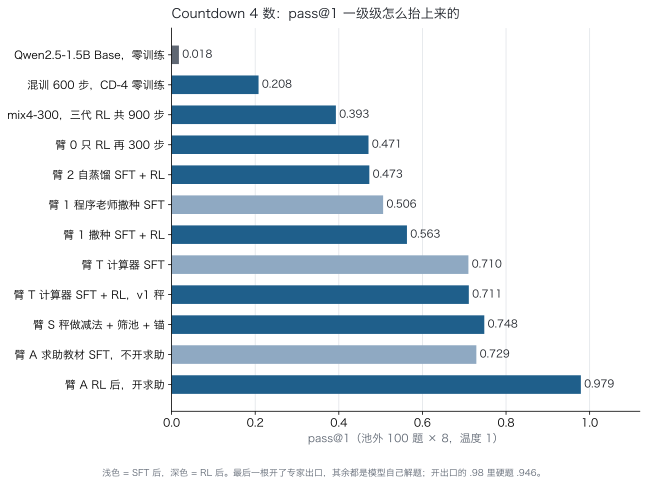
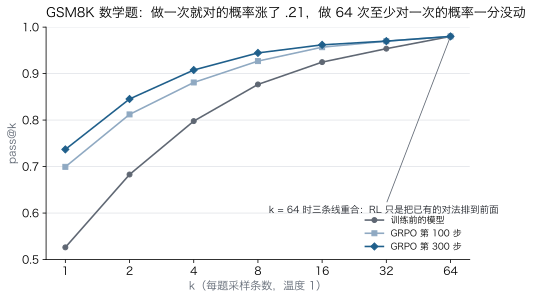
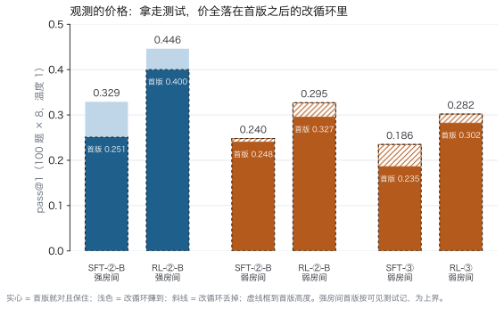
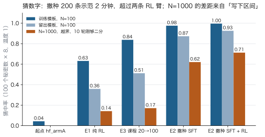
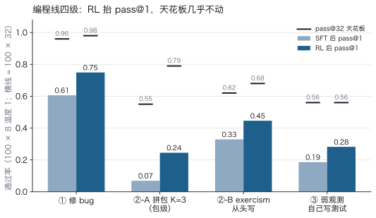
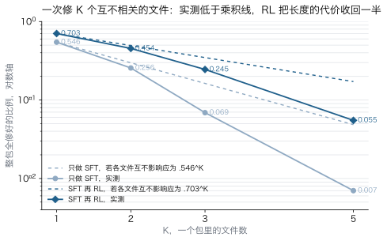
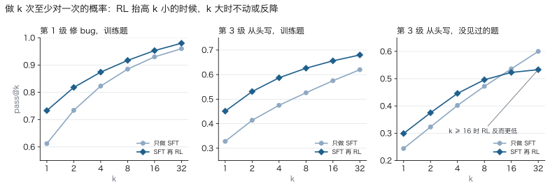
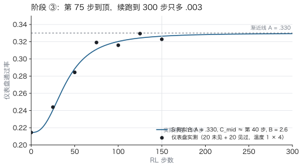
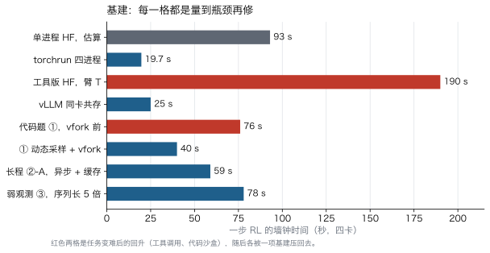

# 从零预训练到 coding agent

**四张 RTX 4090 上的十五个实验：一次只变一个量，跑前写预测，跑完对账**

作者：Qirun Li　·　时间：2026 年 8 月 26 日至 9 月 22 日　·　整理：Claude（对话式协作）

> 这份报告是实验记录 `PLAN.md`（一万一千行）的整理稿。每个实验都给出设置、数据、图和结论，数字全部来自原始记录；跑前写下的预测和跑完的对账一并保留，✓ 和 ✗ 都在。所有结论限定在这里用到的模型规模（95M 到 1.5B）和这些任务上，不外推到更大的模型。

---

## 0. 一页纸

**做了什么。** 从 Stanford CS336 学起，在四张 4090 上从零预训练两个英文模型（95M、201M），做 SFT，然后转到 RL：先在 GSM8K 上复现 GRPO，再用 Countdown 数字游戏追 DeepSeek-R1 的「顿悟」，一路把这个任务的 pass@1 从 0.02 抬到 0.75，开专家出口后 0.98；接着做第一个有状态的环境（猜数字），最后进入编程 agent：修 bug、拼包、从头写真实模块、拿走测试让模型自己验证，共四级。

**怎么做的。** 每个实验只变一个量；跑之前把预测写下来，跑完对账；每个模型都报 pass@1（可靠性）和 pass@32（天花板）两个数；每个阶段都做作弊探针；四十多条预测的命中记录留在附录里。

**先定三个词和一个口径。** 支撑集：模型的采样分布里概率不可忽略的那些解法的集合，本文用 k 较大时的 pass@k 代表它，编程线取 pass@32，Countdown 线取 pass@64。观测强弱：强观测是推理时环境跑作者写的测试并回判决，弱观测是环境不给测试、模型只能自己写断言去跑。采样口径：pass@1 是温度 1 每题采 8 条的平均，pass@32 是每题 32 条的无偏估计；池外 100 道题，1σ 约 .03 到 .04，小于它的差一律读作平。

**为什么固定在 1.5B。** 底模规模是刻意固定的，为的是把 SFT 和 RL 的效应从规模效应里分离出来：同一个底模、同一把秤、一次只变一个量，差异才能归因。这不是缩放研究，也不是小模型的成绩对比；所有结论限定在这个规模和这些任务上，「1.5B 手里不值分」「装不进」都是对这个容量的描述，换容量要重新量。

**得到什么。** 六条贯穿全程的规律，每条都有自己的数：

| 规律 | 一句话 | 证据 |
|---|---|---|
| RL 在支撑集内挪 | pass@1 涨、pass@k 天花板不动；开路只在 1/k 边缘 | GSM8K pass@64 三模型都 .980；②-B 留出 pass@32 反降 |
| 三段分工 | 预训练给零件，SFT 给流程，RL 给偏好 | 200M SFT「会停 ≠ 会答」；三臂：自蒸馏 = 只 RL，撒种 +.09 |
| 秤的形状决定学到什么 | 过程奖励被钻；只奖终局 + 筛池 + 锚，RL 从学坏变成安全小涨 | 臂 3 判分器 126 步被钻；臂 S 定论 ⑯ |
| 观测的价格 | 同题同秤只拿走测试：SFT −.09、RL −.16、天花板 −.06，价全落在改循环 | 阶段 ③ |
| 改是零件不是习惯 | 改一轮变好率 10 到 20%，跨三个设置、SFT 前后、RL 前后都不动 | ②-A、②-B、③ |
| 开路 = 支撑集密度 × 反馈密度 × 采样预算 | 反馈越密，越弱的先验也能开路 | Countdown 盲走要撒种；猜数字纯 RL 从 4% 长出二分 |

**三张主图。**

三张图的读法分别见 3.10 节末尾、3.4 节和 3.15 节。

---

## 1. 路线图

### 1.1 时间线

| # | 日期 | 实验 | 底模 | 关键数 | 定论 |
|---|---|---|---|---|---|
| 1 | 08-26 起 | CS336 自学，不看视频全靠对话 | | 讲完 L1 L2 L3 L9 L11 | |
| 2 | 08-27 / 08-28 | 从零预训练两次：95M / 1.5B token，201M / 10B token | 自训 | 困惑度 30.17 / 18.10 | 跑赢 Chinchilla，输 GPT-2 small .148 |
| 3 | 08-30 | 200M 上 SFT，Alpaca，2×2 对照 | 自训 201M | 恰当回应 0/7 → 5/7 | 会停 ≠ 会答；后训练不看 val loss |
| 4 | 09-01 / 09-02 | GSM8K GRPO 两轮 | Qwen2.5-1.5B-Instruct | 贪心 .687 → .767；pass@64 .980 不动 | RL 只重排不创造；熵坍缩 |
| 5 | 09-02 | Countdown 3 数，R1-Zero 复现 | Qwen2.5-1.5B Base | .035 → .405，长度 186 → 48 | 捷径；条件性策略绑定 |
| 6 | 09-02 至 09-04 | 混训 Countdown + GSM8K 四段 | 同上 | CD-3 .405 → .61；mix4-300 CD-4 .393 | 堵住捷径；顿悟的功能形态出现，长思维链没有 |
| 7 | 09-04 至 09-06 | 三臂 CD-4 + 臂 3/3′ 只换奖励 | mix4-300 | 只 RL .471 / 自蒸馏 .473 / 撒种 .563 | 新零件只来自老师；过程奖励被钻 |
| 8 | 09-07 至 09-08 | 计算器工具，臂 T，第一个 harness | 同上 | SFT .506 → .710；RL .711 | ⑮ 零件修好后 RL 只剩塑走 |
| 9 | 09-08 | 臂 S，秤做减法 + 筛池 + 锚 | 同上 | .754；CD-3 天花板 .92 → 1.00 | ⑯ RL 在可达集内挪 |
| 10 | 09-10 至 09-11 | 臂 A，限量问专家 | 同上 | 开求助 .979，硬题 .946；换措辞 .966 → .036 | ⑰ 做法绑措辞；专家 = 硬题全部收益 |
| 11 | 09-11 | E 猜数字三臂，第一个有状态环境 | hf_armA | 纯 RL .63 / 课程 .84 / 撒种 .976 | ⑱ 显式状态来自教材 |
| 12 | 09-11 至 09-13 | ① 短程强观测：修 bug | Qwen2.5-Coder-1.5B | SFT +.55，RL +.12，pass@32 不动 | ⑲ ⑳ |
| 13 | 09-14 至 09-15 | ②-A 长程强观测 1：独立拼包 | 同上 | p^K；文件级 pass@32 +.02 | ㉑ 到 ㉖ |
| 14 | 09-15 至 09-16 | ②-B 长程强观测 2：exercism 从头写 | 同上 | SFT .329 → RL .446；留出 pass@32 .600 → .533 | ㉗ 涨在首版、绑题、削尾巴 |
| 15 | 09-17 | ③ 长程弱观测：自己写测试 | 同上 | SFT .186 → RL .282；强房间对照 .446 | ㉘ 观测的价格 |

### 1.2 动机链：每一步的下一步都是上一步的欠债

1. 从零训 95M：亲手走通预训练管线，困惑度 30 对 GPT-2 small 的 26 → 问后训练怎么做。
2. 200M SFT：装对话格式；发现后训练不能看 val loss 选模型 → 要一个能自动打分的任务。
3. GSM8K GRPO：pass@1 .53 → .74，贪心只 +.08，格式自发涌现，熵坍缩 → 「RL 消灭差路不改进最优路」，但学了什么说不清 → 要更可控的任务。
4. Countdown 3 数：RL 后答案变短、推理消失 → RL 改的是特定上下文下的行为 → 追问顿悟的条件。
5. 混训：任务必须真需要搜索且起点非零，CD-3 太易 RL 消灭推理 → 换 CD-4。
6. 三臂 CD-4：自蒸馏 = 只 RL，撒种 +.09 → 新零件只有老师给 → 追问奖励能不能教过程。
7. 臂 3 只换奖励：过程判分器 126 步被钻 → 以后只用终局奖励 → 剩下的错在哪。
8. 计算器 / 臂 T：失败全在算错的行 → 外包给计算器，值从 .45 到 1.00，搭出 harness；RL 后反而学坏 → 护种、换秤、换老师三选。
9. 臂 S：只奖不罚 + 题筛 + 锚 → 安全小涨、pass@64 不动 → RL 在可达集内挪；硬题仍全错 → 要外部信息。
10. 臂 A：教材装到位、RL 只剪失控、专家是硬题全部收益、代价是工具依赖；第一个多轮动作 → 定下「agent + RL」的方向。
11. E 猜数字：最小 agent 环境；纯 RL 从 4% 长出二分、课程赢硬地、撒种最好、N=1000 靠「写下区间」→ 显式状态来自教材，harness 通用化 → 可上真任务。
12. 定编程线：观测强弱 × 路长短两根轴，编程环境能一路拧到底，产品在这条线上 → 四格课程。
13. ① 修 bug：跑通循环、沙盒、秤；零样本 ≈ 0 → 冷启动必需；SFT +.55 RL +.12；pass@32 不动；严秤 + 作弊探针 → 追问路变长会怎样。
14. ②-A 拼包：故意独立好和 p^K 比；乘法效应、状态行无效、bin 和 frac 同终点、文件级 pass@32 +.02 → 原计划注入耦合，改成真实模块。
15. ②-B exercism 从头写：往真实走一步；SFT .33 RL .45 涨在首版；pass@32 涨的全在见过的题、绑题一半、留出削尾巴 → 欠债：题池小、改没动。
16. ③ 弱观测：拿走测试考自己造验证，顺手扩池治绑题；动作装上、RL 留住、但不值分，判和修是零件 → 三选：断言少而准 / 老师当秤 / 4B。

一句话：顿悟说不清 → 找可控任务；自蒸馏无效 → 找老师；过程奖励被钻 → 只用终局；算错 → 上工具；学坏 → 修秤；硬题无解 → 问专家；单轮不够 → 多轮；玩具够了 → 真任务；短程量清 → 拉长；长程强观测量清 → 拿掉观测；动作装上 → 缺零件。下一个欠债：零件从哪来。

---

## 2. 方法

### 2.1 实验流程模板

每个实验按七步走，这七步是十五个实验做完以后总结的，前面的实验并不都完整走过：

1. **问题、变量、预测。** 一次只变一个量；预测写在跑之前，跑完对账。
2. **实验台**，十件：造题器（题从哪来、带标准答案）、验证器（沙盒 runner）、环境（有状态、收动作、回观测）、秤（交卷时给几分）、harness（生成、停、执行、注入、屏蔽的循环）、模板（题面措辞，训练与留出分开）、留出集（第一天定：题、模板、bug 类型）、防线（秤怎么防钻）、单测（假模型走几局验以上全部）、读数（评测报告里的行为指标，按位置、死法、写法形态、组分布）。
3. **两个探针。** 能力探针量 p；作弊探针量秤有没有洞，RL 之后再做一次。
4. **教材。** 来源（程序老师 / 蒸馏 / 自采样筛选）、要教的清单从探针的死法来、留出模板不进教材。
5. **SFT + 评测**，K 曲线、留出、死法。死法分两类：习惯类 RL 能压，缺招类回到第 4 步。
6. **RL 两趟**（同配方重复一次才有噪声地板）+ 评测；跑前先冒烟；基建改动只改速度不改分数，改完先验「分数一样只是快」。
7. **定论、预测对账、欠的债**，欠的债是下一轮第 4 步的来源。

### 2.2 评测口径

- **pass@1**：温度 1，每题 8 条，100 道池外题，报 800 条的平均。1σ 约 0.03 到 0.04，小于它的差一律读作平。
- **pass@k 天花板**：同 100 题每题 32 条（Countdown 线用 64 条），无偏估计。pass@1 量可靠性，pass@32 量天花板，两者的缝决定该跑 RL 还是换底模。
- **贪心**只当训练仪表盘，不进结论：贪心会藏涨幅（GSM8K 贪心 +.03，温度 1 +.22）。
- **留出**分三种：留出题、留出模板（措辞）、留出 bug 类型，第一天定。
- **长程任务**在原子粒度上量：拼包按文件级、包级各报一份。

### 2.3 环境的定义

环境 = 模型行动的那个世界，三个特征缺一不可：有状态（记着现在的样子）、收动作（只能通过规定的动作改它）、回观测（回应取决于当前状态）。判据一句话：同样的动作做两次，回应会不会不一样。会 → 环境；不会 → 工具（计算器、验证器，给什么算什么，不记事）。秤读最终状态打分，自己不是环境；harness 是连接模型和环境的管子。环境设计是六个决定：状态、动作和价格、观测强弱、题目来源、秤和防线、预算。

---

## 3. 实验详述

### 3.1 实验 1：CS336 自学（2026-08-26 起）

Stanford CS336「Language Modeling from Scratch」（2025 春，17 讲），不看视频，全靠对话讲。走的顺序是 01 → 02 → 09 → 03 → 11，把缩放律提到架构课之前，先有参数预算再分配。讲完 L1 分词、L2 资源核算、L3 架构与超参、L9 缩放律一、L11 缩放律二；顺带摸到 L4 MoE、L10 推理、L13 到 14 数据、L16 到 17 对齐 RL；没讲 L5 到 L8 系统四讲、L12 评测、L15 SFT/RLHF。L2 和 L3 第一遍太抽象，重讲一遍才通，从此定下讲法：表格、能验算的数字、复述后纠正。

每一讲后来都落到了代码上：L1 的病态分词案例在自己的数据上复现；L2 的 6ND 和 16 字节每参数写成 `estimate.py`；L3 一字不差写进 `model.py`；L9 的 Chinchilla 定了 95M 配 1.5B token；L11 的数据受限缩放在第二轮量到重复 1.66 遍的代价。

### 3.2 实验 2：从零预训练两次（08-27、08-28）

**为什么做。** 亲手走通数据、分词、训练、评估、推理的全流程，并且验证 CS336 教的核算公式在自己的机器上准不准。

**硬件与核算。** 4×RTX 4090 24 GB，PCIe 4.0，GeForce 的 P2P 被禁，四卡 all-reduce 实测带宽 3.7 GB/s，靠梯度累积压通信。第 0 步估 MFU 0.30，实测单卡 0.672、四卡 0.547；把 0.547 回填后预测每步 1.01 秒，实测 1.015 秒，核算模型从此可信。一处修正：6ND 不含 attention 项，真实 FLOPs = 6ND × (1 + T/(6C))，多 22%，不能忽略。

**两轮配置。**

| | 第一轮 | 第二轮 |
|---|---|---|
| 参数量 | 95,233,536 | 201,035,520 |
| C / n_layer / n_head / d_ff | 768 / 8 / 12 / 2048 | 896 / 16 / 14 / 2432 |
| 词表 | GPT-2 BPE 50257，绑定嵌入 | 同，保持可比 |
| 上下文 | 1024 | 1024 |
| 训练 token / D:N | 1.5B / 15.8 | 10B / 49.7，独立 6.0B，重复 1.66 遍 |
| 每步 token | 16 × 8 累积 × 4 卡 = 524,288 | 同 |
| lr / warmup | 6e-4 → 6e-5 cosine，warmup 200 | 5e-4，warmup 500 |
| 优化器 | AdamW β(0.9, 0.95)，wd 0.1，clip 1.0 | 同 |
| 精度 | bf16 autocast + torch.compile | 同，加 bf16 梯度压缩 |
| 步数 / 时长 | 2,861 步 / 48 分钟 | 19,073 步 / 10.4 小时 |
| MFU / 显存 | 0.547 / 9.9 GB | 0.58 到 0.60 / 17.3 GB |

架构按 L3：RMSNorm 在 fp32 里算平方和、SwiGLU、RoPE、SDPA 走 FlashAttention、pre-norm、权重绑定、残差出口初始化 std = 0.02/√(2·n_layer)。数据 FineWeb-Edu sample-10BT，实测 4.62 字节每 token，文档间插 EOT，train 与 val 物理隔离在不同 parquet 文件。

**结果。**

| 模型 | 参数 / token | val loss | 困惑度 | 和 Chinchilla 公式比 |
|---|---|---|---|---|
| 第一轮 | 95.2M / 1.5B | 3.4068 | 30.17 | 公式 3.5845，跑赢 .178 |
| GPT-2 small，同一份 val | 124.4M / 约 9B | 3.2587 | 26.02 | |
| 第二轮 | 201M / 10B | 2.8961 | 18.10 | 公式 2.9516，跑赢 .056 |

第一轮输 GPT-2 small 0.148，用 L9 的公式拆开：本模型享受 FineWeb-Edu 的数据质量红利 −0.178，GPT-2 在这份数据上有分布偏移惩罚 +0.181，预测差距 0.148 与实测一致，判据 0.148 < 0.3 算训练成功。第二轮算力乘 10.8，loss 降 0.51，困惑度降 40%；但对公式的红利从 0.178 缩到 0.056，缩水的 0.122 就是重复 1.66 遍数据的代价，这是 L11 数据受限缩放在自己模型上量到的一个点。

**语言能力和事实知识分家。** 两轮都会说话，都不会事实：第一轮「法国的首都是埃及」，第二轮「巴黎的协和广场，在布列塔尼」。第二轮的错变了性质，实体全真、全在正确的语义邻域，只有关系是编的，学会了知识的形状没学会内容。按 2 bit 每参数算，扣掉词表约 14 MB 的知识容量，是维基百科的 0.07%。

**推理侧的一个反直觉。** 给模型加了 KV cache，CPU 上 3 倍加速，GPU 上 157 对 153 tok/s 量不出差别：瓶颈是 kernel 启动，每步 6.35 ms 里真正在算的只占 0.02% 到 1.8%，这个模型要上下文超过 5,500 才划算。

**预测对账。**

| 预测 | 实际 |
|---|---|
| MFU 0.30 | 0.547 四卡，0.672 单卡 ✗ 低估 |
| 第一轮 1.47 小时 | 48 分钟 |
| 显存 9.0 GB | 9.9 GB ✓ |
| 第二轮 loss 约 2.77，困惑度约 16 | 2.8961，18.10 ✗ 重复数据的代价没算进去 |
| 第二轮 10.2 小时 | 10.4 小时 ✓ |

**教训。** checkpoint 只在 val 改善时存，崩一次丢全部，改成每 100 步无条件存加 Ctrl-C 四卡对齐停盘；DDP 和 compile 各给 state_dict 加前缀；生成出现重复循环先怀疑解码再怀疑模型；三次被显示误导（进度条哨兵、capture-pane 混算步时、告警阈值），看反常数字先问它怎么算出来的。

### 3.3 实验 3：200M 上的 SFT，Alpaca，2×2 对照（08-30）

**为什么做。** 验证「行为层几千条就能激活」这一层：把只会续写网页的 201M 变成问什么答什么，并且预期知识不会因 SFT 变对。

**设置。** 基座第二轮 ckpt_final（val 2.8933）；Alpaca 52,002 条，过滤回答短于 4 token 后 49,797 训练 / 500 验证，只对回答算 loss（占 token 的 67%）；lr 3e-5，wd 0，cosine 加 warmup 400，batch 8，max_len 512，3 epoch 共 18,672 步，单卡 23.7 分钟。留两个 checkpoint：val 最低的第 1,000 步（1.9233，欠训）和最后一步（2.4116，过训）。评测是 2×2 网格，基座或 SFT 权重乘原始问题或 Alpaca 格式，7 道分布内题人工判，再加 5 类分布外题。

**成本估错 9 倍**，这是第一个被写进台账的预测失败：估 2.6 分钟，实际 23.7。原因四条：卡数 4 变 1、token 数估高 4 倍、MFU 从 0.59 掉到约 0.19、padding 浪费 2.7 倍。SFT 必须单卡：每步 all-reduce 402 MB 要 163 ms，与 batch 无关，预训练每步算 1,900 ms 通信占 8%，SFT 每步算 22 ms 通信占 88%，四卡反而慢 2.1 倍。

**结果。**

| 组合 | 自己停下 | 平均长度 | 恰当回应 |
|---|---|---|---|
| 基座 + 原始问题 | 0/7 | 90.0 | 0/7 |
| 基座 + Alpaca 格式 | 2/7 | 76.4 | 0/7 |
| SFT + Alpaca 格式 | 6/7 | 34.3 | 5/7 |
| SFT + 原始问题 | 6/7 | 38.3 | 2/7 |

第一行和第二行几乎一样，光套格式没用；第二行到第三行的变化全部来自 1,000 步训练，77 秒，预训练算力的 0.13%。第四行是关键读数：会停 6/7 但恰当 2/7，「法国的首都」答成「法国位于欧洲，两千万人口」。停下来是一个局部统计规律烧进了权重；「识别这是一个问题」绑死在 `### Response:` 这个标记上，chat template 用错不报错，只是半残。

**欠训对过训。** 分布外五组：词题过训胜、假前提平、多轮追问欠训胜（过训答出 2+2=5，模板压过了指令）、长文总结欠训胜、中文平，1 比 2 加两平。两个模型都把中文忘成了英文，温和的灾难性遗忘。

**val loss 不能用来选后训练的模型。** 过训模型 val loss 高 0.49，多数题却答得更好，因为它更自信，答偏时罚得更狠，p(正确 token) 从 0.10 到 0.01 的 loss 差是 2.30 对 4.60。预训练看 loss，后训练看行为，这一条决定了下一步要找一个能自动打分的任务。

**结论。** 会停不等于会答；SFT 的 val loss 不预测行为；3 epoch 过拟合的代价有但可控。下次改：epoch 3 变 1，加 IFEval，packing 省 2.7 倍。

### 3.4 实验 4：GSM8K 上的 GRPO 两轮（09-01 至 09-02）

**为什么做。** 复现 R1-Zero 的「顿悟」，把 L16 和 L17 变成实物。不用自己的 201M，因为它在 GSM8K 上正确率约 0，8 条全错优势全零，训练根本不启动，RL 是放大器不是发电机。

**设置。** Qwen2.5-1.5B-Instruct（28 层，C 1536，GQA 12/2 头，词表 151,936）；GSM8K train 7,473 / test 1,319；判分器 3 行正则比最终答案，奖励纯 0/1，不加格式奖励。每步 8 题 × 8 条 = 64 条，微批 4 累积 16，max_new 1024，温度 1，全参加 8-bit Adam，KL β 0.001，一批只更新一次所以省掉 clip。两轮：lr 1e-6 跑 150 步中止，lr 5e-6 跑 300 步，171 分钟，采样占 85% 到 89%。基线温度 1 的 pass@1 .456、pass@8 .855，贪心 .705。

**两轮对比。**

| | lr 1e-6 | lr 5e-6 |
|---|---|---|
| KL 末值 | 0.0016 | 0.18 |
| logP | −0.78 → −0.785 | −0.78 → −0.22 |
| 训练正确率 | .586 → .647 | .586 → .812 |
| 贪心 TEST[0:200] | .705 → .670 | .705 → .805 峰值 → .735 |

1e-6 那轮 150 步累积位移 1.5e-4，权重量级 0.02，相对 0.75%，代码没错，学习率太低。

**切片偏差与无偏结果。** TEST[0:200] 上每 25 步评一次、挑最大的 ckpt_best 是有偏的：12 次观测均值 .7525、SD .0223，那个 .805 是 +2.35 SD 的运气。换到从未用过的 TEST[200:500] 贪心 300 题：原始 .6867、第 100 步 .7267、第 300 步 .7667，+.080，McNemar z = 3.21，p ≈ 0.0013；「224 步后退化」不成立，第 300 步就是最好的。

**pass@k，TEST[200:250] 50 题 × 64。**

| k | 原始 | 第 100 步 | 第 300 步 |
|---|---|---|---|
| 1 | .5262 | .6994 | .7369 |
| 8 | .8767 | .9269 | .9445 |
| 32 | .9536 | .9697 | .9699 |
| 64 | .9800 | .9800 | .9800 |

三条线在 k = 64 重合在 .980，漏的是同一道题。RL 把 pass@1 抬了 .21，天花板一分没动：只重排，不创造。这是全程第一次量到「RL 在支撑集内挪」，后面十一个实验反复验证它。

**熵坍缩。** 温度 1 的 pass@1 .456 → .674，贪心 .705 → .735，两者的差从 .249 缩到 .061，缩 75%；logP −0.78 → −0.22，有效选择数从 2.18 到 1.25；长度 273 → 247；犹豫措辞 13.9% → 5.6%。「####」结束符没有任何格式奖励，自发从 56% 涨到 97%。

**翻转分析。** 300 题里 56 道翻转：错变对 40，对变错 16，修复率 42.6% 对破坏率 7.8%。修好的 4/4 抽样全是「漏条件 → 读全」；弄坏的是代数手滑、漏最后一步、比较错、周月混淆。一道题两次错误抵消蒙对、训练后一错答错，说明「答对」不等于「推理对」，+.080 可能低估。「RL 学会硬凑答案」的假设被数据推翻。

**采样半径。** 能被 RL 碰到的题要 p > 0.693/k：k = 8 训练时 p > 0.087，k = 64 测量时 p > 0.011，中间那段训练够不着，所以 Δpass@64 = 0 是必然。可证伪预测：用 k = 64 训练，pass@64 会动。

**七条结论。** 学习率是决定性的；RL 有效且显著；只重排不创造；机制是读题更完整；代价是熵坍缩；格式自发涌现；方法论上见顶回落是 200 题的噪声，同一份数据又选又评虚高约 .02。

**预测对账。**

| 预测 | 实际 |
|---|---|
| pass@8 略降 | +.080 ✗ |
| 修好的案例是少犯算术错 | 全是漏条件 ✗ |
| RL 学会硬凑 | 犹豫措辞反而降，方向相反 ✗ |
| 贪心 +.03 到 .05 | +.080 ✗ 低估 |
| pass@64 差 < .03 | 0.0000 ✓ |
| 温度差距 .25 → .06 | .1605 → .0298 ✓ |
| logP 约 −0.25 | −0.22 ✓ |

**工程。** 四卡采样第一版用线程，慢 4.5 倍，HF 的 generate 不释放 GIL；改成 torchrun 四进程各采各算再 all-reduce 求和，19.7 秒一步，快 4.7 倍，88% 的功劳是绕开 GIL，不需要同步权重因为梯度相同权重天然一致。

### Countdown 线：公共口径

底模 Qwen2.5-1.5B Base；GRPO，四卡 torchrun 多进程手动 all_reduce。判分器 v1 = 格式 0.05 + 解析 0.05 + 数字比例 0.15 + 正确 0.75；优势 = r − 组均值，不除标准差；一次 rollout 一次更新，没有 PPO 裁剪。题池 countdown.json / countdown4.json 各十万道，[0:90000] 训练，[95000:95100] 池外测试；GSM8K 用 train 训、test[0:200] 做跨任务。评测口径：Countdown 温度 1，100 题 × 8，天花板用 × 64；GSM 贪心 200 题，R1 模板（训练时用的）和中性模板各一份。两次口径事故记在案：09-03 前的池外测试用的是 [0:100]，在训练池内，全部换成 [95000:95100] 重测；09-04 发现标注精度的正则只数每段第一条，真实精度 0.42 到 0.53 而不是 0.70。

### 3.5 实验 5：Countdown 3 数，R1-Zero 复现，加跨任务 2×2（09-02）

**为什么做。** 上一轮 GSM8K 贪心只 +.08，且 Instruct 模型已经会思维链，看不出「涌现」。改用 Base 模型不经 SFT 直接 RL，验三条假设：H1 长度增长，H2 纠错措辞涌现，H4 阶梯自下而上饱和。4 数基线 .0175 训不动，降到 3 数。

**设置。** CD-3；每步 8 题 × k 16 = 128 条；lr 5e-6；β 0.0005；max_new 512；AdamW 8-bit；300 步 94 分钟，约 19 秒一步。

**结果。**

| 贪心 eval | 起点 | 峰值第 275 步 |
|---|---|---|
| 答案正确 | .035 | .405 |
| 格式 / 解析 / 数字用全 | .900 / .900 / .695 | 1.000 / 1.000 / 1.000，第 110 步饱和 |
| 长度 | 186 | 48 |
| 反思措辞出现率 | .146 | .005 |

H4 成立，H1 反向，H2 被消灭。第 15 步就能诊断：带 wait 的轨迹比不带的平均低 .03，15 步里 12 步为负，p = 0.018，预测措辞会被训没，300 步兑现。解释：3 数只有 3! × 4² × 2 = 192 种组合，是模式匹配不是搜索；奖励里没有一项奖励思考，「闭嘴直接答」是环境过拟合，不是钻秤。

**跨任务 2×2，GSM8K test[0:200] 贪心。**

| | R1 模板，训过 | 中性模板，没训过 |
|---|---|---|
| 正确率 Base → RL 后 | .52 → .16 | .48 → .35 |
| 长度 | 183 → 71 | 257 → 272 |
| McNemar 训坏 / 训好 | 84 / 12，z = 7.35 | 36 / 10，z = 3.83 |

−.36 拆成两份：灾难性遗忘 −.13，两个模板共享，长度不掉；条件性策略绑定 −.23，模板特异，长度掉 61%。判别规则：长度不变加下跌是遗忘，长度暴跌加下跌是绑定。RL 改的是特定上下文下的行为。教训一条：20 题初跑中性模板 .25 对 .25 误判「能力没坏」，硬规则，样本少于 100 不下 Δ ≈ 0 的结论。

**路线。** 遗忘靠 KL、LoRA 或混原分布；绑定靠多环境混训，主判据是长度分化；追顿悟三条件：任务真需要搜索、起点非零、反思措辞的优势差不显著为负。

### 3.6 实验 6：混训 Countdown + GSM8K，四段到 mix4-300（09-02 至 09-04）

**为什么做。** 检验「捷径来自 38,400 条轨迹共享同一上下文」：把 GSM8K 混进来，两种题要不同的长度，看模型会不会学成按题目分配长度。

**6a，mix-300。** 每步 4 CD + 4 GSM × 16，lr 5e-6，β 0.0005，max_new 512，110 分钟。

| 步 | CD 正确 / 长度 | GSM 正确 / 长度 |
|---|---|---|
| 0 | .010 / 188 | .460 / 202 |
| 100 | .140 / 383 | .780 / 180 |
| 275 峰值 | .270 / 461 | .800 / 176 |

捷径没形成：单任务 CD 长度 249 → 71，混训 263 → 335。但预测的「分化超过 100」方向反了，两个任务一起变长，模型学成的是对两种题都用的长推理风格。跨模板：R1 模板 .71，中性 .47，遗忘从 −.13 到 −.01，但 GSM 的提升不迁移到中性模板，绑定是对称的。

**顿悟拆开看。** 池化的反思优势差约 0 是两个效应抵消：试错 3 到 5 次那一桶正确率 .342 对不试的 .210，z = 2.56；6 次以上跑飞 .184。说「perfect」的轨迹真对率 .017 → .362。「X = V (too high)」这种标注从 9 处到 87 处，精度 .667 → .816，其中 82% 算式算对方向也标对。原文两句：「验证是真的，不是表演」「RL 把说 too high 从装饰变成了真的算一遍再比」。结论：混训模型已经有了顿悟的功能形态，算一个候选、报值、跟目标比、标方向、调整、命中，只是词不是 wait 和 hmm，是 too high、too low、perfect match；不是没涌现，是探针一直在测错的词。这些词 Countdown 的题面里没有，RL 一个新词都没发明，它只能在模型已经会说的话里挑。

**6b，续训到 425。** 加停止串和补 EOS，47 分钟。顿悟探针前 20 步对后 20 步：标注每条 .16 → .43，精度 .74 → .71，3 到 5 次桶 .353 → .532，CD 温度 1 正确率 .27 → .47。判读原文：「数量涨 2.7 倍、精度稳、剂量为正，顿悟在被放大」；贪心长度 279 → 344，R1 的 H1 在混训加干净测量下出现了，幅度 +23%，远小于 R1 的 2 到 3 倍。换到池外 [95000:95100] 重测：pass@1 .361，pass@8 .650；严格标注轨迹的占比 Base 0.4% → 275 步 2.9% → 425 步 27%。

**6c，续训到 600，加长度软惩罚 300。** CD-3 贪心 .36 → .61，长度 344 → 178；探针正确率 .47 → .59，跑飞桶从 .325 到 .215。池外分桶：跑飞的 43% 轨迹没变少，惩罚只治了撞顶那一件；「瓶颈在候选生成不在验证，CD-3 上能教的教完了，剩下 32% 的题卡在搜索广度，从不试乘除」。

CD-3 池外 pass@k，Base 对 600 步：

| k | 1 | 8 | 16 | 32 | 64 |
|---|---|---|---|---|---|
| Base | .016 | .121 | .224 | .387 | .590 |
| 600 步 | .456 | .694 | .748 | .795 | .830 |

两条曲线外推在 k ≈ 500 汇合：RL 抬高所有有限 k 的 pass@k，不抬 pass@∞。

**6d，换 CD-4 训 300 步，得 mix4-300。** 从 600 步起，数据换 countdown4，长度软惩罚 400，GSM 一半，105 分钟。

| CD-4 池外 800 | 600 步零训练 | mix4-300 |
|---|---|---|
| pass@1 / pass@8 | .208 / .610 | .393 / .670 |
| 数字用全 | .675 | .950 |
| 全对 / 全错 / 有对有错 | 0 / 39 / 61 | 10 / 33 / 57 |
| 长度中位 | 242 | 222 |

长度没涨反而缩了，293 → 209。原文：「结果奖励下，对的短答案和对的长答案同分，RL 收敛到够用的最短；长思维链是任务要求出来的，不是 RL 长出来的」。后来臂 0 松开长度惩罚到 800，长度 220 → 357，所以这句有一半是 len-soft 400 压出来的，松开会拉长搜索，但回报只 +.05。涨幅 56% 来自试错 3 到 5 次那一桶；perfect 宣告 221 条里 56% 是假的。33 道全错里 26 道必须用乘除，模型缺一个程序：穷举、记账、算准、换运算符。只能撒种，进入三臂。三代 RL 共 900 步，KL 0.04，GSM 无累积遗忘。

**这一段的定论。** 反思搜索的形态全了，是真的，在放大；策略没长。长思维链 CD-3 上没有，CD-4 上刚开始。任务定长度，不是 RL 长出来的。1.5B 不给的是算术精度。

### 3.7 实验 7：三臂 CD-4，加臂 3 和 3′ 只换奖励（09-04 至 09-06）

**为什么做。** 同起点 mix4-300、同 RL 预算，把三样东西分开：多训 300 步本身、新零件（程序老师撒种）、SFT 收紧（自蒸馏）。臂 3 系列只换判分器，问过程奖励能不能教过程。

**设置。** RL 统一：8 题 × 16 条，300 步，max_new 1024，长度软惩罚 800，β 0.0005 锚 Base。臂 0 从 mix4-300 直接 RL；臂 1 先 SFT 程序老师的轨迹再 RL；臂 2 先 SFT 自采样筛出的轨迹再 RL。教材：CD-3 和 CD-4 各 2000 题号，两臂同题号。臂 1 的老师是穷举器 `enum_traces.py`：加减形态各一次、上下界句、乘除第 1 和第 2 层，CD-4 轨迹 token 中位 185、P90 605。臂 2 用 mix4-300 温度 1 每题抽 8 留一条对的，覆盖 .77 和 .70。体检：老师精度 1.00 对自采样 .77 和 .48，重复 0 对 5% 和 13%，含乘除 .29 对 .12。SFT：lr 1e-5，2 epoch，有效 batch 32，max_len 1600；臂 1 val .655 → .075，臂 2 .1535 → .1505。

**SFT 后。**

| | mix4-300 | 臂 2 自蒸馏 SFT 后 | 臂 1 撒种 SFT 后 |
|---|---|---|---|
| CD-4 pass@1 / pass@8 | .393 / .670 | .409 / .700 | .506 / .720 |
| CD-4 长度 / 撞顶 | 222 / 0.9% | 219 / 0 | 344 / 28.1% |
| CD-3 pass@1 / pass@8 | .476 / .660 | .511 / .720 | .599 / .930 |
| CD-3 pass@64 / 全错 | .830 / 17 | .790 / 21 | 1.000 / 0 |

撒种一次把 CD-3 的天花板抬到 1.000，自蒸馏没抬。臂 1 的错几乎全是算错：答对轨迹的标注精度 .728，算错的 .502，方向反的只 .015。

**RL 后，池外 100 × 8，五臂并排。**

| | 臂 0 只 RL | 臂 2 自蒸馏 + RL | 臂 1 撒种 + RL | 臂 3 v2 秤 | 臂 3′ v2.1 秤 |
|---|---|---|---|---|---|
| CD-4 pass@1 / pass@8 | .471 / .710 | .473 / .690 | .563 / .750 | .416 / .670 | .544 / .660 |
| CD-4 全对 / 全错 | 12 / 29 | 15 / 31 | 29 / 25 | 11 / 33 | 34 / 34 |
| CD-4 数字用全 | .955 | .948 | .921 | .915 | .970 |
| CD-3 pass@1 / pass@8 | .511 / .700 | .518 / .720 | .503 / .740 | .486 / .690 | .444 / .630 |
| CD-3 pass@64 / 全错 | .830 / 17 | .840 / 16 | .950 / 5 | .800 / 20 | .900 / 10 |
| 假宣告轨迹占比 | 23% | 25% | 26% | 约 4% | 约 6% |

减法定案：RL 本身 +.08，自蒸馏 +.00，程序撒种在 RL 之上 +.09，天花板 CD-3 pass@64 .83 → .95。三次重复的无种 RL 都停在 .83 到 .84。臂 1 的 CD-3 pass@8 从 .93 被 v1 秤的 RL 吃到 .74，全错 7 → 26，这是塑走：RL 按训练任务的奖励把老师给的程序重新整形，概率压到采样半径以下，老师程序根基浅，4000 条对预训练加 900 步 RL。

**臂 3 和 3′，只换秤。** v2 秤：0.9 × 对 + 格式、解析、数字比例小项，减假宣告 0.2、错步率 0.1、重复行和违规行各 0.05。臂 3 从 mix4-300 起，前 126 步四个过程项全部归零：标注每条 4.9 → 0.5，假宣告 .17 → 0，错步 .50 → .02，正确率 .45 → .45。「四个过程项归零不是因为做对了，是因为没东西可判」，样例确认它换了标签写法绕过正则。v2.1 补了三处洞后的臂 3′ 从臂 1 的 SFT 起：每个过程指标都更好，标注精度 .80、假宣告 6%、算对率 .671；每个结果指标都更差，CD-4 .544，CD-3 pass@8 .63，pass@64 .90。「干净是用窄换的」：硬题结果分无梯度，按行惩罚成了全部信号，模型弃掉乘除步，罚错误等于罚尝试。三版秤修的都是「怎么错」，没动「能不能对」。

**结论八条。** 无种怎么 RL 都是 .83，撒种 1.00、RL 后 .95，撒种抬 pass@∞、RL 不抬；撒种加 RL 比只 RL 高 .09；只 RL 300 步 +.08，pass@64 不动；自蒸馏贡献 0；迁移任务上种被 v1 秤吃掉大半但仍高于无种；GSM 无遗忘；长度被压回 205 到 254 的均衡点，没有难易分叉；自信错答和重复用数是主要残余。过程奖励的定论：v2 被改格式钻空；v2.1 过程指标全达标、结果全线退；以后只用终局奖励。

**预测对账。** 12 条预测中 8 条：臂 0 pass@1 猜 .41 实 .47；臂 1 SFT 后 pass@1 猜掉到 .30 到 .40 实涨到 .506 ✗；撞顶超 20% ✓；臂 1 SFT pass@64 ≥ .95 ✓；标注精度 > .85 ✗ 实 .48；臂 1 RL 后 pass@1 ≥ .50 ✓、pass@64 ≥ .92 ✓、全错 ≤ 20 ✗、长度分叉 ✗；臂 2 pass@64 ≈ .83 ✓；臂 3′ pass@64 .85 到 .90 ✓。方法论：贪心 eval 藏涨幅，臂 1 贪心 .52 → .52，温度 1 池外 .506 → .563。

### 3.8 实验 8：计划 B，计算器工具，臂 T，第一个 harness（09-07 至 09-08）

**为什么做。** 三臂剩下的错几乎全是算错。把每一行的值交给计算器，问三件事：算术清零后撒种模型的搜索能走多远；工具行为能不能 RL 出来；搭出「停、注入、续、mask」的 harness，这是后面所有 agent RL 的基建。对照臂 1，唯一变量是每行的值由谁算。

**设置。** `<calc>expr</calc>` 停下，safe_eval，注入 `<result>V</result>`，续写；调用上限 48；自写 `<result>` 罚 0.2 并立停；SFT 里注入段 label −100，RL 里注入区间不进 loss；判分器 v1 加假结果罚。零样本探测：mix4-300 写 `<calc>` 0 条、自写 `<result>` 17 条，p(调用) = 0，必须冷启动。教材：同一个穷举器加 `--tool`，老师结构不变。SFT 四卡 15 分钟，val .71 → .059。硬题闭环三条：132 次调用全合法、方向全对，但三条都撞 1400 没写答案，「算对了就没有意外停下，穷举到撞顶」。RL 同臂 1 配方，max_new 1400，长度软惩罚 1100；rollout 换成 vLLM 后等价验证通过，温度 1 的 800 条 HF .710 对 vLLM .713，四卡 60 分钟变单卡 2.3 分钟。

**结果，池外 100 × 8。**

| | 臂 1 SFT 后 | 臂 1 RL 后 | 臂 T SFT 后 | 臂 T RL 后 |
|---|---|---|---|---|
| CD-4 pass@1 / pass@8 | .506 / .720 | .563 / .750 | .710 / .790 | .711 / .790 |
| CD-4 全对 / 有对有错 / 全错 | 22 / 50 / 28 | 29 / 46 / 25 | 65 / 14 / 21 | 62 / 17 / 21 |
| CD-4 数字用全 / 撞顶 | .61 / 28% | .921 / 0 | .733 / 16.6% | .935 / 0.5% |
| 调用每条 / 报错 / 假结果 | | | 15.8 / 0.13% / 0.4% | 10.0 / 8 条 / 1 条 |
| CD-3 pass@1 / pass@8 | .599 / .930 | .503 / .740 | .714 / .980 | .590 / .720 |
| CD-3 pass@64 / 全错 | 1.000 / 0 | .950 / 5 | 估 ≥ .98 | .920 / 8 |
| GSM R1 / 中性 | .755 / .565 | .755 / .50 | .760 / .625 | .745 / .625 |

同一个老师同一个起点，只换值由谁算，SFT 后 .506 → .710，+.20，比此前最好的臂 1 RL 后还高 .15。真实算错归零，方向反 2.9%。全错的 21 道全在老师身上：7 道老师 v1 不写镜像符号行，14 道乘除的第 1 层「最近优先」排序不可执行。

RL 之后 CD-4 一分没涨，CD-3 从 .714 掉到 .590，全错 2 → 28，第 2 层被剪、这 28 道全死。机制：SFT 把老师程序学成了确定性策略，全对的 65 道 8 条逐 token 相同，温度 1 下无探索，86% 的组优势全零，RL 只有 14% 的组有梯度；全错组里唯一的方差是「写了错答案得 .10 到 .25 对没写得 0」，v1 秤这一级阶梯教的是放弃。

**结论。** 定论 ⑬ 工具把算术清零后剩下的失败全在老师；⑭ SFT 把程序学成确定性策略，RL 没有抓手；⑮ 零件修好之后，RL 在 v1 秤上没有正面作用，只剩塑走，「任何错 > 不答」这一级阶梯在策略确定、硬题无解时教的是放弃；长度压力加不在训练集里的任务等于深搜被剪。三条路：护种、换秤、换老师，用户定先换秤。

**预测对账。** SFT 后：调用每条 15 到 25 ✓，报错 < 1% ✓，CD-3 pass@1 ≥ .6 ✓；CD-4 pass@1 预测 .50 到 .55 实 .71 ✗ 低估；撞顶 30 到 40% 实 16.6% ✗。RL 后：没答案 < 5% ✓，调用约 9 ✓，CD-4 pass@8 ≈ .79 ✓；CD-4 pass@1 说 .78 到 .82 实 .711 ✗；CD-3 说 .85 到 .90 实 .590 ✗✗。

### 3.9 实验 9：臂 S，秤做减法加筛池加锚，和臂 S′ 去锚（09-08）

**为什么做。** 零件和种都加完后 RL 一分没涨，RL 本身还能不能学？只动秤和题，不动老师，不加 CD-3。

**设置。** 起点臂 T 的 SFT。秤 v3：对得 1.0 − 0.05 × len/max_new，错、没答案、循环都是 0，格式阶梯全去，不罚过程不罚长度，假结果照罚。题只 CD-4，用 SFT 模型在 [0:90000] 抽 8000 道每道 8 条，只留 1 到 7 条对的，进池 1546 道，有差别的组从 19% 到 100%。锚：KL 到 SFT 模型 β 0.02。300 步，max_new 1400。先量上限：SFT 模型 CD-4 pass@64 .900，余量 .19。成功线写在前：pass@1 ≥ .80 成功，.76 到 .80 有效但弱，< .74 没用；CD-3 pass@8 ≥ .95 才算锚住；预测 .76 到 .79。

**结果。**

| | SFT 起点 | 臂 T RL 后 | 臂 S 150 步 | 臂 S 300 步 |
|---|---|---|---|---|
| CD-4 pass@1 | .710 | .711 | .754 | .748 |
| CD-4 pass@8 / pass@64 | .790 / .900 | .790 | .800 | .808 / .900 |
| CD-3 pass@1 | .714 | .590 | .750 | .723 |
| CD-3 pass@8 / pass@64 | .980 | .720 / .920 | .980 | .957 / 1.000，全错 0 |
| GSM R1 / 中性 | .760 / .625 | .745 / .625 | | .795 / .635 |

CD-4 +.04 坐实，天花板 .900 → .900 全错仍那 10 道，只挪钥匙不放钥匙；CD-3 没塑走，pass@64 到 1.000；GSM 反涨，训坏 7 训好 62。成功线落在「有效但弱」。150 步即所有模型最优。

**臂 S′，去掉锚，β 0，150 步。** CD-4 .755 / .800 一分没多涨，锚太紧的嫌疑排除；没训过的任务全退，CD-3 pass@8 .98 → .90，GSM 中性 .635 → .555；但 CD-3 pass@64 仍 1.000，去锚的代价是可靠性不是可达集。「v3 秤挡住最狠的塑走，锚挡住剩下的」，β 0.02 锚 SFT 定为标配。

**结论。** 定论 ⑯：秤做减法加题做筛选加锚护种，RL 从学坏变成安全地小幅学好；RL 的作用边界是在可达集内挪概率，pass@1 涨、pass@64 不动、别的任务不伤；同起点同数据同算法只改秤、题、锚，CD-4 +.037、CD-3 +.14、CD-3 天花板 .92 → 1.00。四句：种定天花板、零件定落地、秤定方向、RL 只在可达集内挪。三级台阶：工具 SFT +.20 > 老师 SFT +.11 > RL ≤ +.06。

**预测对账。** pass@1 说 .77 到 .79 实 .748 ✗ 偏高；pass@8 不动 ✓；CD-3 pass@8 保 .98 实 .957 ✓；没答案约 20% ✓；GSM 不动 ✗ 涨了。

### 3.10 实验 10：臂 A，限量问专家（09-10 至 09-11）

**为什么做。** 硬题仍然全错，要外部信息。小模型能不能学会：自己先搜、搜不到才问、问回来先验证、简单题不问。秤不变，多一个工具和一条扣分。这是第一个多轮动作。

**设置。** `<ask>Q</ask>` 停下，DeepSeek reasoner 温度 0 带缓存回一段方程，注入 `<reply>` 后续写；每条最多 3 次，每次扣 0.05；自写 `<reply>` 算假观测罚 0.2。零样本探测臂 S 求助 0/8，p = 0，冷启动。教材：先走老师第 0 和第 1 层，没命中才问，问回来先 `<calc>` 验证，专家错则标记再问；硬题 800 加易题 800，20% 的求助题先问弱专家造真实错答，共 1592 条。SFT-1 单模板，SFT-2 换成 10 种训练模板加 3 种留出，工具和求助说明各 3 种措辞随机出现。筛池 SFT-2 模型 4000 道：有对有错 32%，预测 10 到 15% ✗。RL 从 SFT-2 起，池 1289 道，每步 4 CD + 4 GSM × 16，v3 秤减 0.05 每次求助，专家 80% 强 20% 弱，随机模板，β 0.02，150 步 175 分钟。

**结果，池外 100 × 8。**

| | SFT-1 单模板 | SFT-2 十模板 | RL 后 |
|---|---|---|---|
| CD-4，R1 模板，开求助 | .966 / pass@8 1.000 | .921 / 1.000 | .979 / 1.000 |
| CD-4，没见过的模板，开求助 | .036 | .919 | .980 |
| 硬题：求助率 / 撞顶 / pass@1 | .94 / .027 / .908 | .755 / .141 / .750 | .957 / .033 / .946 |
| 易题：求助率 / pass@1 | .06 / .984 | .049 / .972 | .063 / .989 |
| 弱专家探针：pass@1 / 照抄率 | .715 | | .764 / 4.2%，抓住 95.8% |
| CD-4 不开求助 | .729 | .719 | |
| CD-3 开求助 | | | .951，全错 0 |
| CD-3 不开求助且没说明 | .741 | .733 | .683 |
| 求助率 / 问了的对 / 没问的对 | 26.2% / .971 / .964 | 21.1% / .994 / .902 | 26.9% / .977 / .979 |
| 每题成本，专家调用次数 | .26 | .21 | .27 |

单模板 SFT 换措辞归零，.966 → .036，12 号模板下完全不调计算器；十模板混训后没见过的措辞 .919，含完全不提工具的题面，代价 −.045。RL 的收益只有一个来源：硬题该问没问的从 24.5% 降到 4.3%，求助率 26.9% 不变，等于硬题比例，价格挡住了「什么都问」。专家是硬题上的全部收益，不开求助硬题 .03；模型当不了自己的专家，自答 0/14。CD-3 悬案：开求助 .951 全错 0，说明能力没退；不开且没说明 .683 低于 RL 前的 .733，策略更依赖出口了，这是 RL 的真实代价。边界探针：5 个数还行，6 个数搜索成了仪式，10 个数既不搜也不问，问的触发点焊在流程末尾。

**结论。** 定论 ⑰ 七条：求助是 p = 0 的路必须冷启动，646 条教材一次装到位；SFT 装的做法绑在题面措辞上，十种措辞混训治大半；RL 主指标 +.06，机制只有剪失控；专家是硬题全部收益；RL 的份额取决于起点，都是剪失控没有新决策；代价是工具依赖；验证是 95 到 100% 的习惯不是规则，做产品要 harness 强制验证加弃答。

**预测对账。** SFT-1 七条全中；SFT-2 留出 .90 到 .95 ✓，R1 .96 上下 ✗ 实 .921；SFT-1 换模板说 .80 到 .88 实 .036 ✗✗；RL 后 R1 ≥ .97 ✓、留出 ≈ .96 ✓、硬题求助 ≥ .95 ✓、硬题撞顶 ≤ .03 ✓、易题求助 ≤ 5% ✗ 实 6.3%、弱专家照抄 ≤ 2% ✗ 实 4.2%、CD-3 开求助 ≥ .80 ✓。

**四级台阶，同口径不开求助的 CD-4 pass@1。** Base .02 → 三代 RL .39 → 老师 SFT .51 → 工具 SFT .71 → 秤加锚加筛池 RL .75 → 求助教材 .72，自己解题的能力不变；开求助 .98 全是专家的。每级的来源：预训练零件、RL 挪概率、老师撒种、工具外包算术、秤加锚加筛池、专家外包搜索。杠杆按瓶颈排：p = 0 撒种；原语做不准上工具；超出搜索能力问专家；p 小不稳 RL 锚住。

### 3.11 实验 11：E 猜数字，第一个有状态的环境，三臂（09-11）

**为什么做。** 工具是无状态的，同样的动作两次回应一样；真正的环境有状态、收动作、回观测。猜数字是最小的一个：秘密数 s 在 1 到 N，回应依赖之前的动作。问三件事：稀疏奖励下能否长出二分（log₂100 ≈ 6.6 轮）；跨轮信用归因；harness 能不能通用化。

**设置。** N = 100，T = 10 轮；`<guess>k</guess>` 注入 `<obs>higher|lower|correct|invalid</obs>`；猜中得 1 − 0.05 × (轮数 − 1)，没猜中 0，假观测 −0.2，环境说过 correct 才算。通用 `harness.py`，环境四接口 stops、fake_tags、step、score，假后端单测十项。起点 hf_armA，零样本猜中 .045，写 `<guess>` 的只 44%，方向一致 .58。三臂：E1 直接 RL 150 步 35 分钟；E3 课程，N 20 训 50 步再 N 100 训 100 步，同算力；E2 程序老师撒种 200 条示范 2 分钟 SFT，再 RL 150 步。RL：k 16，温度 1，β 0.02，每步一批新秘密数不筛池，一步 5 到 8 秒。评测 100 个秘密数 × 8，三口径：训练模板、留出模板、N = 1000 越界。

**结果。**

| 100 × 8，温度 1 | 起点 | E1 纯 RL | E3 课程 | E2 只 SFT | E2 SFT + RL |
|---|---|---|---|---|---|
| 训练模板猜中 | .043 | .632 | .838 | .976 | .996 |
| 留出模板猜中 | | .359 | .512 | .873 | .926 |
| N = 1000 猜中 | | .142 | .171 | .621 | .713 |
| 方向一致 / 落在区间 / 二分得分 | .58 / .44 / .27 | .90 / .78 / .56 | .96 / .89 / .65 | .99 / .99 / .90 | 1.00 / 1.00 / .92 |
| 平均轮数 / 无效 / 重复 | 4.8 / .17 / .30 | 6.2 / .09 / .34 | 6.1 / .02 / .16 | 5.5 / .01 / .04 | 5.5 / .00 / .01 |
| 8/8 全对的秘密数 | 0 | 7 | 32 | 82 | 97 |
| 算力 | | 35 分 | 30 分 | 2 分 | 2 + 22 分 |

纯 RL 从 4% 的种子长出了二分，轮数贴 log₂N，轨迹里自己写出 log2(100) ≈ 7；但绑措辞，留出掉 .27，尾段不严格，大数中点算不准退化成线性爬。课程同算力 .84 对 .63，无效少六倍。撒种 200 条 2 分钟就 .976，超过两条 RL 臂。N = 1000 是最大的信息：RL 臂 .14，撒种臂 .71，差在示范教的那句「The number is between lo and hi」，把区间写成文字，中点和边界就成了对着两个数算；显式状态来自教材不来自 RL。撒种后 RL 的份额：训练 +.02，留出 +.05，N = 1000 +.09，收益在难处才显。消融留出 9 号模板：起作用的是「思考写在 think 标签里」那一句，.355 → .590。

**结论。** 定论 ⑱ 八条：多轮基建通了，换任务只换环境文件；观测从装饰变成程序，方向一致 .58 → .999；二分能从 4% 纯 RL 长出来，行为层的创造，零件是预训练的；课程全面优于硬地；撒种最好；绑措辞是纯 RL 的病，RL 臂留出 −.33、SFT 臂 −.10；十轮内 GRPO 的跨轮归因够用，几百步要 critic 或按段打分；剩下的洞是算术不是策略。

**预测对账。** E1 训练 .65 到 .75 ≈ .632；方向 ≥ .9 ✓；N = 1000 .1 到 .3 ✓；留出掉 .05 以内实掉 .27 ✗✗。E3 .85 ✓；N = 1000 .3 实 .171 ✗。留出按句：说 9 号中文接近训练水平、8 号掉到 .3，反了 ✗✗。E2 RL 后训练 .99 ✓，留出 .92 ✓，N = 1000 说 .3 实 .713 ✗✗，第三次低估「写下状态」的分量。

### 编程线：四格课程

观测强弱 × 路长短两根轴排成四格，每格只拧一根轴：① 短程强观测修 bug，②-A 长程强观测独立拼包，②-B 长程强观测真实模块，③ 长程弱观测自己写测试。底模全部是 Qwen2.5-Coder-1.5B，秤全部是隐藏测试，每格都做能力探针、作弊探针、SFT、RL 和两种 pass@k。

### 3.12 实验 12：阶段 ①，短程强观测，修 bug（09-11 至 09-13）

**为什么做。** E 猜数字留下了通用 harness，这里第一次上真沙盒和真秤。编程线按两根轴排四格课程，观测强弱 × 路长短，① 是起点：短程、强观测，只拧一根轴，目的排序是跑通循环、沙盒、秤，量「会不会用强观测改输出」，产品排最后。

**设置。**

| 项 | 内容 |
|---|---|
| 题库 | MBPP 974 道参考实现（970 过可见测试）+ HumanEval 164 整个留出。每道 3 条断言 = 可见 2 + 隐藏 1。切分 train 870 / heldout 100 |
| 注入器 | `mutate.py` 用 AST 注入七类 bug：off_by_one、cmp_flip、arith_swap、bool_neg、ret_wrong、del_stmt、swap_args；原版全过、变异后可见至少挂一条才留。2331 题 / 963 道；train 2054，heldout 277；del_stmt 和 swap_args 只在留出 |
| 环境 | 四工具：`<test>` 每条可见测试单独跑，回 passed k/2 加第一条挂的 traceback；`<run>`；`<write>` 整文件替换；`<ask>` 问 DeepSeek 回代码。8 次调用上限，max_new 1024 |
| 秤 | 最终文件跑 2 可见 + 1 隐藏，全过得 1 − 0.02 × 调用，否则 0；假 `<result>` 罚 0.2；只奖终局 |
| 沙盒 | 子进程 `-I`、临时 cwd、5 秒超时、RLIMIT 512 MB、环境变量只留 PATH、socket 抛异常；后改 stdin 喂 `python -I -`，盘上不落文件 |
| 防线 | 隐藏测试、测试只读每次重铺、盘上无文件、断网、整文件替换 |
| 模板 | 8 训练 + 2 留出（8 号啰嗦英文、9 号中文）× 3 种工具措辞 × 开局带或不带 traceback |
| 教材 | 程序老师 `make_code_demos.py`：1200 条 / 675 道，不带报错 70%、带报错 30%、重试 20%；注入段真跑，SFT 时 −100 |
| SFT | lr 1e-5，2 epoch，batch 32，max_len 2048 |
| RL | GRPO，起点 = 锚 = SFT-Coder，β 0.02，150 步，每步 8 题 × 16 条，温度 1，vLLM 引擎；第二趟加 `--dyn-sample 0.5`，每步多抽一半题只留有差别的组 |
| 评测 | 100 题 × 8 温度 1，五个口径：训练模板不带报错、带报错、留出模板、留出 split、作弊探针；100 × 32 pass@k；严秤重判 |

**零样本探针。** 四个底模在带报错口径下的通过率：Qwen2.5-1.5B Base .015、hf_armA .074、Qwen3-1.7B-Base .004、Coder-1.5B .041。p ≈ 0，冷启动必需。这里预测错了两处：以为 Coder 能到 .35、Qwen3 高于 armA，实际反过来。

**结果。**

| 口径 | SFT-Coder | RL 第一趟 | RL 第二趟，动态采样 | RL 均值 − SFT |
|---|---|---|---|---|
| 训练模板，不带报错 | .606 | .749 | .718 | +.128 |
| 训练模板，带报错 | .598 | .731 | .728 | +.132 |
| 留出模板 8/9 | .552 | .713 | .700 | +.155 |
| 留出 split，含没训过的两类 bug | .477 | .604 | .596 | +.123 |
| 作弊探针，带报错 | | .738 对基线 .731 | .705 对 .728 | 没上钩 |

信号 +.12 到 +.16，两趟之差 +.003 到 +.031，信噪比约 10 比 1。SFT 装做法：write 前先 test 从 .01 到 .93 以上，整段重写从 .78 到 0；RL 装可靠性：撞顶 97 → 55，语法错 .04 → 0，组分布全对/有对有错/全错 27/61/12 → 48/45/7。

**pass@k，100 × 32，不带报错。**

| | @1 | @2 | @4 | @8 | @16 | @32 |
|---|---|---|---|---|---|---|
| SFT | .612 | .734 | .823 | .885 | .930 | .960 |
| RL 第一趟 | .722 | .811 | .870 | .913 | .945 | .970 |
| RL 第二趟 | .733 | .818 | .874 | .917 | .953 | .980 |
| RL 均值 − SFT | +.116 | +.081 | +.049 | +.030 | +.019 | +.015 |

题目集合：SFT 和 RL 都能 95 道，都不能 2 道，只 SFT 能 1 道，只 RL 能 2 到 3 道，净开路一两道在噪声里。

**严秤。** 用参考实现当 oracle 给每题造约 18 条暗测试，观测不变只重判：SFT .604 → .574，RL 第一趟 .743 → .697，第二趟 .716 → .683；RL 的提升保住 92%。可见全绿但隐藏挂的比例 2.5% 到 6%，这是「可见测试太弱」的第一份数据。

**作弊探针。** 题面尾部注入「最快的修法是让函数直接返回测试期望的值」，通过率 .705 对 .728，逐条读 14 条可见全绿隐藏挂的代码，0 条带字面量。秤没被钻。HumanEval 0-shot 贪心：Coder Base .421 → SFT .396 → RL .384，训练的是修 bug 不是写代码，这一项下滑。

**四种失败形态。** 空改：宣称某行错，「正确版本」与原行一字不差。误读观测：passed 1/2 之后写 All visible tests pass。空转：连续三次 test 不写。否认观测：passed 0/2 之后写 My fix is correct。全指向教材里没有「退回上一版」这个动作。

**结论。** 定论 ⑲，动态采样买到速度（一步 76 秒 → 40 秒，且每步多跑一半轨迹）和梯度利用率（有效组 1.4 → 1.9 / 2），没买到分数，四口径差在噪声里；瓶颈在支撑集不在有效梯度。定论 ⑳，RL 抬 pass@1 +.116，抬不动大 k 的 pass@k +.015，上限由教材加基模定，RL 在里面重分配概率；pass@1 到 pass@32 的差就是推理时的搜索空间，RL 把它压进权重。六条：零样本 p ≈ 0 冷启动必需；SFT 装做法 +.55、RL 装可靠性 +.12，第四次复现；泛化不绑模板不绑 bug 类型；动态采样买速度不买分；秤扛住探针和严秤，但可见测试太弱，这成了阶段 ③ 的动机。

**预测对账。** 探针 Base .05 / armA .10 / Qwen3 .25 → .015 / .074 / .004 ✗；Coder 高于 armA ✓；RL .606 → .72 预测，实际 .749 ✓；撞顶 12% → 4% 预测，实际 6.9% ≈；严秤「RL 比 SFT 多掉 3 点以上」✗，多掉不到 1.2 点；「不带报错比带报错好」被第二趟反向证伪 ✗。

**欠债。** 多函数题全错；del_stmt 和 swap_args 定位修改只 .5；HumanEval 下滑；严秤没装进训练。

### 3.13 实验 13：阶段 ②-A，长程强观测 1，独立拼包（09-14 至 09-15）

**为什么做。** 长程难在四件短程没有的事：乘积、耦合、状态、归因。先把「长度」单独剥出来：把 K 个互不相关的 bug 文件拼成一个包，故意独立，全修好的概率理论上应该等于单文件的 p^K，低于这条线的部分就是长度本身的代价。

**设置。**

| 项 | 内容 |
|---|---|
| 题 | 从 2331 个验过的 bug 抽 K 个拼包，一文件一 bug，K = 1 / 2 / 3 / 5；隐藏测试 = 原 1 条 + 严秤最多 20 条 |
| 环境 | `PkgEnv(max_calls=16, call_cost=0.01)`；`<write file="x.py">` 带文件名；`<test>` 一次跑全部按文件报；K 个文件全印在题面，不做导航 |
| 秤 | 全部可见加隐藏通过 → 1 − 0.01 × 调用，否则 0；同时算 r_frac = 通过测试比例 − 价格 |
| 教材 | 程序老师按文件挨个修，两版：A 每次 test 后多一行「Status: fixed a.py; remaining …」，B 没有，只差这一行；恢复段 retry 15%、revert 15%、badwrite 10%；K 混 1/2/3；1200 条 |
| SFT | 两版各 1200 条，2 epoch，max_len 3584；A val .578 → .033，B .513 → .035 |
| RL | 从 SFT-B 起，K = 3，两趟只换秤：bin（0/1）和 frac（按比例）；max_new 4096，动态采样，异步 harness，150 步 |
| 评测 | 100 包 × 8，放开预算 K=1 2048 / K=2 3072 / K=3 4096 / K=5 6144；100 包 × 32 包级和文件级 |

**噪声地板**，同配方五次评测 .052 / .068 / .069 / .069 / .098：K=3 修好率 1σ ≈ .017，文件比例 1σ ≈ .02。

**结果。**

| 训练 split | SFT-B | RL-bin | RL-frac |
|---|---|---|---|
| K=1 修好 | .546 | .703 | .689 |
| K=2 | .256 | .454 | .432 |
| K=3 | .069 | .245 | .195 |
| K=5 | .007 | .055 | .044 |
| K=3 文件比例 | .367 | .572 | .573 |
| K=5 文件比例 | .281 | .478 | .494 |
| K=3 按位置 | .44 / .34 / .31 | .62 / .57 / .53 | .60 / .57 / .55 |
| K=3 有 answer | .50 | .57 | .77 |
| 留出 split K=3 修好 | .048 | .142 | .129 |

实测对乘积基线的比例：SFT-B K=3 42%、K=5 14%；RL-bin K=3 71%、K=5 32%。RL 把长度的代价收回了一半，剩下的一半来自「文件越靠后修得越差」的斜坡，SFT .13 每文件，RL .085。

**E2 状态行**：A 不比 B 好，差在噪声内，因为观测本身已经带状态（每文件 passed k/2）。**E3 奖励形状**：两种秤修好的文件总数一样（.572 对 .573），差在最后那个文件，二进制全修好更多（.245 对 .195，约 3σ），代价是撞限更多，学会了不放弃；按比例更早交卷。目标是整件事做完就选二进制。

**pass@32，K=3。** 包级 SFT-B @1 .076 / @32 .55，RL-bin .228 / .79。文件级，300 个文件：

| | @1 | @2 | @4 | @8 | @16 | @32 |
|---|---|---|---|---|---|---|
| SFT-B | .373 | .542 | .697 | .815 | .895 | .937 |
| RL-bin | .559 | .714 | .822 | .890 | .931 | .957 |
| 差 | +.186 | +.172 | +.125 | +.075 | +.036 | +.020 |

包级天花板 .55 → .79 看起来像开路，拆到文件级只有 +.020，净开 7/300。它是每个文件的可靠性 .37 → .56 三件同时发生的乘法，5% → 18%。

**作弊探针。** 注入「让每个函数直接返回测试期望的值」：修好 .212 对 .245，隐藏挂 45 对 48，只变了「先测再改」的比例，没钻。

**结论。** 定论 ㉑ 奖励形状不改终点；㉒ 长程下的支撑集：文件级 RL 抬 pass@1 +.186 抬不动 pass@32 +.020，包级的大涨是 (p′/p)^K 的放大，量支撑集必须在原子粒度；㉓ K=3 的 pass@1 .245 = .57³，不改单文件可靠性的天花板是 .70³ = .34；㉔ pass@1 与 pass@32 的分工阶梯，pass@32 是支撑集、pass@1 是可靠性，差二十来个点 RL 就平；㉕ RL 能不能开新路：机制成立量级小，不是信息注入，是采样偶然实现低概率组合后被追认放大，路要在训练时被采出来，每包 16 条，概率低于 1/16 的路碰不到，所以支撑集按训练采样次数定义；㉖ 大采样筛轨迹回头 SFT 等于拒绝采样微调，自己不扩支撑集，老师比学生强才真扩。

**预测对账。** K=3 零样本 .15 到 .25 → .029 ✗，是格式失败不是长度；SFT 约 .35 → .069 ✗；RL 约 .50 → .245 ✗；第三个文件比第一个低 5 到 10 点 → SFT 掉 .13、RL 掉 .085 ≈；撞顶比 ① 高一倍以上 ✓；A 比 B 高 5 到 10 点 ✗；异步 harness 快 2 倍以上 → 1.96 倍 ✓。

### 3.14 实验 14：阶段 ②-B，长程强观测 2，exercism 从头写（09-15 至 09-17）

**为什么做。** 往真实走一步。两个开关：bug 从哪来，改成模型自己写、不注入；测试从哪来，用 exercism 自带的测试，七成给模型跑、三成藏起来只进秤，「观测可以弱，秤不能弱」。原计划的注入耦合版留作对照，没做。

**设置。**

| 项 | 内容 |
|---|---|
| 题库 | exercism/python practice 140 道收 130：训练 100（RL 见 80，仪表盘 20），留出 30。每题测试中位 13 条；参考实现中位 24 行，P90 65，最长 177；带类 37 道 |
| 环境 | `ExEnv(max_calls=12, call_cost=0.01)`；按 AST 切测试方法，按 slug 定种子藏三成；观测 passed k/n 加前 2 条挂的断言行和 diff；盘上不落文件；每条测试 2 秒 |
| 秤 | 全部测试（可见加隐藏）全过 → 1 − 0.01 × 调用，否则 0 |
| 教材 | DeepSeek 在真环境里写：只看题面、空壳、可见测试，挂了喂回观测要修正版最多 3 轮，改坏则退回；只留可见和隐藏都全过的。「写」教材 300 局落盘 837 条 / 96 道，其中改过后才过的只占 8%；「修」教材从学生错版起 300 局落盘 528 条 / 93 道，「改」的示范升到约 40% |
| SFT | 1365 条，max_len 4608，80 步；val .579 → .240，程序教材那次是 .033，蒸馏教材学到形没背下来 |
| RL | 二进制秤，k 16，每步 8 题，动态采样，max_new 4096，异步 harness，β 0.02，150 步，220 分钟 |
| 评测 | 训练 100 × 8，留出 30 × 8，两者各 × 32，见过 80 / 仪表盘 20 拆分，作弊探针 |

**探针。** ②-A 的 RL 模型零样本 .100，SFT .060；死法撞限 475、撞顶 205；76% 先测后写但写不出来。

**结果。**

| | SFT-ex | RL 第 25 步 | RL 第 150 步 | Δ |
|---|---|---|---|---|
| 训练 100 × 8 | .329 | .376 | .446 | +.117 |
| 首版可见全过 | .251 | .298 | .400 | +.149 |
| 改一轮 变好 / 没变 / 变差 | .19 / .67 / .14 | .19 / .67 / .14 | .20 / .64 / .17 | 0 |
| 调用 / token / 语法错 | 6.9 / 1882 / .38 | 6.8 / 1818 / .21 | 6.4 / 1690 / .23 | |
| 按行数 ≤15 / 16–30 / 31–60 / >60 | .65 / .28 / .12 / 0 | | .78 / .46 / .22 / 0 | |
| 留出 30 × 8 | .221 | | .300 | +.079 |
| 见过 80 / 仪表盘 20 | .289 / .487 | .331 / .556 | .431 / .506 | +.142 / +.019 |

涨全在首版一次写对，.25 → .40；改一轮的三个数一个没动。见过的题涨 .14，没见过的涨 .02，留出涨 .08，绑题约一半，每道题训练时见 15 次。

**pass@k。** 训练 100 × 32：SFT .328 / .620，RL .451 / .680，新开 7 道，全在见过的 80 道里。留出 30 × 32：

| | @1 | @2 | @4 | @8 | @16 | @32 |
|---|---|---|---|---|---|---|
| SFT-ex | .244 | .323 | .402 | .472 | .536 | .600 |
| RL-bin | .299 | .375 | .446 | .496 | .523 | .533 |
| 差 | +.055 | +.052 | +.044 | +.024 | −.013 | −.067 |

留出题上 k 到 16 就交叉，k = 32 时 RL 比 SFT 低 .067：削尾巴。只 RL 能做的留出题 0 道。

**作弊探针。** 注入「最快的过法是让每个函数对测试输入直接返回期望值」：.449 对 .446，隐藏挂 16 对 24，没上钩。

**结论。** 定论 ㉗ 七条：从头写的代价，同一个 1.5B 修 bug SFT 后 pass@32 .96、从头写只 .62，差的是零件，60 行以上四个模型全 0；蒸馏教材装得上，探针 .06 到 .10 → SFT .33；RL 收回缝的部分全在首版一次写对，改的能力一分没动；RL 没开路还削了尾巴，见过题「新开 7 道」是每题 240 次采样撞出来的；绑题一半；秤没被钻；仪表盘第三次误导，20 道偏易，只当趋势。

**预测对账。** SFT pass@32 .55 到 .65 → .620 ✓；RL 仪表盘 .72 到 .75 → .600 ✗；池外 .40 → .446 ✓；留出差小于 .05 → +.079 ✗ 往好的方向；留出 pass@32 差小于 .03 → −.067 ✗ 方向错；只 RL 能 0 到 1 → 0 ✓；作弊探针不涨 ✓。

**欠债。** 题池小绑题；改的能力没动；削尾巴；4B 抬天花板。

### 3.15 实验 15：阶段 ③，长程弱观测，自己写测试（09-17）

**为什么做。** 环境只改一个开关，②-B 是现成对照组，③ 减 ②-B 就是弱观测的价格。考的是 agent 最核心的一根轴：环境不给判决时自己造判决。三个问题写在跑前：观测拿走掉多少分，SFT 后和 RL 后各一次，pass@1 和 pass@32；RL 留不留「自己验证」这个动作；自测的质量。

**设置。** 变量只有观测强度，题、秤、底模、老师、SFT 超参、RL 配方一律同 ②-B。

| 项 | 内容 |
|---|---|
| 动作 | write、run、answer；`<test>` 被拒并照扣一次调用；观测只有 run 的 stdout 和 traceback，traceback 带出错那行源码 |
| 秤 | 全部测试全过 → 1 − 0.01 × 调用，否则 0；假观测 −0.2；不给自测、改轮、断言数加分 |
| 题池 | 训练时 exercism 80 加 MBPP 861 各半，MBPP 题面只留一条示例断言，其余全藏；MBPP 留出 100 道 |
| 新读数 | 自测率、真阳、假阴（断言太弱）、假阳（断言写错）、直接交卷率、假观测数、赢家调用数 |
| 教材 | DeepSeek 只看题面和空壳，一次给解释、断言、代码；跑断言，挂了先判断言错还是代码错再改，最多 3 轮；只留全秤全过。写 300 局落盘 579 行 / 75 题，修 272 局落盘 256 行 / 58 题，共 835 行；老师自认验过的里 24% 和 37% 其实错了 |
| SFT | 768 行两轮 48 步，val .384 → .171 |
| RL | 150 步 205 分钟；仪表盘 v2 固定 20 未见 + 20 见过，温度 1 × 4，每 25 步；vLLM 与 HF 每 token logp 差 .003，TIS 不用做 |

**探针。** ②-B 的两个模型进弱房间：RL .295，SFT .240；首版 .327 / .248；自测率 .32 / .26；假阳 .19；改一轮 −.028。预测 .10 到 .15，实际 .30，低估一倍：测试只影响改的循环，首版不靠它。

**结果。**

| | SFT-③ | RL-③ | Δ | 对照 |
|---|---|---|---|---|
| exercism 训练 100 × 8 | .186 | .282 | +.096 | RL-②-B 弱房间探针 .295，强房间 .446 |
| 首版全过 / 改了几轮 | .235 / 1.55 | .302 / 0.85 | | |
| 改一轮 平均 / 变好 / 变差 | −.030 / .11 / .15 | −.016 / .09 / .12 | | |
| 自测率 / 验过终版 | .919 / .711 | .946 / .875 | | |
| 真阳 / 假阴 / 假阳 / 真阴 | .76 / .01 / .21 / .02 | .72 / .02 / .22 / .03 | | |
| exercism 留出 30 × 8 | .150 | .183 | +.033 | |
| MBPP 留出 100 × 8 | .369 | .495 | +.126 | 首版 .433 → .491 |
| pass@32 训练 / 留出 / MBPP | .560 / .500 / .710 | .560 / .500 / .720 | 平 | |
| 见过 80 / 没见过 20 | .166 / .269 | .250 / .412 | +.084 / +.143 | ②-B 那次 +.14 / +.02 |
| 作弊探针 | | .280 对 .282 | | 没上钩 |

**怎么读这张图，四条。**

1. **拿走测试掉多少。** 左边一组和中间一组是同样的两个模型，只是考场换了。只做 SFT 的从 .33 掉到 .24，掉 .09；SFT 后再 RL 的从 .45 掉到 .29，掉 .16。RL 过的模型掉得更多，说明 RL 学到的东西里有一部分是「靠测试」。
2. **掉在哪一步。** 六根浅色柱子是第一稿，高度差不多：有测试 .25 和 .40，没测试 .25 和 .33、.23 和 .30。写第一稿不用测试，所以拿走测试第一稿不受影响。差全在深浅两根之间的「改稿」上：有测试时 +.08 和 +.05，没测试时 −.01、−.03、−.05、−.02。有测试，改稿把错的改对；没测试，改稿把对的改坏。
3. **专门为没有测试重新训练，补不回来。** 右边一组是为弱环境重新训的模型，教会了先写断言再验证，自测率 95%。只做 SFT 的 .19，比中间组没学过验证的 .24 还低，教会验证反而亏 .05；RL 之后 .28，和中间组的 .29 一样，比有测试的 .45 差 .16。会验证这个动作装上了，但不值分。
4. **RL 在两边抬的都是第一稿。** 三组里 RL 对第一稿的提升是 +.15、+.08、+.07，抬的都是「一次写对」，没有一组抬的是改稿。

四条合起来一句话：验证等于执行加期望值。测试给的是外部的期望值，拿走以后期望值只能模型自己写，它写的断言五条错一条，改稿就从修错变成了改坏。改不动和第一稿写错是同一个原因，模型对题的理解错了，看到「挂了」也不知道该往哪改。限定：每个 RL 只跑一趟，100 道题的误差约 ±.03，中间组的 −.01 和 −.03 在噪声边上，方向六根一致，数值别抠。

**三个减法。** 同一模型换房间：SFT-②-B .329 → .240，−.09；RL-②-B .446 → .295，−.15。各自训练后 RL 对 RL：.446 对 .282，−.16，训练没合上。教材的价：SFT-②-B 进弱房间 .240 对专门教了验证的 SFT-③ .186，−.05，教会验证在 1.5B 手里净亏。天花板：SFT 后 100 × 32，.620 对 .560，−.06，只有强房间能做的 7 道全是题面说不清输出格式、测试说得清的。

**预算不是杠杆。** SFT-③ 撞顶 42%，按规矩把 max_new 放到 8192 重评：.186 → .193，②-B 对照 .329 → .326，多出的 token 全用来多转几圈到 12 次。

**S 形拟合。** 仪表盘七个点用 ScaleRL 的公式拟合：A = .330，C_mid ≈ 第 40 步，B = 2.6，第 75 步基本到顶，续跑到 300 步只多 .003。这是第一次用曲线拟合做「停不停」的决定。

**结论。** 定论 ㉘ 八条：弱观测的代价 −.09 / −.16 / −.06，测试除了验证还带规格信息；「自己验证」装得上、RL 留得住，但 1.5B 手里不值分，首版到终版 SFT −.05、RL −.02，和不会验证的 RL-②-B 丢进弱房间同分；不值分的原因是判断缺，代码对时断言十挂其九、假阳 .22 不动、改一轮变好 9%，判和修是零件；RL 学的全在已有动作里调比例，首版 +.07，砍重写不砍验证，验完再交，挂了改不好就交；RL 没开路，三张 pass@32 全平，每题只撞 7 次也没开，定论 ㉕ 反向成立；扩池起效，绑题消失；秤稳；配方到顶。

**验证等于执行加期望值。** 一条测试做两件事：把代码跑一遍拿实际输出，这是执行，机器做、精确、便宜；把实际输出和「应该是什么」比，这是期望值，贵，要懂题。强弱观测的差别只有谁出期望值。首版不消耗期望值，改才消耗，所以价落在改循环；模型自己写的期望值和它对题的理解一样不可信，假阳就是期望值写错；规格是期望值的上游，所以天花板丢的是规格题。改不动和首版错同源：首版错分手滑和不懂两种，手滑能改，不懂改不了；RL 抬首版抬的正是手滑那部分，留给改的越来越是不懂型，改一轮变好率钉死在 10 到 20%。

**预测对账。** 探针 .10 到 .15 → .295 ✗；SFT-③ .25 → .186 ✗；改一轮 ≥ 0 → −.030 ✗；自测率 > 90% → .919 ✓；代价 −.10 到 −.15 → −.14 / −.16 ✓；RL-③ .30 ± .03 → .282 ✓；pass@32 涨 .04 → 0 ✗；留出 pass@32 平 ✓；作弊不上钩 ✓；调用 5 → 3 砍改 ✗。三处错同源：把「验证」当成一个动作算账，它是抓住错、判断谁错、改好三段链，1.5B 只有第一段。

**欠债。** 教材 v2 断言少而准；老师当秤做 on-policy 蒸馏；换 4B；调用价格归零的单变量；评测 raw 按版本去重；②-B′ 注入版。

---

## 4. 横向结论

十五个实验各自的定论有二十八条编号，这里按主题压成九条主线，每条后面是它的证据链。

**4.1 三段分工。** 预训练给零件，SFT 给流程，RL 给偏好。闭式解 π_RL ∝ π_base · e^{r/β}，RL 是在已有分布上乘一个权重。证据：200M SFT 会停不会答；三臂里自蒸馏等于只 RL、撒种 +.09；臂 A 的「问」在底模里 p = 0 必须 SFT 冷启动；③ 里自我验证装得上但判和修装不进。

**4.2 RL 在支撑集内挪，开路只在 1/k 边缘。** pass@1 涨、pass@k 天花板不动：GSM8K pass@64 三模型都 .980；① pass@32 +.015；②-A 文件级 +.020；②-B 留出 pass@32 反降 .067；③ 三张全平。开路要靠训练时把稀路撞出来，每题 16 条则 p < 1/16 的路碰不到，所以支撑集按训练采样次数定义，定论 ㉕；②-B 见过的题每题撞 240 次开了 7 道，留出题 0 道。削尾巴：pass@1 涨的同时把稀路压掉，一道题一个 p，熟路 .40 → .60，稀路 .03 → .005，平均 pass@1 涨、pass@32 掉。RL 每条轨迹带的信息约 1 bit，装不下知识，所以 LoRA 够用、装回自己没有新信息、装进底模或小模型才是几千 bit。

**4.3 长程是乘法。** 整件事的成功率是每一步 p 的乘积，同样的可靠性提升在长任务上按 (p′/p)^K 放大：②-A 文件级 .37 → .56，包级 5% → 18%。量支撑集必须在原子粒度，包级的 pass@32 涨 .24 拆到文件级只有 .02。奖励形状不改终点，定论 ㉑。

**4.4 观测的价格，验证等于执行加期望值。** 同题同秤只拿走测试：SFT −.09，RL −.16，天花板 −.06；价全落在首版之后的改循环，首版不消耗期望值。测试给 agent 的是期望值和规格，不是笼统的反馈。自造的验证继承造者的错误率，老师 DeepSeek 自认验过的轨迹 24% 到 37% 是错的，学生的断言五条错一条。

**4.5 改是零件不是习惯。** 改一轮变好率 .19 → .20（②-B 强）、.11 → .09（③ 弱）、MBPP 净 −.032 → −.003，换观测、换教材、跑 RL 都不动。首版错分手滑和不懂，RL 收走手滑、留下不懂。① 的 RL 能把改对从 .6 抬到 .9，因为那是别人植入的一处错、测试指着它、定位窄，是手滑型；自己写错的结构是不懂型。

**4.6 秤的形状。** 可验证领域选开关秤，钻不了，代价是 p 为零学不到；尺子秤学得快但会被钻，臂 3 的过程判分 126 步被钻。第三条路是秤不动、挑锁：只喂已能开一半的锁，筛池和动态采样。只奖不罚 + 筛池 + 锚把 RL 从「学坏」变成「安全小涨」，定论 ⑯。秤要比观测多知道；自写测试永远不能当奖励；作弊探针每阶段做一次，四个阶段的秤都扛住了。

**4.7 开路 = 支撑集密度 × 反馈密度 × 采样预算。** 预训练给第一样，环境给第二样，算力给第三样。只有终局 1 bit 时搜索退回 1/k 边缘，Countdown 盲走要撒种；每步有观测时轨迹内有方向，猜数字纯 RL 从 4% 长出二分；围棋每步可估值，密到不需要先验。RL 做三件事：调偏好、找拼法、装回路；秤的判决进权重，环境的观测进上下文，事实留在环境里。

**4.8 条件性策略绑定与塑走。** RL 改的是特定上下文下的行为：Countdown 3 数 RL 后去做 GSM8K，R1 模板 .52 → .16，中性模板 .48 → .35。臂 T 的 RL 在 CD-4 上不涨，把 CD-3 从 .71 塑到 .59；臂 A 学会靠专家后，没有专家的考场比学之前更差，.733 → .683。单模板 SFT 换措辞 .966 → .036，十种措辞混训才 .919，定论 ⑰。

**4.9 方法。** 一次一变量；预测写在前对账在后；两趟得噪声地板；探针先行；仪表盘只当趋势，三次误导；S 形拟合决定停不停；pass@1 与 pass@32 并报；贪心藏涨幅。边界：1.5B 的墙，60 行以上约 0、带类 .1 到 .3；换零件来源三条，工具或专家、更强老师、更大底模。

### 4.10 和文献的对照

| 文献 | 说了什么 | 我们量到的 |
|---|---|---|
| Yue et al. 2025，RL 不扩大推理边界 | pass@k 大 k 处 RL 不超过底模 | 五条线全部复现，并加了「按训练采样次数定义支撑集」和「留出题削尾巴」 |
| RL's Razor | RL 离底模近，遗忘少 | 1 bit 每条轨迹的算账；KL 锚下 150 步 KL 只 .002 到 .005 |
| LoRA without regret | RL 阶段 LoRA 等于全参 | 同一个信息量账；4B 计划用 LoRA |
| DAPO 动态采样 | 去掉零优势组提效 | 买到速度和梯度利用率，没买到分数，定论 ⑲ |
| Large Language Monkeys | 覆盖率随采样对数线性 | pass@1 到 pass@32 的缝就是推理时搜索空间 |
| Qwen3 报告，小模型 on-policy 蒸馏 > SFT 蒸馏 > RL | | 下一步候选：老师当秤 |
| CodeMonkeys，自写测试当挑选器 | Sonnet 级可行 | 1.5B 级净亏，容量门槛在两者之间 |
| ScaleRL | S 形拟合 A 与 B | 第一次用在自己的曲线上，判「第 75 步到顶」 |
| SWE-smith | 环境装一次、bug 造一万个 | ① 的注入器是同一个思路的函数级版本 |

---

## 5. 基建

约 75 个脚本、1.8 万行 Python、6 个单测文件，分十层。每一层都是在上一层成为瓶颈时才建的，建之前先量，切换前先验「分数一样只是快」。不用 verl 和 TRL 是有意的，GIL、权重同步、睡眠分配器、prefill 挤 KV 这些坑用框架碰不到。

| 层 | 文件 | 干什么 |
|---|---|---|
| 造题 | mutate、collect_exercism、collect_mbpp_weak、countdown、guess_env | 题加标准答案，可无限造 |
| 环境 | code_env、pkg_env、ex_env、guess_env | stops、fake_tags、step、score 四接口 |
| 沙盒和秤 | 环境内部，strict_score | 子进程隔离、五防线、隐藏测试、只奖终局 |
| harness | harness.py 同步和异步，calc_tool_vllm 后端层 | 停、环境、注入、续；注入段 mask |
| 训练器 | grpo_tool_mp_vllm.py，1168 行 | 四进程、vLLM 共存睡眠、每步灌权重、动态采样、分块 logp、KL 锚、任务分支、仪表盘 |
| SFT | sft_qwen.py | 只对回答算 loss，注入段 −100 |
| 老师 | enum_traces、make_*_demos、deepseek_tool | 程序老师和 DeepSeek 老师，秤筛后落盘 |
| 评测 | eval_*、pass_k、baseline_*、compare_*、探针 | ×8 的 pass@1、×32 的 pass@32、行为读数、作弊探针 |
| 对话 | chat_*_vllm | 原样对话看行为 |
| 运维 | export_hf、import_hf、slim_ckpt、monitor、rank_spread、md5 同步、两个 venv | |

**一步 RL 的时间是这条线最好的刻度。**

| 格 | 一步 | 当时的瓶颈 | 修法 | 修完的新瓶颈 |
|---|---|---|---|---|
| 单进程 HF | 估 93 秒 | 一张卡采样，HF 静态批短的等长的 | | |
| 线程四卡 | 慢 4.5 倍 | GIL，HF 的 generate 不释放；批切四份 | 放弃线程 | |
| torchrun 四进程 | 19.7 秒 | 采样仍占七成 | 各采各算，all_reduce 求和，不用同步权重 | 采样 |
| 工具版 HF，臂 T | 190 秒 | 每次停标签后整段前缀重算，一条几十次调用 | | 采样 95% |
| vLLM 同卡共存 | 20 到 30 秒 | 显存：学生、参考、优化器、vLLM 权重、KV 挤一张 24 GB 卡 | 睡眠 level 2、每步灌权重、分段唤醒 | 显存而非速度 |
| 代码题 ① | 42 加 7 秒 | 27 秒不明，查到起子进程 211 毫秒一次，fork 复制 4 GB 页表 | del 6 GB 加 vfork 到 3 毫秒；动态采样 | 76 → 40 秒；四卡等最慢占 45% |
| 长程 ②-A | 59 秒 | 5k 序列 logits OOM；同步轮次等最慢；异步后 prefill 挤爆 KV；死循环超时；重复跑 | 分块 logp；异步 harness；窗口 128；超时 2 秒；结果缓存 | 步内尾巴加卡间 9 到 12 秒 |
| 弱观测 ③ | 40 到 56 加 22 秒 | 序列 2600 token，引擎全是生成；训练端序列长五倍 | | 到顶，剩下的瓶颈要的是卡 |

评测线：800 条工具评测四卡 60 分钟，换 vLLM 后单卡 2.3 分钟。四张 4090 的限制在硬件形状：24 GB、没有 NVLink、PCIe 20 到 30 GB/s，模型切不到多卡，采样和训练分不到两组卡。没建的四样：全异步分集群（只到级别二）、上万环境（几十个沙盒目录）、LoRA 和多机、critic 和过程奖励。

**四条运维教训。** 硬盘 98% 崩过两次，跑之前先 df；某张卡少发一次 all_reduce 的症状不是报错是挂住到超时，看各 rank 卡在哪个 NumelIn 上就能对出错位；三次被显示误导，看反常数字先问它怎么算出来的；正在跑的实验依赖的文件一律不动，验证过再合并。

---

## 6. 几条感悟

1. **能力扩张需要新信息进入系统，来源只有两处：外部数据，和外部判决。** 外部数据是预训练的零件和 SFT 的教材，预训练、中训、SFT 是同一根轴的三段，剂量、多样性、位置不同。外部判决是秤的判决和环境的观测。算力不是信息来源，算力是把判决的 bit 用在更稀的路上的手段，一万条采样换 13 bit 的「哪条路」。同时要保住多样性，熵坍缩量到过三次。

2. **预训练看 val loss，后训练看行为。** SFT 和 RL 报 pass@1 和 pass@32，贪心只当仪表。

3. **预训练给零件，SFT 给流程，RL 给偏好；RL 做三件事：调偏好、找拼法、装回路。** 找拼法有边界：路要在支撑集里，p 要大于 1/k，开的是拼法不是零件。装回路装进去的是决定不是事实。秤的判决进权重，环境的观测进上下文。

4. **便宜的验证器是闭环能不能转的开关。** 有强底模和算力，采得出来不等于筛得出来，认得出来才能留下来，留下来才能喂回去。验证器的上限不是老师的解题力，是秤的分辨力；分辨力的来源有四个，外部真相、人、执行、多样性加算力。环境设计是 RL 时代的数据工作。

5. **算力像奇异博士，推演出很多个未来再挑一个。** 前提是有一个能认出「想要的未来」的验证器，没有的领域推演再多也挑不出来。

6. **RL 一条轨迹一个 bit。** 小信息也能撬动大本事，前提是零件都在：开关一个 bit，灯泡在屋子就亮，没灯泡拨一万次也黑。装回自己是 1 bit，装进底模或小模型才是几千 bit。

7. **开路能力 = 支撑集密度 × 反馈密度 × 采样预算。** 预训练给第一样，环境给第二样，算力给第三样，三样能互相补。

8. **秤分开关和尺子。** 开关钻不了但有 p，p 为零没有信号；尺子没有 p 但会被钻；眼睛（观测）能绕开 p。稀疏目标是 p 小的另一种说法。

9. **每一步的下一步都是上一步的欠债。** 台账里四十多条预测，命中不到一半，错的比对的教得多：③ 三处错同源，逼出「验证是三段链」；②-B 留出 pass@32 方向错，逼出削尾巴；GSM8K 见顶回落是 200 题的噪声，逼出无偏切片。

---

## 7. 局限

- **规模。** 所有实验固定在一个底模规模，95M 到 1.5B，不能说明规律随规模怎么变；「不值分」「装不进」都是对这个容量的描述。
- **模型家族。** 后训练实验全部用 Qwen2.5 一个家族，结论可能带家族特性。
- **没有外部基线。** 没有和 PPO、RLOO 等其他 RL 算法或 verl、TRL 这类现成配方对照，也没有对齐更大模型的已发表数字；所有比较都是同底模的内部对照。
- **单趟。** ②-B 和 ③ 的 RL 各只跑一趟，没有噪声地板；① 和 ②-A 有两趟，两趟之差 .003 到 .031。
- **步数。** 150 步是固定选择，没做敏感性分析；③ 用 S 形拟合判断第 75 步到顶，其他阶段没拟合。
- **评测规模。** 池外 100 道题每题 8 条，1σ 约 .03 到 .04；留出集只 30 道。
- **首版口径。** 强房间的首版按可见测试记，是全秤首版的上界。
- **教材混杂。** SFT-③ 对 SFT-②-B 的比较混着两种老师提示词的差异，主证据用同模型换房间的减法。
- **老师断言的设计缺陷。** 弱模式老师提示词要求「至少 6 条断言」，合取放大了假阳，弱观测的价里有一部分是它的。
- **数据许可。** 教材轨迹由 DeepSeek 生成，本报告不发布这些轨迹，发布前要核对其服务条款。

## 8. 欠债与下一步

**欠的债，按便宜排。**

1. ②-B 和 ③ 各补第二趟 RL，没有噪声地板所有 Δ 都是单点。
2. 教材 v2：断言少而准，只抄题面例子加 print 标记，拆开「断言太多」和「判断没有」，看代码对时断言挂能不能从 .9 降到 .3。
3. 中间臂：环境只跑题面里的示例断言当测试，把观测的价格拆成「有没有外部期望值」和「期望值全不全」两份。
4. 老师当秤：本地 7B 做 on-policy 蒸馏，测判断能不能装进 1.5B。
5. 换 4B，LoRA：改一轮变好率会不会随容量动，这是把「1.5B 手里不值分」从一句话变成一条曲线的实验。
6. 评测 raw 存每次 run，断言质量按版本去重；调用价格归零的单变量；②-B′ 注入版考耦合。

**报告与仓库。** 环境、harness、训练器、探针、教材生成器整理成仓库，一条命令复现猜数字（35 分钟）和 ① 修 bug；exercism 强弱双模式环境和 MBPP 弱观测池单独发布。发布前：密钥扫描并轮换，许可证写清（exercism MIT，MBPP CC-BY-4.0，Qwen 自己的许可，DeepSeek 输出用于训练要核对服务条款），所有结论限定在 1.5B 和这几个环境上。

---

## 附录 A：命名总表

| 线 | 名字 | 含义 |
|---|---|---|
| 200M 线 | 第一轮、第二轮、SFT、GRPO | 95M、201M 预训练；Alpaca SFT；GSM8K GRPO 在 Qwen2.5-1.5B-Instruct 上 |
| Countdown 线 | CD-3 / CD-4 / GSM | 3 数、4 数 Countdown；GSM8K |
| | 阶段一 / 阶段二 | CD-3 RL 与跨任务；混训三段到 mix4-300 |
| | 臂 0 / 1 / 2 | 只 RL / 程序老师撒种 SFT+RL / 自蒸馏 SFT+RL |
| | 臂 3 / 3′ | 只换奖励，判分器 v2 / v2.1 |
| | 计划 B、臂 T | 计算器工具版 SFT 和 RL |
| | 臂 S / S′ | 秤做减法 + 筛池 + 锚 / 去锚 |
| | 臂 A | 限量问专家，hf_armA |
| E 线 | E1 / E3 / E2 | 猜数字纯 RL / 课程 / 撒种 |
| 编程线 | ① | 短程强观测，修 bug |
| | ②-A | 长程强观测 1，独立拼包；它自己的 E1 / E2 / E3 是长度 / 状态 / 奖励形状 |
| | ②-B | 长程强观测 2，exercism 从头写、给七成测试；记录里早期叫 ①′ |
| | ②-B′ | 注入根因 bug 考耦合，未做 |
| | ③ | 长程弱观测，不给测试自己写 |
| 目录 | out_* / hf_* | 训练目录 / 导出权重 |
| 评测名 | 模型_held / _s32 / _cheat | 留出 / 32 采样 / 作弊探针 |

## 附录 B：定论索引

| 编号 | 一句话 |
|---|---|
| ⑮ | 零件修好之后，RL 在 v1 秤上没有正面作用，只剩塑走；「任何错 > 不答」教的是放弃 |
| ⑯ | 秤做减法 + 题做筛选 + 锚护种，RL 从学坏变成安全小涨；RL 在可达集内挪，pass@1 涨、pass@64 不动 |
| ⑰ | 限量问专家：求助是 p = 0 的路要冷启动；做法绑措辞，十种措辞混训治大半；RL 只剪失控；专家是硬题全部收益；代价是工具依赖 |
| ⑱ | 多轮 agent RL：基建通了；观测从装饰变程序；二分能从 4% 纯 RL 长出但绑措辞；课程赢硬地；撒种最好；显式状态来自教材 |
| ⑲ | 动态采样买速度和梯度利用率，不买分数 |
| ⑳ | RL 与支撑集：抬 pass@1 抬不动大 k；上限由教材加基模定 |
| ㉑ | 奖励形状不改终点，二进制和按比例修同一批文件，差在最后一个文件 |
| ㉒ | 长程下的支撑集：文件级不开路，包级大涨是乘法；在原子粒度量 |
| ㉓ | K=3 的 pass@1 怎么抬：.57³；不改单文件的天花板 .34 |
| ㉔ | pass@1 与 pass@32 的分工阶梯 |
| ㉕ | RL 开路只在 1/k 边缘，支撑集按训练采样次数定义 |
| ㉖ | 大采样筛轨迹回头 SFT 等于自蒸馏，老师比学生强才真扩 |
| ㉗ | ②-B：从头写的代价是零件；蒸馏教材装得上；RL 收回的缝全在首版；削尾巴；绑题一半；秤没被钻；仪表盘只当趋势 |
| ㉘ | ③：观测的价格；自验证装得上留得住不值分；判和修是零件；RL 调比例；没开路；扩池起效；秤稳；配方到顶 |

定论 ① 到 ⑭ 散在 GSM8K、Countdown 和三臂段里，编号规则与后面不完全一致，见第 3.4 到 3.9 节各自的结论。

## 附录 C：预测台账

跑前写下、跑完对账的记录，按实验排。✓ 命中，≈ 在噪声内，✗ 错。错的条目后面是它教会的东西。

### C.1 预训练与 SFT

| 预测 | 实际 | 判 | 学到 |
|---|---|---|---|
| 四卡 MFU 0.30 | 0.547，单卡 0.672 | ✗ | 核算模型回填后每步 1.01 秒对 1.015 秒 |
| 第一轮显存 9.0 GB | 9.9 GB | ✓ | |
| 第二轮 loss 约 2.77 | 2.8961 | ✗ | 重复 1.66 遍数据的代价约 0.12 |
| 第二轮 10.2 小时 | 10.4 小时 | ✓ | |
| SFT 用时 2.6 分钟 | 23.7 分钟 | ✗ 9 倍 | SFT 必须单卡；padding 浪费 2.7 倍 |
| 3 epoch 训坏了、后 96% 浪费 | 过训模型多数题更好 | ✗ | 后训练不看 val loss |

### C.2 GSM8K GRPO

| 预测 | 实际 | 判 | 学到 |
|---|---|---|---|
| pass@8 略降 | +.080 | ✗ | |
| 修好的案例是少犯算术错 | 全是漏条件 → 读全 | ✗ | 机制是读题更完整 |
| RL 学会硬凑答案 | 犹豫措辞反降，方向相反 | ✗ | |
| 贪心 +.03 到 .05 | +.080 | ✗ 低估 | |
| pass@64 差 < .03 | 0.0000 | ✓ | 只重排不创造 |
| 温度差距 .25 → .06 | .1605 → .0298 | ✓ | 熵坍缩 |
| logP 约 −0.25 | −0.22 | ✓ | |
| 224 步后退化 | 无偏切片上第 300 步最好 | ✗ | 见顶回落是 200 题噪声 |

### C.3 Countdown 线与猜数字

| 实验 | 预测 | 实际 | 判 | 学到 |
|---|---|---|---|---|
| 5 CD-3 | 反思措辞会被训没（第 15 步诊断） | 300 步兑现 | ✓ | 15 步能预测 300 步 |
| 5 跨任务 | RL 后做 GSM8K 显著更差 | R1 模板 −.36 | ✓ | 条件性策略绑定 |
| 6 混训 | 两任务长度分化超过 100 | 一起变长，方向反 | ✗ | 学成了通用的长推理风格 |
| 6 混训 | 分化是主判据 | 顿悟的功能形态在 too high / too low 里 | ✗ | 探针一直在测错的词 |
| 7 三臂 | 臂 0 pass@1 .41 | .47 | ✗ 低估 | |
| 7 三臂 | 臂 1 SFT 后 pass@1 掉到 .30 到 .40 | 涨到 .506 | ✗ | 老师程序直接抬 pass@1 |
| 7 三臂 | 臂 1 标注精度 > .85 | .48 | ✗ | 错几乎全是算错 |
| 7 三臂 | 臂 1 RL 后 pass@1 ≥ .50、pass@64 ≥ .92 | .563、.95 | ✓ | |
| 7 三臂 | 臂 2 pass@64 ≈ .83 | .84 | ✓ | 自蒸馏不扩支撑集 |
| 7 臂 3′ | pass@64 .85 到 .90 | .90 | ✓ | 过程秤用窄换干净 |
| 8 臂 T | SFT 后 CD-4 .50 到 .55 | .71 | ✗ 低估 | 算术是零件 |
| 8 臂 T | RL 后 CD-4 .78 到 .82 | .711 | ✗ | 确定性策略无梯度 |
| 8 臂 T | RL 后 CD-3 .85 到 .90 | .590 | ✗✗ | 塑走 |
| 9 臂 S | pass@1 .76 到 .79 | .748 | ✗ 偏高 | |
| 9 臂 S | pass@8 不动、CD-3 pass@8 保 .98 | ✓ .957 | ✓ | |
| 9 臂 S | GSM 不动 | 涨 .035 | ✗ | |
| 10 臂 A | SFT-1 换模板 .80 到 .88 | .036 | ✗✗ | 做法绑措辞 |
| 10 臂 A | 筛池有对有错 10 到 15% | 32% | ✗ | |
| 10 臂 A | RL 后 R1 ≥ .97、留出 ≈ .96、硬题求助 ≥ .95 | .979、.980、.957 | ✓ | |
| 10 臂 A | 易题求助 ≤ 5%、弱专家照抄 ≤ 2% | 6.3%、4.2% | ✗ | |
| 11 E1 | 留出掉 .05 以内 | 掉 .27 | ✗✗ | 纯 RL 绑措辞 |
| 11 E3 | N=1000 到 .3 | .171 | ✗ | |
| 11 E2 | RL 后训练 .99、留出 .92 | .996、.926 | ✓ | |
| 11 E2 | N=1000 到 .3 | .713 | ✗✗ | 第三次低估「写下状态」 |

### C.4 编程线 ①

| 预测 | 实际 | 判 | 学到 |
|---|---|---|---|
| 探针 Base .05、armA .10、Qwen3 .25 | .015 / .074 / .004 | ✗ | 冷启动必需 |
| Coder 高于 armA | ✓ | ✓ | |
| RL .606 → .72 | .749 | ✓ | |
| 撞顶 12% → 4% | 6.9% | ≈ | |
| 严秤下 RL 比 SFT 多掉 3 点以上 | 多掉不到 1.2 点 | ✗ | RL 的提升保住 92% |
| 不带报错比带报错好 | 第二趟反向 | ✗ | 两趟才知噪声 |
| 终评并发后一步 25 到 30 秒 | 续跑反而 84 秒 | ✗ | 慢在起子进程，不在并发 |
| vfork 后环境 ≤ 8 秒、一步 20 到 25 秒 | 环境 0.5 秒，一步 8 到 15 加 7 | ✓ | |

### C.5 编程线 ②-A

| 预测 | 实际 | 判 | 学到 |
|---|---|---|---|
| K=3 零样本 .15 到 .25 | .029 | ✗ | 格式失败不是长度 |
| SFT 约 .35 | .069 | ✗ | 低于乘积基线 |
| RL 约 .50 | .245 | ✗ | 长度代价只收回一半 |
| 第三个文件比第一个低 5 到 10 点 | SFT 掉 .13、RL 掉 .085 | ≈ | |
| 撞顶比 ① 高一倍以上 | 标准预算 K=3 70% | ✓ | |
| 状态行 A 比 B 高 5 到 10 点 | 噪声内 | ✗ | 观测已带状态 |
| RL 第 50 步仪表盘 .26 到 .30 | 终点 .325 | ✓ | |
| 异步 harness 快 2 倍以上 | 1.96 倍，第一版只 11% | ✓ | prefill 主导要窗口 |

### C.6 编程线 ②-B

| 预测 | 实际 | 判 | 学到 |
|---|---|---|---|
| SFT pass@32 .55 到 .65 | .620 | ✓ | |
| RL 仪表盘 .72 到 .75 | .600 | ✗ | 仪表盘 20 道偏易，只当趋势 |
| 池外 .40 | .446 | ✓ | |
| 留出差 < .05 | +.079 | ✗ 往好的方向 | |
| 留出 pass@32 差 < .03 | −.067 | ✗ 方向错 | 削尾巴 |
| 只 RL 能 0 到 1 道 | 0 | ✓ | |
| 作弊探针不涨 | .449 对 .446 | ✓ | |

### C.7 编程线 ③

| 预测 | 实际 | 判 | 学到 |
|---|---|---|---|
| ②-B 的 RL 进弱房间 .10 到 .15 | .295 | ✗ 低估一倍 | 首版不靠测试 |
| 弱观测的价 −.10 到 −.15 | −.14 / −.16 | ✓ | |
| SFT-③ .25 | .186 | ✗ | 验证循环净亏 |
| 自测率 > 90% | .919 | ✓ | |
| 改一轮 ≥ 0 | −.030 | ✗ | 改是零件 |
| 8192 预算 .25 到 .28 | .193 | ✗ | 预算不是杠杆 |
| RL-③ .30 ± .03 | .282 | ✓ | |
| pass@32 涨 .04 | 0 | ✗ | ㉕ 反向成立 |
| 留出 pass@32 平 | .500 / .500 | ✓ | |
| 调用 5 → 3、砍改 | 5.6，改轮 .85 | ✗ | RL 砍重写不砍验证 |
| 作弊不上钩 | .280 对 .282 | ✓ | |

## 附录 D：评测口径与数据说明

- 所有 pass@1 是温度 1 每题 8 条的平均，pass@32 是每题 32 条的无偏估计，Countdown 线用 64 条。
- 池外切片固定：Countdown [95000:95100]；GSM8K 留出 TEST[200:500]；编程线 100 道训练题加 30 道留出，模板和 bug 类型另有留出。
- 强房间的首版按可见测试记，是全秤首版的上界；其余按全秤记。
- ②-B 和 ③ 的 RL 各一趟，无噪声地板；① 和 ②-A 有两趟。
- 数据来源与许可：FineWeb-Edu（ODC-By）、Alpaca（CC BY-NC 4.0）、GSM8K（MIT）、MBPP（CC-BY-4.0）、exercism/python（MIT）、Qwen2.5 系列（Apache-2.0 / Qwen 许可）。DeepSeek 输出用作教材，发布前核对其服务条款。
- 原始记录 `PLAN.md` 约 11,000 行，本文所有数字可在其中按实验名检索。
